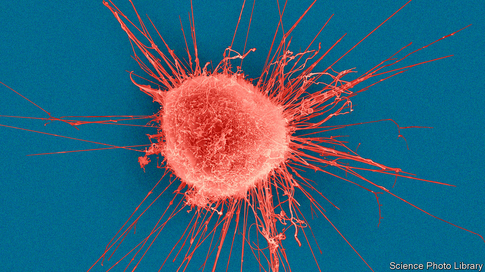

## Advancing oncology

# Scientists reveal the most extensive genetic map of cancers ever made

> It shows how hard tumours will be to crack

> Feb 8th 2020

PERHAPS MORE than any other, cancer is seen as a disease of genes gone wrong. So, as genetic-sequencing technology has become cheaper and faster, cancer scientists are using it to check which changes to genes cause tumours to spread.

The latest insights from one group, the international Pan-Cancer Analysis of Whole Genomes (PCAWG), are revealed this week in Nature. In an analysis of the full genomes of 2,658 samples of 38 types of tumour taken from the bladder to the brain, the researchers give a blow-by-blow account of how a series of genetic mutations can turn normal cells into runaway clones. It provides the most comprehensive analysis yet of where to find this damaging disruption to DNA and, by unpicking the genetics of what makes cancer tick, just how hard it will be to tame.

For each of the cancer samples, the team produced a read-out of the tumour genome—the 3bn or so individual DNA letters—and compared it with the genome sequences of healthy cells taken from the same patients. In this way they could look for the genetic signatures of the cancer cells, where specific mutations had warped the genetic information.

Most mutations in the genome are harmless. But driver mutations, where genetic changes cause a cell to multiply more easily and faster than other cells, can trigger tumour growth. Many driver mutations have been found over the past decade and a handful have been translated into new medicines. In a fifth of breast cancers (pictured), for example, a driver mutation in the gene HER2 makes cells produce more of a protein on their surface that encourages them to grow and divide out of control. A series of drugs, including Herceptin, target this protein, and lead to significantly improved survival rates. The same HER2 mutation also appears in some lung cancers, raising hopes that similar therapies could work against that disease.

The problem is that most cancers have multiple driver mutations. Indeed, the PCAWG work found that on average each cancer genome carried four or five. And with some clever genetic archaeology they also found that some driver mutations can occur years before symptoms appear.

To discover this, researchers used a new concept called “molecular time” to reconstruct the cellular evolution of tumour cells. By comparing the DNA of cells within tumours, the researchers could place mutations in chronological order based on how many cells they appeared in. Earlier mutations occur more frequently. For example, driver mutations in a gene called TP53 were found to have originated at least 15 years before diagnosis in types of ovarian cancer, and at least five years before in types of colorectal and pancreatic cancer. Driver mutations in a gene called CDKN2A were found to have occurred in some lung cancers more than five years before diagnosis. In theory, that provides a window in which to find people at risk of developing these diseases, and perhaps prevent the cancer ever appearing.

The new study closes down talk that significant numbers of unknown driver mutations could lurk in the relatively unexplored regions of the human genome. One such driver mutation in non-coding DNA was found in 2013—a mutation in the TERT gene across many different cancer types. To check for more like this, the consortium sequenced and analysed all the DNA letters of these non-coding regions (which account for 98% of human DNA) for the first time. They found that non-TERT driver mutations occurred at a rate of less than one per 100 tumours in these regions.

Peter Campbell of the Wellcome Sanger Institute in Cambridge, Britain, and a member of the PCAWG consortium, says an important contribution of the study is that by sequencing so many tumours it has raised the number of patients in whom a genetic contribution to their cancer can be identified from less than 70% to 95%. The goal, he says, is for genome sequencing of tumours to become routine. Efforts to introduce this are under way in some countries, including Britain, the Netherlands and South Korea, he adds.

Insights are all very well, but what about cold, hard clinical progress? Turning genome sequences into meaningful predictors of cancer will require comparisons between samples from tens of thousands of patients, say the researchers, along with data on their treatments and survival rates. Processing this would be beyond the reach of any single organisation. Instead, a follow-up project is planned that includes national funding agencies, charities and corporate partners from more than a dozen countries around the world. It aims to link full sequences of 200,000 cancer patients to their clinical data by 2025.■