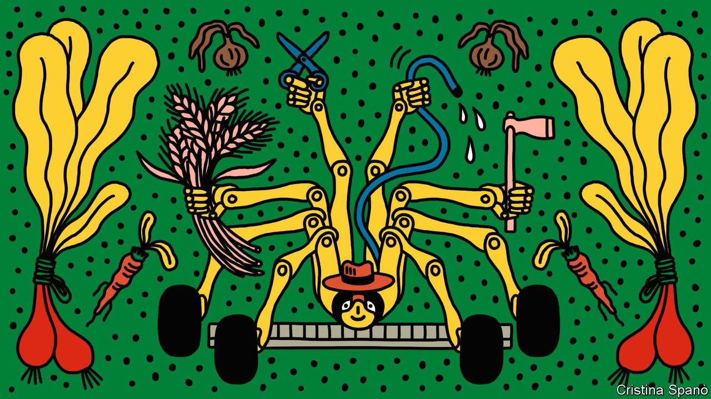

## Farming

# Using artificial intelligence, agricultural robots are on the rise

> Down on the farm with Tom, Dick and Harry

> Feb 6th 2020WEST DEAN

SLOWLY BUT surely, a spidery machine about the size of a golf cart swings an electrode over a tray of plants. Every few seconds there is a small puff of smoke as a weed keels over, having been zapped with a high voltage. The device doing the zapping is a prototype weeding robot developed by the Small Robot Company, a new firm operating out of an old munitions depot near Salisbury, in south-west Britain.

Such machines, called “agribots”, are appearing in many shapes and sizes from a variety of companies. Muddy tracks from other prototypes lead into the Small Robot Company’s workshop, where a row of 3D printers make bright orange components out of plastic. That makes parts easier to find should they fall off in a field, which is a sure sign that farmers are at work here, with roboticists and scientists.

Weed control is essential for improving crop yields, but it is getting increasingly difficult. Some weeds are becoming resistant to herbicides, which face stricter regulation and in some cases are being banned. On top of that, many consumers want organic produce. And labour shortages mean that repeatedly tilling the soil to disrupt weed growth using a mechanical hoe towed behind a tractor is costly, time consuming and not always practical.

Weeding is a chore that most farmers would happily hand to robots. But for a robot to do the job properly it must be able to distinguish a weed from what is being cultivated. That is becoming easier with advances in computer vision. Artificial-intelligence (AI) algorithms are getting better at classifying images. Some phone apps can now identify a plant from just a photo. Robots equipped with cameras will not only weed but automate other farming roles. Agribots, driverless tractors and other types of farm automation form an industry that is expected to grow at around 23% a year and to be worth more than $20bn by 2025, according to MarketsandMarkets, an American research firm.

Having spotted a weed, there are several ways to try to kill it. The Small Robot Company’s weeding agribot, called Dick, electrocutes them. The robot’s wheels work like an electrode to make contact with the ground while another electrode is moved to touch the plant. This makes a circuit through the plant and creates heat, effectively boiling the plant’s cells and killing it from stem to root instantly. It can take several thousand volts, although this is adjusted according to the type of weed. The remnants of the plant can then be left to naturally decompose into the soil.

Dick will work with two other agribots, Tom and Harry, all of them electrically powered. The idea, says Ben Scott-Robinson, one of the company’s co-founders, is that Tom will routinely scan fields to a level of detail of just a few centimetres. Using its cameras and other sensors, the spindly four-wheel-drive machine can cover about 20 hectares a day, mapping the health of every plant, along with soil conditions. When weeds appear, Dick will be dispatched to zap them. Harry, the third agribot, is under development for tasks such as seeding and applying precise levels of fertiliser to each plant, a process known as microdosing.

Tom will go into commercial production in August. Early versions are already in use on some farms in Britain, including the Leckford Estate, which is run by a large supermarket chain. Dick will begin trials later this year. Tom has already learnt how to spot broadleaved weeds and is being trained in the more difficult art of identifying grass-type weeds, which look similar to cereals. Unlike many vegetables, cereals are grown more densely in rows, which makes the mechanical hoeing of weeds a tricky operation. Armed with Tom’s algorithms, Dick should be able to zap grassy weeds in cereals accurately.

The company will offer its robots as a service. Tom will live in a kennel on the farm, where it will download data for the farmer and recharge. Dick and Harry will be delivered to farms as and when they are needed, much as farmers already bring in contractors. This business model, reckons Mr Scott-Robinson, will demonstrate to farmers that the cost of using agribots will be competitive with other weed-control measures and provide additional benefits, such as being chemical-free.

Dick’s zapping system is supplied by RootWave, another small British company, based near Leamington Spa. RootWave, which calls the process “electricide”, already makes a hand-held version for spot weeding. Electricide does not disturb the soil or harm microbes, says Andrew Diprose, the firm’s boss. As for safety, agribots would—like all farm machinery—need to be handled by trained operators. Built-in safety features, such as sensors that detect an approaching person or animal and shut the robot down, would reduce risks.

RootWave is working with other companies interested in electricide. These include Steketee, a Dutch producer of agricultural equipment. Its tractor-towed hoes already benefit from computer vision. Steketee equips one machine with cameras that detect well-spaced crops, such as vegetables, and then moves the hoeing knives in and out to weed not just along the rows, but also between individual plants.

Agribots can also hoe. Sebastien Boyer, an AI expert who has worked for IBM and Facebook, co-founded FarmWise, a San Francisco-based company, in 2016 to develop farming robots. After field trials, the firm is about to launch its first agribot, called Titan. This can navigate autonomously around a field of vegetables, such as lettuce, broccoli and cauliflower, identifying individual plants and their location. As it moves, Titan deploys a series of rotary blades, which are automatically adjusted to slice into the soil at an appropriate depth to dispatch any weeds. Future versions will do other jobs, such as seeding and microdosing fertiliser and pest treatments directly to individual plants. “It is personalised care for plants,” says Mr Boyer.

Self-contained agribots will have to compete with systems towed by smart tractors. Most modern tractors and combine harvesters can steer themselves across fields using satellite positioning and other sensors. Some tractors use digital maps of crops obtained by satellites and drones to highlight the places that require fertiliser or pesticides. Big tractor-producers, such as John Deere and CNH Industrial, which makes Case and New Holland machines (and whose largest shareholder owns shares in The Economist Group), are developing fully autonomous tractors.

When chemicals are required on crops, both tractor-towed systems and agribots could apply microdoses to the individual plants that require them, rather than spraying an entire field. Some trials have suggested microdosing could reduce the amount of herbicide being sprayed on a crop by 90% or more. BASF, a German chemical giant, is working with Bosch, a German engineering firm, on a spraying system that identifies plants and then applies herbicides in just such a targeted way.

The development of harvesting agribots is also being driven by AI. These machines tend to come in many different shapes and sizes and use a variety of systems specifically tailored to pick individual crops, such as tomatoes, asparagus and lettuce. This suggests that agribots that weed and care for plants will evolve in a similar manner, their form depending on the crop concerned and its location, which could be a field, a vineyard or an orchard. Some may be smart machines towed by fully autonomous tractors, while in other cases swarms of small agribots will be employed. The one sure thing is that farmers won’t spend a penny on any of them unless they prove they are up to the job.■