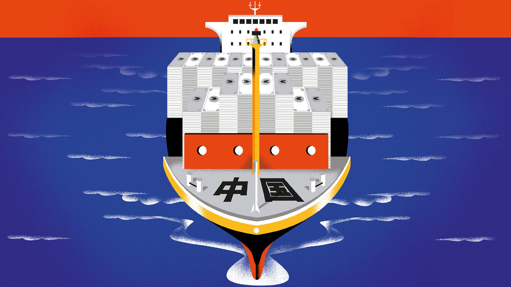
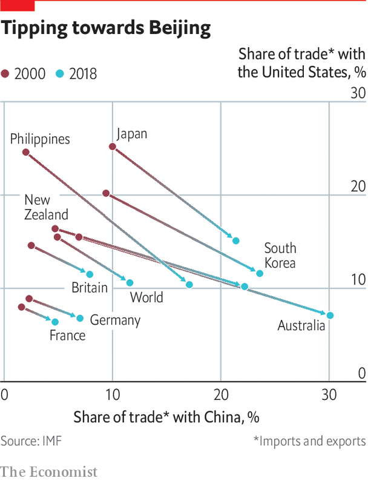

## The road

# China is making substantial investment in ports and pipelines worldwide

> Many are worried they could be used for military or other strategic purposes

> Feb 6th 2020

NO CHINESE REFERENCE to the maritime Silk Road is complete without mention of the voyages of Zheng He. The eunuch admiral, a Muslim at the Ming court, led seven voyages in the early 15th century in a fleet of vast sailing barges known as “treasure ships”. The official narrative is that he went abroad to spread peace, carrying treasures for the potentates he would meet from South-East Asia to east Africa. Back came fabulous curiosities, including a giraffe, which he fashioned as tribute to the emperor. The peaceful nature of Zheng’s trips is greatly embellished—the fleet was well armed and got into scuffles. But few tales better show the mix of hard power and emoluments that embodied imperial China’s tributary relations with others. Barbarians were worthy of engagement if they accepted China’s cultural and military superiority and moved into China’s orbit.

The idea of emissaries bringing peace lingers on in schematic maps of the 21st-century maritime Silk Road. What jumps out is how vague and imprecise are these doodles of desire. The routes themselves chart sinuous curves. The waypoints speak more to exotic places from the old spice trade than to where concrete is being poured (no mention of a military base in Djibouti, for instance). The lines copied out in the Pentagon, by contrast, are harder and firmer. American strategists believe China is sending out modern treasure fleets laden with goodies, such as offers to build ports, that will pave the way for deploying warships in future.

China downplays such notions. Yet it is rarely easy for observers to separate the commercial from the strategic along the maritime road. Nearly everything, potentially, can be used to make money and project power.

The road starts by coursing innocently through the South China Sea. Already the paradox is glaring. This is a seat of heightened geopolitical contest on account of disputes among littoral states over maritime claims in the sea—none more hyberbolic than China’s. It is aggressively asserting its claims (and disregarding others’), through a large naval, coastguard and fishing-fleet presence, as well as huge terraforming around reefs and rocks to create runways, quays and military bases.

The approach is at odds with protestations of peace and mutual co-operation embodied in the BRI. But the contradiction is resolved if you consider that by enmeshing neighbours in ports and other projects, and by increasingly dominating the sea lanes with Chinese vessels, China hopes to settle the matter of sovereignty by giving neighbours little choice but to be drawn into its embrace.

So far, most Chinese investment has gone into commercial ports. The maritime push is being led by a handful of giant state enterprises with close links to the Communist Party’s leaders. China Communications Construction Company (CCCC) is the biggest company on the belt and road. COSCO, a shipping behemoth, is the world’s third-biggest container line and has investments in 61 port terminals around the world. China Merchants, founded as a patriotic enterprise in 1872 to attract Chinese capital to take on Western shipping lines, manages 36 ports in 18 countries. Since 2010 well over $20bn of Chinese money has been poured into foreign ports.

One dimension is the “port-park-city” concept: a port is more likely to thrive with a hinterland in the form of industrial zones and a growing city. Following the model are Kuantan on peninsular Malaysia’s east coast and Gwadar in Pakistan on the Arabian Sea. In both places, Chinese-built industrial parks are going up close to new port development, with plans for urban expansion. In Colombo in Sri Lanka, next to the busy container port, controlled by China Merchants, CCCC has won 269 hectares from the sea to extend the business district and build glitzy flats. It is not clear whether such projects are intended more for property speculation by rich locals and Chinese keen to park money abroad, or organic evolutions of an existing city’s fabric. The domestic reception often hangs on the answer.

Another plan is for major ports to serve as regional hubs at which the biggest container ships can dock; their cargoes are then unloaded and despatched on smaller vessels serving other regional ports. Colombo is one example. Sri Lanka sits at the crossroads of major shipping lanes in the Indian Ocean, and Colombo is one of the world’s busiest—and most profitable—container ports.

The most notable success of a hub port is COSCO’s involvement in Piraeus, Athens’s ancient harbour. China arrived when the financial crisis of 2008 had brought Greece to its knees. COSCO took a long lease on two terminals of the container port with a promise to build a third. Soon, the contrast in productivity between those and the remaining Greek-run one, plagued by inefficiency and powerful unions, was stark. The left-wing government of the day had refused the sale of that pier. But in 2016, needing funds demanded by the EU in return for a third bailout, it offered COSCO control of the whole port. COSCO has invested $5bn, with more promised for everything from a ship-repair business to turning warehouses into hotels for cruise passengers.

Under COSCO, container volumes have grown by more than 700%. Next year Piraeus may overtake Valencia in Spain to become the biggest port in the Mediterranean and the seventh biggest in Europe. Its value to Asian exporters is as a trans-shipment hub. Goods arriving in Piraeus via the Suez Canal are quickly shipped to other parts of the Mediterranean. That saves time and money compared with unloading in the giant ports of northern Europe, such as Rotterdam (though COSCO has stakes there too). COSCO is also investing in a rail route for sending freight from Piraeus to the Balkans and beyond to the German-led manufacturing cluster in eastern Europe. The railway neatly connects the land-based approach with that by sea.

But for every success, there are other strange, stalled or suspicious Chinese port ventures. The merging of commercial and military potential is glaring in tiny Djibouti, guarding the approach to the Red Sea and the Suez Canal. There, China opened its first overseas military base in 2017, ostensibly for Chinese UN peacekeepers in the Horn of Africa as well as to combat piracy. Djibouti has not been fussy about hosting bases, so long as it makes money from them, and China’s sits not far from those of the United States, France and Japan.

But a few months later the Djibouti government nationalised the main port, tearing up the long-term deal it had signed with DP World, Dubai’s port operator. Soon after, it handed a stake in the port to China Merchants, which has taken over its running. International arbitration courts have ruled in DP World’s favour, though that is unlikely to dislodge China Merchants. A Chinese state-owned enterprise, therefore, handles nearly all the incoming supplies for the other bases, a source of alarm for the United States and its allies. Similarly, China may have the upper hand in Djibouti now, but the country’s fiscal position is the most parlous of all BRI countries—and more than half of its debt is to China. To hawks it means China holds all the cards. Others point to China’s reputational risk should Djibouti default.

Another case is Hambantota, a port at the southern tip of Sri Lanka often cited as a notorious instance of debt-trap diplomacy. Opened in 2010, China Merchants took control of the new port in 2017 on a 99-year lease when the government struggled to service its debt. The debt-trap accusation is off the mark here, for China built the port chiefly to indulge the president of the time (and now prime minister), Mahinda Rajapaksa, in the region of his family’s political base. Chinese enterprises were already making out like bandits at the Colombo port. Besides, given the riskiness of the proposition, Chinese banks made sure to charge commercial rates of interest.

There was, in other words, no well-laid plan. Yet it remains the case that Hambantota sits strategically just a few miles north of one of the world’s busiest sea lanes. Moreover, once bunkering facilities are installed, and ships start to call in to refuel, Hambantota may no longer be the white elephant it is today. Thus China will have one more strategic stepping stone in the Indian Ocean in years to come.

Accusations of debt-trap diplomacy are especially rife in the Pacific. In November 2018 America’s vice-president, Mike Pence, told Asia-Pacific leaders: “Do not accept foreign debt that could compromise your sovereignty.” The perils would be especially acute for its remote and fragile economies. Yet a paper by Roland Rajah, Alexandre Dayant and Jonathan Pryke of the Lowy Institute, a Sydney think-tank, paints a nuanced picture of China’s Pacific activities. They conclude that China is not pursuing a policy of deliberate entrapment. Only in Tonga does China account for more than half of outstanding debt. Meanwhile, nearly all official lending comes in the form of concessional loans with low interest rates and long grace periods—a stark contrast to China’s lending in the other parts of the world.

Certainly the sheer scale of Chinese lending poses risks in future. But the debt-diplomacy debate should not overshadow more salient problems with China’s activities in the Pacific. For Mr Pryke of the Lowy Institute, they include both the quality of Chinese lending, and the way relationships are forged. “They’re using corruption to lubricate their engagement,” he argues. By striking murky deals with politicians, China undermines already weak governing institutions.

There are accusations elsewhere of projects that aggravate domestic problems in the countries in which they are undertaken. In January President Xi Jinping became the first Chinese leader to visit Myanmar in 20 years, a trip over which much was at stake. With a deap-sea port being built at Kyaukpyu in Rakhine state, a corridor is to connect landlocked parts of south-west China to the Indian Ocean. Myanmar offers China a crucial energy route from Kyaukpyu to Kunming, capital of Yunnan, its most south-westerly province. One pipeline has the capacity to pump 12bn cubic metres of gas a year from fields in the Bay of Bengal. A second is for oil from the Middle East. A planned railway is to run from Kyaukpyu to Kunming via Mandalay, a city in central Myanmar with a large Chinese presence.

The pipelines have special value to China, whose strategists have long fretted over a “Malacca Strait dilemma”. The strait, which the American navy dominates, is the world’s busiest maritime area, with nearly a third of world seaborne trade passing through it a year—including 80% of China’s energy imports. China’s concern is that at a time of crisis or war, America and its allies could choke off the narrow strait, throttling China.

But the planned corridor in Myanmar runs through a violent and highly complex land, home to over a dozen insurgent armies in the borderlands financed by China-linked drugs, jade and logging rackets. Chinese projects are as likely to throw fuel on the fire of ethnic conflicts as bring peace and development. As for the Myanmar government, China is too big to ignore. But it is also too big to want to be dominated by, and many in the establishment, from Aung San Suu Kyi down, have longstanding ties with the West and Japan. For now, Myanmar is in the doghouse with the West, for its army’s ethnic cleansing of Muslim Rohingyas. Mr Xi certainly does not believe that will last.

Strategic dimensions along the maritime Silk Road are not limited to ports. Chinese engineering companies have lobbied Thailand’s army establishment about digging a 100km-long canal across the Kra Isthmus in the country’s south. Supporters say vessels heading for East Asia from the Arabian Sea would shave 1,200km off their passage. The Chinese navy could get quickly to the Indian Ocean. A canal would put Thailand at the heart of a regional e-commerce economy built around quick delivery times.

Though the generals want development, they are nervous about the Kra canal. They fear Chinese dominance. And Thailand’s south is complicated by a long-running Muslim insurgency—an attack on a security checkpoint in November left 15 dead. The army’s sacred mission has always been to hold the country together. Physically slicing it in two and isolating the restive Muslim south makes them queasy.

Not everything, then, is guaranteed to go China’s way. Certainly, it is the Eurasian geopolitical force, a combination of economic might and geographic extent. But along both the belt and the road, Chinese-led efforts meet those of other powers. In continental Eurasia, as the Silk Road reconfigures, other former empires make their mark along it. Turkey has long-standing ethnic ties with Turkic peoples in Central Asia, and construction and business expertise to offer. Iran, while facing American hostility and sanctions, has made developing ties with Central Asia a “fundamental policy”. As for the Indian Ocean, India remains the regional naval power. In Colombo, alongside China Merchants, India and Japan are jointly to develop a new container terminal.

China claims that “win-win co-operation” is what the BRI is all about. Who would want it any other way? Yet along the fast-emerging digital Silk Road things look increasingly zero-sum. ■

## URL

https://www.economist.com/special-report/2020/02/06/china-is-making-substantial-investment-in-ports-and-pipelines-worldwide
