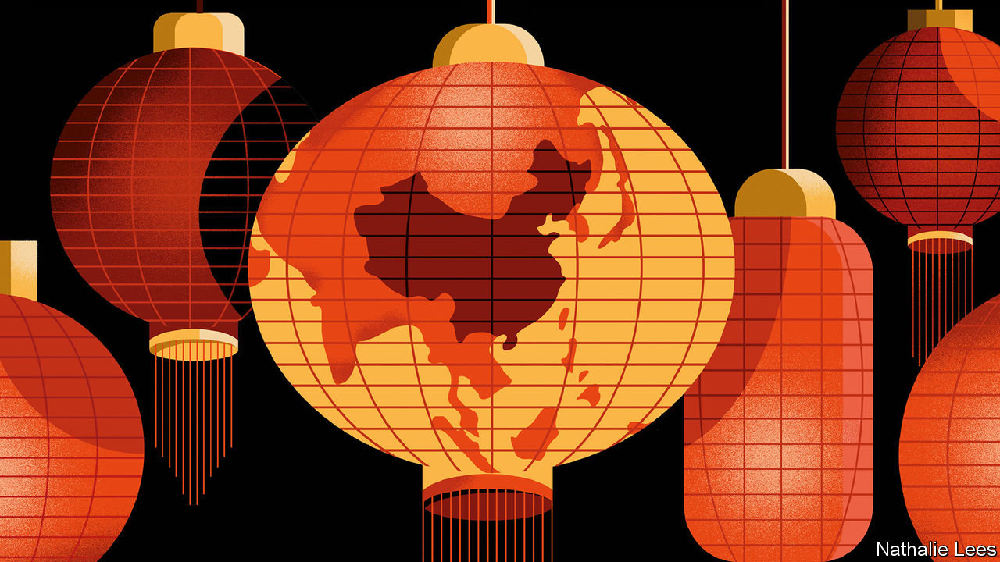
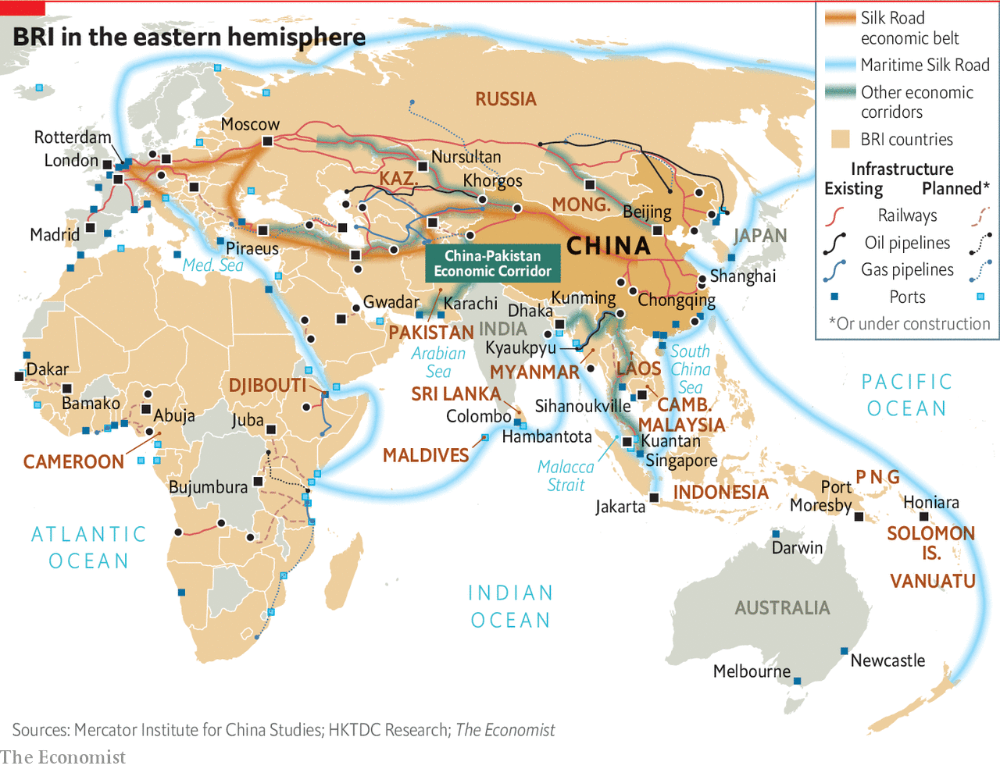

## China’s Belt and Road

# China wants to put itself back at the centre of the world

> The Belt and Road Initiative revives memories of China’s imperial tributary system, says Dominic Ziegler

> Feb 6th 2020

ON CHINA’S BORDER with Kazakhstan, a new Silk Road city has sprung up with such speed that Google Earth has scarcely begun to record the high-rises that now float on a winter mist above the steppe. What once would have been flattered to be called a hard-scrabble border town is now home to 200,000 people, giant outdoor video screens extolling the glories of a new Silk Road, and restaurants serving sashimi and European wine. Khorgos has become China’s gateway to Central Asia, and all the way to Europe.

A twin town is going up in Kazakhstan. A duty-free mall already straddles the border for Kazakhstanis to get deals on booze, perfume and cut-price Chinese goods. But the key features, just across the border, are the giant gantry cranes more usually seen in the world’s ports. The Khorgos Gateway is a container terminal, a “dry port” built from scratch in 2014. The transport hub is intended as a critical link in what China’s president, Xi Jinping, has called the “Eurasian land bridge”. Among its investors is China’s COSCO, one of the world’s shipping giants. It is run by DP World, Dubai’s port operator. Last year the dry port handled 160,000 TEUs (a unit equivalent to a 20-foot container). Hicham Belmaachi, its Moroccan manager, expects that to rise to 400,000 in 2025.

Khorgos is in the middle of nowhere: Eurasia’s pole of inaccessibility, the point on Earth farthest from any ocean, lies not far away. Now, beyond it, a vast new Eurasian supercontinent is forming. The promise is not just of railways through Central Asia to Europe but of gargantuan plans—some already realised—for pipelines, roads, high-speed rail and fibre-optic cables.

It is reshaping the geography of the Earth’s biggest land mass. In this new space, the obstacles of the recent past—the Iron Curtain, China locked in its Mao-made autarky, even the physical impediments of the Himalayas, the Inner Asian deserts and the melting Arctic itself—are of diminishing consequence. The physical and psychological distance between Europe and East Asia is shrinking as the sparsely populated expanse at the heart of Eurasia is being wrangled, through new infrastructure, to manageable size. That, at least, is how Chinese planners see it. And, taking the historical view, if there is a surprise, it is that the transformation is not being made in the West’s image or according to its rules. Asia is coming to Europe, not the other way around.

The Silk Road’s renaissance has been turbocharged as part of a Chinese expansion that has come to be known as the Belt and Road Initiative (BRI). The BRI is China’s signature, indeed all-encompassing, foreign policy—the “project of the century”, as Mr Xi calls it. But what exactly is it? Is it mostly aid or trade? Is it a Chinese Marshall Plan? Does it have real substance or is it just a branding exercise for China’s international rise? And why is the land part called a belt, and the sea part called a road?

The World Bank has an elemental definition of the BRI: “a China-led effort to improve connectivity and regional co-operation on a trans-continental scale through large-scale investments”. That is a good summary as far as it goes, and helping poor countries build infrastructure is an important component. The global need for new infrastructure is immense. The Asian Development Bank (ADB) estimates that Asia alone needs to invest $26trn between 2016 and 2030, or $1.7trn a year, if it is to maintain economic growth, eradicate poverty and respond to climate change.

But this special report will argue that, above all, the Chinese Communist Party is using the BRI to reshape a world order more to its liking. The focus is economic engagement and clever diplomacy. Leaders in Beijing ink BRI projects with countries for strategic or political reasons. Often, these are hidden by the sheer commercial anarchy that the BRI has engendered. (For those puzzled as to whether the BRI is a top-down, dirigiste initiative or a bottom-up frenzy, the answer is both.) Yet for China’s leaders, it represents a prototype for an emerging geopolitical bloc at a time when the rules-based order is under shaky American management.

The notion of a new order, baldly stated, might alarm. So a more benign idea puts the BRI in a broader historical context: the tributary system of old. China sits at the centre of the world, bringing its wealth and power to bear, first on its near-abroad, and linking people into the concept of China as a beneficent power and an alternative locus to the West. Those who buy into it receive munificence from Beijing. Those who do not will not. It is a way to help knit together continents through improved infrastructure and a catch-all phrase to make anything China does abroad look unthreatening. Crucially, it is Mr Xi’s own baby: as much a political project to reflect well on the emperor as an economic one. 

Mr Xi launched the initiative in two speeches in 2013. The first—in Astana (now Nursultan), the capital of Kazakhstan—presented the policy’s overland component, the “Silk Road economic belt”. It links China to Central, South-East and South Asia, and on to Europe. The word “belt” has that curious name to imply something more than mere transport, energy or other nodes. Rather, an interconnected network of infrastructure would grow into something thicker: industrial zones and economic corridors with manufacturing, logistics, construction and more.

Soon after, Mr Xi presented the maritime component in the Indonesian capital, Jakarta. A “21st century maritime Silk Road”, a network of port cities in the South China Sea, the Indian Ocean and the Mediterranean would tie China closer by sea to these regions. Mr Xi has unveiled further dimensions to the plan: a “polar Silk Road” to develop Arctic shipping routes; a “digital Silk Road” of undersea cables, 5G telecoms and cloud computing; and even a “space information corridor” to open up satellite- and space-launch capabilities. 

The debates about the BRI began from the outset. At one level, it merely extended a trajectory China had followed for some time, meshing with its major resource suppliers worldwide, as well as its European markets. At another, it was a response to the global financial crisis of 2007-9, which removed a large source of demand for Chinese goods. The lesson was that in future China had to make its own markets abroad. At a third level, it represented an internationalisation of Chinese industrial policy. Faced with overcapacity in steel, cement and more, a party-state whose legitimacy hangs on creating jobs and investment could hardly shut down capacity, as Western countries might do. Instead it must try to export it. Lastly, at a time when the West appeared to be stumbling, both in terms of growth and global leadership, here was a bend in the historical road. Everything was contingent, but China’s moment had come and needed to be seized—more Leninist opportunism than Marxist determinism.

The BRI is about all these things and more. Mr Xi calls it a decades-long project, while some estimates put spending on schemes both built and intended at $6trn. But sift through deals actually built or signed for, and the initiative is far smaller than some of the wilder figures imply. Yet it is so broad and amorphous it is meaningless to say you are for or against it. Any investment that China undertakes abroad can be, and is, lumped into it.

Even inside China, where the party ensures unstinting praise for the BRI, a surprising vagueness reigns. No authoritative figure is published for what is invested where. The best guess is that $400bn of financing, in grants but especially in loans, has been or is about to be spent in more than 160 countries with three-fifths of the world’s population. In real terms, that dwarfs the Marshall Plan ($130bn in today’s money) that America advanced to revive Europe’s war-ravaged economies.

But the economic benefits of projects often fall short of the claims made. A vast, bottom-up push to sell the BRI brand and pay lip-service to Mr Xi has produced hare-brained and duplicate schemes. Many provincial enterprises “going out” for the first time had no experience of operating abroad. At the first BRI Forum in Beijing in 2017, convened to spread awe and wonder at China’s generosity, there was already disorder under heaven. By the time of the second, last April, more disciplined guidelines were published about lending, the environment and more.

Projects may fall short economically for another reason: their priority is strategic, above all, securing critical supplies of natural resources, to drive economic growth at home. Shanghai now gets half its natural gas from Turkmenistan. Such pipelines neatly get around the “Malacca Strait dilemma”: seaborne supplies of oil and gas that could easily be choked off in time of war.

Elsewhere, strategic benefits might come from developing ports and cementing dominance in the global shipping industry. They could be stepping stones to China one day projecting naval power far from home—with big implications for Japan, South-East Asia, India and other countries that depend on the world’s busiest sea lanes. By rolling out infrastructure across the Eurasian land mass, China becomes the indispensable power in an emerging supercontinent. Crucially, the state directs giant enterprises to do the national bidding, and state banking institutions to provide the financial firepower.

From a Communist Party perspective, cultivating political relationships, and what the party likes to call “people-to-people” ties, bends the world, bit by bit, to China’s will. As Bruno Maçães, a former Portuguese foreign minister, puts it in “The Dawn of Eurasia”, the spillover effects from infrastructure, trade and finance into politics, culture and security are not “a bug in the project”, but its most fundamental feature.

Above all, the BRI is the world’s greatest branding exercise. A foreign country or leader usually signs up to the brand in the form of a vague memorandum of understanding lauding “win-win co-operation”. After that, it is very hard to be disloyal. Praise the plan and you will be rewarded. Criticise it, and not only have you offended China. You have offended the cosmos, or at least the “Silk Road spirit” of “peace and co-operation, openness and inclusiveness, mutual learning and mutual benefit.” This branding, with sanctions, is powerful and it works. Foreign loyalty, in turn, reinforces the brand for a domestic Chinese audience: look what a peaceable, open and future-facing country China is, ready to join in endeavours for mutual benefit.

Not everyone buys it. The harshest criticism comes from the incumbent superpower, whose global dominance the project is challenging. America’s National Security Strategy claims that the BRI is “predatory economics”; to borrow money from China is to fall into a well-laid trap. In December Adam Boehler, the head of the new US International Development Finance Corporation, told the Financial Times that China’s overseas investments were “100%” like a house of cards, because of heavy debts, badly built infrastructure, corruption and lack of transparency.

That is an overstatement. Certainly, China applies dodgier lending criteria than do members of the Paris Club of major sovereign lenders. Yet there is no nefarious master plan. Indeed, that is part of the problem. Nearly every major project meets bumps along the way. Out of sight, deals often get renegotiated, with lower interest rates and longer grace periods and repayment terms.

China knows flexibility serves its image best. It offers development money and diplomatic support not available elsewhere. If there is to be an American-led pushback, it must work by attraction, too, by offering developing countries better options than China does. The new connectivity must work well for client states.

In January 2017 a train quietly pulled into the sidings on the outskirts of London. Its containers had started their journey just 12 days earlier in eastern China, less than half the time than had they gone by sea, at less than half the cost by air, travelling through Khorgos. The route is rapidly becoming more popular. HP, an American computer giant, has moved its computer factories to the inland Chinese city of Chongqing, building its business model on rail delivery via Khorgos to the Netherlands.

In part because of HP’s move, trains from China to Europe have risen from three a week in 2013 to over 25. An industrial zone and distribution centre is being built in Khorgos with $600m of investment from the provincial government of Jiangsu province 3,700km to the east. The hope is to attract businesses that serve the through-trade—packaging and putting price tags on retail products, for instance—and light manufacturing migrating from higher-cost China. Coming the other way, BMW sends several trains a week to China, its biggest market. Yet, for all this new connectivity, much still can, and does, go wrong. ■

## URL

https://www.economist.com/special-report/2020/02/06/china-wants-to-put-itself-back-at-the-centre-of-the-world
