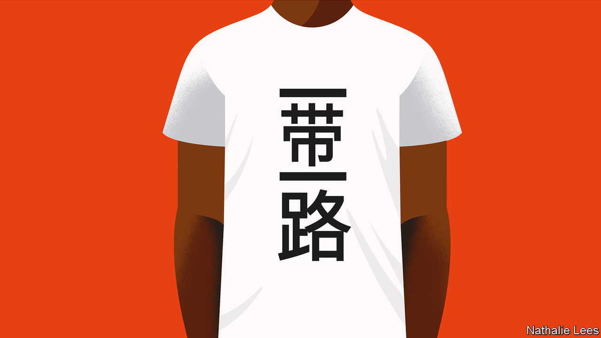

## Of belts and roads

# How the Belt and Road Initiative got its name

> It sounds better in Mandarin

> Feb 6th 2020

SUPPOSE YOU wanted to imagine a new world, or even a new world order. How, then, would you go about conjuring it up? You would do well to start with a name.

Forget for a moment the significant problems of translating President Xi Jinping’s grand project for an English-speaking audience. In Chinese it is called yi dai yi lu: literally, “one belt, one road”.

Such correlative, four-character phrases are common in Chinese, and imply balance, harmony, wholeness. Yi fu yi qi, or “one husband, one wife”, is monogamy; yi xin yi yi, or “one heart, one soul” means wholeheartedly. As Eyck Freymann at Oxford University writes in a forthcoming book, “One Belt One Road”, to a Chinese audience the phrase has a classical, even epic ring.

It evokes an image of China “going forth to encompass the world on land and sea, at once opening to the world and binding the world more closely to China, in a balanced and harmonious way.” To a Chinese ear, that would carry echoes of the ancient concept of tianxia (literally, “all under heaven”), by which emperors ruled. In an orderly, peaceful hierarchy, your obligations depend on your relationships within the hierarchy. China’s status as hierarchical leader goes without saying. There are, admittedly, obligations there too. China keeps the whole cosmic show on the road.

And in English? “One Belt One Road”, or OBOR for short, was the official name at launch. But in 2015 the Communist Party’s Central Compilation and Translation Bureau issued an English name change, to the “Belt and Road Initiative”, or BRI.

That sounded easier on an English speaker’s ear. Not least, it allowed semantically for the possibility of multiple belts and roads (even if confusion remained about what a belt was, and why a road should go by sea).

But calling the dream an initiative is suggestive. First, by abandoning the classical intimations implied in the Chinese phrase, a sense of China’s return to historical greatness has been removed for the benefit of foreign audiences. Second, a power that wants to conceal from other countries what, in terms of loftier ambitions for global pre-eminence, it is signalling to its own people, could do worse than choose a bland, unthreatening word like “initiative”.

Meanwhile, official Chinese sources publishing in English have not all fallen into line with the translation bureau’s ruling. “OBOR” is still used, along with the “Belt and Road” and, often, the “New Silk Road”. Not only, says Mr Freymann, does the party-state want to communicate two very different interpretations of the BRI concept to domestic and foreign audiences respectively. It has also been rather sloppy in doing so.