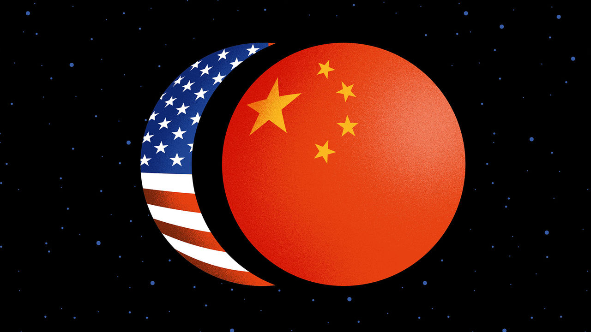

## The future

# Will China sit again at the heart of its own cosmos?

> And does it have more than just cold, hard cash to offer?

> Feb 6th 2020

BACK in KHORGOS one winter’s morning, a press of shopworkers—members of the ethnic Han majority, along with Kazakhs and Uighurs—line up in front of border officials to enter the duty-free mall shared with Kazakhstan. Four city officials from the propaganda department have got wind of this correspondent’s presence, and insist on accompanying him, nervously calling their boss for instructions. Even in this zone of declared openness, the contradictions multiply. Not least, Kazakhs and Uighurs—though not Han Chinese—must surrender their passports if they want to work in the zone, so that they may not cross over into Kazakhstan.

It is a small mark of a much larger campaign of high-tech surveillance and incarceration in which China has sent over 1m innocent Muslims in Xinjiang to indoctrination camps. Though most caught up in the dragnet are Uighurs, the biggest ethnicity in the region, some 1.5m ethnic Kazakhs live in Xinjiang, too. Every family he knows, says one young Kazakh man, has at least one member in the camps. His uncle, a local-government official, disappeared six months before, for having needlework verses from the Koran on his wall. “It is meant to make us love the authorities,” says the man, “but it only makes us hate them more.”

The anti-Muslim repression sends ripples across Central Asian borders. In September anti-China protests erupted in western Kazakhstan, in large part against the Xinjiang campaign. It is, a Kazakhstani foreign-ministry official admits, a highly delicate issue. Practically the only thing China demands of Central Asian states in return for BRI money is unquestioning allegiance to a fight against supposed separatism in Xinjiang. Indeed, one main motivation for the BRI was to do an end-run around China’s restive province, putting Central Asia out of bounds as an anti-China base. And by bringing development to Xinjiang itself, the BRI might address the economic backwardess of the province that the authorities assume must be at the root of its restiveness. So far, it has failed.

It points to a big question over the BRI: how to square all the fizzing connectivity implied in it with China’s dystopian techoauthoritarianism at home? It is the BRI’s foundational paradox.

In grappling with it, it helps to sort BRI projects into three buckets, assessing each bucket separately. First come projects intended to promote local development or growth. Power stations in Pakistan are a case in point: who can doubt Pakistanis’ need for more electricity? Yet even here come questions, above all, about the environment. The great bulk of BRI energy spending is in carbonintensive areas—especially coal-fired power stations. The emissions from such projects are not counted under China’s own undertakings under the Paris agreement. Neither are they usually factored into recipient countries’ commitments, as the World Resources Institute, an environmental group, points out. The BRI severely undermines China’s own green credentials.

The second bucket contains those connectivity-related projects that boost transport and trade—the Khorgos corridor is a prime example. Here the potential benefits need to be more rigorously assessed. A study by the World Bank last year, “Belt and Road Economics”, concluded that, by shortening transport time and lowering trade costs, the BRI can expand trade and investment, and lift 7.6m people out of extreme poverty, mainly in “corridor” economies like those in Central Asia. But the gains will only happen with complementary reforms that increase transparency, cut hassles at borders, face up to environmental and social consequences, and ease labour mobility. As it is, in some countries, like Mongolia, the costs of new infrastructure outweigh the gains.

The final bucket holds those aspects of the initiative that ostensibly promote greater openness and global interconnectedness. They include much of the BRI’s digital strategy. But all the highlevel and “people to people” diplomacy is key for China’s leaders too. It is here that the paradox is starkest. At home, the Communist Party monopolises the political space, prevents debate and enforces an information autarky. Abroad, its obsessive attempts to stifle critics suggest limits to the openness it will tolerate. That undermines the BRI’s attractions. One development economist from Ethiopia says that its training courses on Chinese campuses to which many foreigners are invited are stifling and dogmatic.

These flaws are baked into the belt and road. But they do not mean that the project of the century is heading for the buffers. The goodies China offers reflect well on leaders. And Chinese construction companies and workers get stuff done. Even politicians who, in opposition, make much of China’s rapaciousness usually come round once in power. In Malaysia, the threat by the prime minister, Mahathir Mohamad, to spike $20bn-worth of rail and other projects turned out to be a negotiating ploy.

What is more, China is unquestionably now the dominant Eurasian force, and a canny one at that. One instance is its dealings with Russia, another Eurasian former empire with aspirations to greatness again. In 2015 Russia formed the Eurasian Economic Union (EAEU) with former Soviet states of Central Asia, the better to draw them close and stipulate economic terms. But after facing censure from the West over its annexation of Crimea, Russia needed China for economic and diplomatic support. China has since co-opted the EAEU for its own purposes. The union’s common customs zone from Kazakhstan to Belarus makes it much easier to get cargoes to Europe—bypassing much of Russia altogether. This is just one example of how things are tipping in China’s favour.

Yet one thing is glaringly absent in China’s attempts to bend the world to its will. The last time countries circled in China-centred orbits, before the 19th century, China’s moral and cultural authority played as big a part as its sheer size. Japan, Korea and Vietnam all used Chinese characters in their writing systems and organised their societies according to Confucian precepts. Today, China lacks moral or cultural appeal. Its attraction is its cold, hard cash.

It is in this context that America has been grappling for a response. Three years ago the Trump administration made a first attempt: a “Free and Open Indo-Pacific”, in conjunction with Japan, Australia and India. It emphasised a strong naval dimension. But with no development dimension, and a sense of sharpening big-power rivalry, the region has been reluctant to embrace it.

Now the West is offering developing countries alternatives that emphasise transparency, debt sustainability, environmental safeguards and solid social and economic returns. America has set up the new US International Development Finance Corporation. Its available money is a fraction of what China can offer. But its strength may prove to be in involving private capital in projects. Meanwhile, in late 2018, Australia launched its Infrastructure Financing Facility for the Pacific, worth A$2bn ($1.4bn) in loans and grants. And in September Japan and the EU signed a wide-ranging deal for joint infrastructure projects, setting clear standards for investments ranging from transport to digital industries.

Such ventures may start to make a mark in the next year or two. Meanwhile, democratic countries are quietly finding other ways to push back against China. Japan has long been active in South-East Asia and its ties with India have grown. Chinese plans for a port in Bangladesh were shunted aside by offers from India and Japan. India has also come to the aid of the tiny Maldives, whose previous repressive government racked up debts with China. Pakistani officials, burned by their experience with CPEC, now stress how much they welcome American development initiatives. Even the Rajapaksas in Sri Lanka suggest they will be more careful to cultivate India in future.

Countries’ leaders say they welcome having more options. They do not relish being forced to choose between the historical global power and the ascendant one. That is why they worry about the growing American and Chinese rivalry over telecoms and cyberspace. America should be careful not to hasten a situation in which countries fall on one or other side of a digital iron curtain—with rich, open societies taking their tech from American, European and Japanese suppliers, while poorer, less democratic ones take theirs—and their political direction—from China. Then Chinese leaders would indeed have their new order. They would sit again at the heart of a China-centred world, an echo of the tributary relationships of old. But it will be a hard-edged cosmos and it will not be one in which its citizens have chosen to live. ■