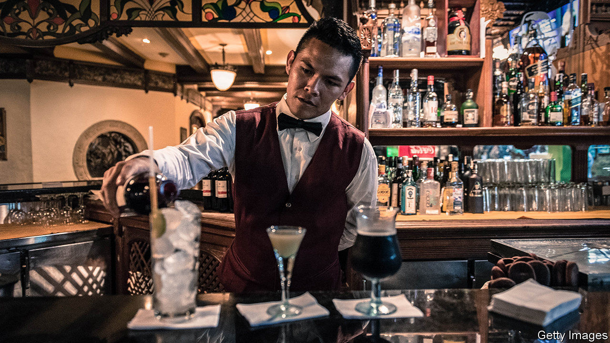

## Rum raisin’

# A share issue in Venezuela, the world’s worst-performing economy

> An investment in the stockmarket is not as nutty as you might think

> Feb 6th 2020CARACAS

SOME WONDERED if the bosses of Venezuela’s oldest rum company had been sampling too much of their product. In January, with Venezuela in one of the deepest recessions in modern world history, Ron Santa Teresa launched the country’s first public share issue in more than a decade. The new equity was priced in bolívares, the world’s worst performing currency. Others speculated that the rum-maker, which cheekily notes on its website that its distillery in the Aragua valley near Caracas has survived “wars, revolutions, invasions, even dictators”, had decided that change was afoot.

Evidence of the latter interpretation is that the latest dictator, Nicolás Maduro, has recently become a capitalist, sort of. The disciple of Hugo Chávez (whose “21st-century socialism” set Venezuela on its road to ruin) has quietly lifted price controls and restrictions on dollar transactions. He now says firms can issue securities in hard currencies. He is thought to be contemplating a sale to foreign investors of a stake in PDVSA, the decrepit state oil company.

Ron Santa Teresa’s president, Alberto Vollmer, a fifth-generation rum-maker, says the company, whose shares were already listed, needs the money to buy barrels and build warehouses. It signed an international-distribution deal with Bacardi in 2016. Mr Maduro’s tentative pro-market turn is “a happy coincidence”, he says. The sale of 1m shares, which raised the equivalent of $300,000, was a fillip for the near-dormant stockmarket, which lists just 31 companies. Demand outstripped supply.

The investors are not as daft as you might think. Although denominated in bolívares, share prices tend to keep pace with inflation. This has dropped, from an annual rate of more than 2m% early in 2019 to a mere 9,500% for the year. That is partly because the government has increased the amount of reserves that banks must hold.

But this has caused a shortage of bolívares. The total amount of bank loans is the equivalent of $225m, less than 0.5% of GDP. Sanctions imposed by the United States and EU have made lending harder. The share issue raised more money in a day than the large banks could lend to Mr Vollmer’s firm.

No one expects a dramatic recovery of the economy, which has shrunk by two-thirds since Mr Maduro took over from Chávez in 2013. But Mr Vollmer welcomes the shift towards pragmatism. “That’s what happens when you run out of money to fund ideas that didn’t work.” 