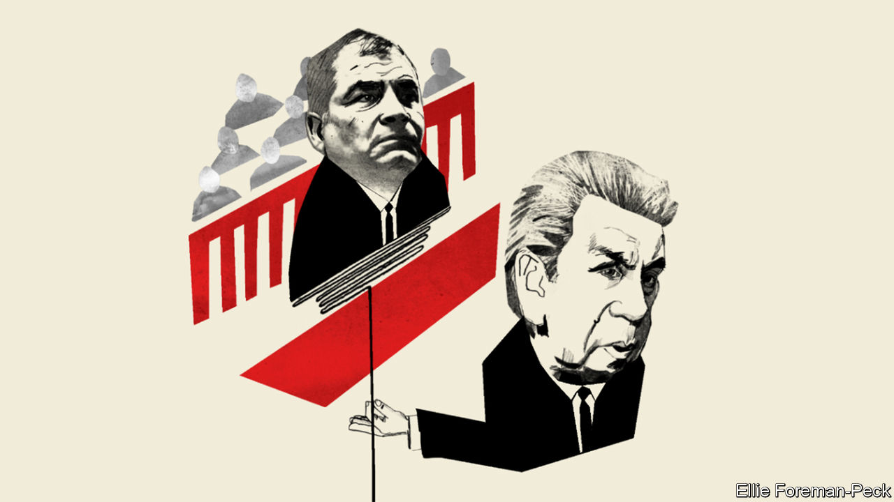
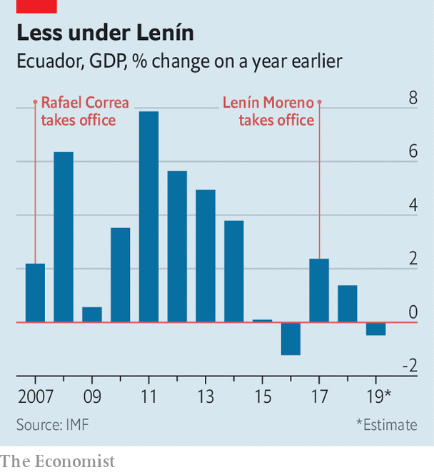

## Rafael Correa in court

# Ecuador’s trial of the century opens

> A former president is in the dock. If acquitted, he could be a kingmaker

> Feb 6th 2020QUITO

IT IS ECUADOR’S trial of the century. On February 10th the country’s top court is expected to open criminal proceedings against Rafael Correa, president from 2007 to 2017, and 20 other people. They are charged with taking and giving bribes, which they deny. Mr Correa, who moved to Belgium shortly after leaving office, hopes to play a big role in the presidential and legislative elections due in February next year. His trial may determine whether he can.

Ecuador’s current president, Lenín Moreno, has spent nearly three years trying to undo Mr Correa’s legacy. He had been Mr Correa’s vice-president and was seen as his heir. Once in office, Mr Moreno turned on his patron. He went after corrupt members of Mr Correa’s administration and took steps to restore independence to the judiciary and the press, which Mr Correa had curbed. The new president replaced his predecessor’s incontinent spending with a programme of austerity, backed with a $4.2bn loan from the IMF. He expelled Julian Assange, a co-founder of WikiLeaks, from Ecuador’s embassy in London, where Mr Correa had offered refuge.

But the undoing project has run into trouble. Mr Moreno’s attempt to end fuel subsidies provoked massive protests in October, which forced him to retreat. His approval rating is less than 20%. Mr Moreno says that he does not plan to run for re-election next year, but he is determined to ensure that correísmo does not come back. A trial that discredits Mr Correa would help.

The investigations of Mr Correa and his co-defendants began last May after two journalists, Fernando Villavicencio and Christian Zurita, revealed an alleged scheme to funnel bribes paid by companies into the campaign coffers of Alianza PAIS, then Mr Correa’s (and now Mr Moreno’s) political party. On the day after their first story appeared police arrested Pamela Martínez, a former Constitutional Court judge who had been an aide to Mr Correa, as she tried to board a flight to Mexico. A search turned up a deposit slip for a $6,000 cheque credited to Mr Correa’s account (he says it was a personal loan). Ms Martínez told a court that Mr Correa had asked her to confirm that she had destroyed incriminating evidence.

Also on trial is Jorge Glas, a Correa ally who was Mr Moreno’s vice-president and is in jail for arranging kickbacks from Odebrecht, a Brazilian construction firm that bribed officials across Latin America. Officials from companies that allegedly paid bribes, including SK Engineering, a South Korean builder, are in the dock. Several projects during Mr Correa’s presidency were badly built and busted their budgets. The government spent $3.7bn, 3% of 2019’s GDP, on two failed refineries.

Mr Correa, who will be tried in absentia, claims that he is the victim of a witch-hunt. He recently tweeted that his enemies are “terrified of the response that the people will give them at the polls”. Simón Pachano, a political scientist at FLACSO University in Quito, disagrees. “It’s a trial of politicians, not a politicised trial,” he says.

That would not have happened if Mr Moreno had not restored to the courts a measure of the independence they lost under Mr Correa. In 2018 Mr Moreno held a referendum, which gave him a mandate to set up an independent panel to review the judiciary. That body replaced senior prosecutors and the judges on the Constitutional Court, who were widely regarded as Mr Correa’s puppets. It also purged the members of the Judiciary Council, which Mr Correa had used to sack judges he didn’t like and intimidate others. Mr Moreno unmuzzled the press by abolishing the “Superintendancy of Information and Communication”, an agency that Mr Correa had used to control the media.

The reforms are imperfect. The Judiciary Council remains in place, points out Human Rights Watch, an NGO. The new media law still characterises the press as a “public service”. Even so, the press and the courts are less cowed than under Mr Correa.

These reforms and a crackdown on corruption brought Mr Moreno popularity, but weak growth and austerity have taken it away. The economy shrank last year and is expected to grow by less than 1% in 2020. Because Ecuador uses the dollar, it cannot devalue to compensate for wage rises that have outpaced productivity growth. After protesters blocked the abolition of fuel subsidies and the legislature weakened a tax reform, the IMF has set easier targets for the Moreno government. But it will still have to cut spending and raise tax revenue this year. Protests could resume.

The outcome of elections in February 2021 will depend on which forces can capitalise on the discontent. Mr Correa, who now hosts a show on RT, a Russian state broadcaster, on which he interviews such left-wing luminaries as Oliver Stone, a film director, and Nicolás Maduro, Venezuela’s dictator, cannot run for the presidency. But he no doubt hopes to be a kingmaker. If he is convicted, he may hope to obtain a pardon from whomever succeeds Mr Moreno.

The strongest challenger to correísmo in a crowded field looks like Jaime Nebot, the conservative former mayor of the coastal city of Guayaquil. He has not announced his candidacy but is acting like a presidential aspirant. If he runs and is elected, he would probably continue Mr Moreno’s undoing project. The path to power may go through a courtroom in Quito.■

## URL

https://www.economist.com/the-americas/2020/02/06/ecuadors-trial-of-the-century-opens
