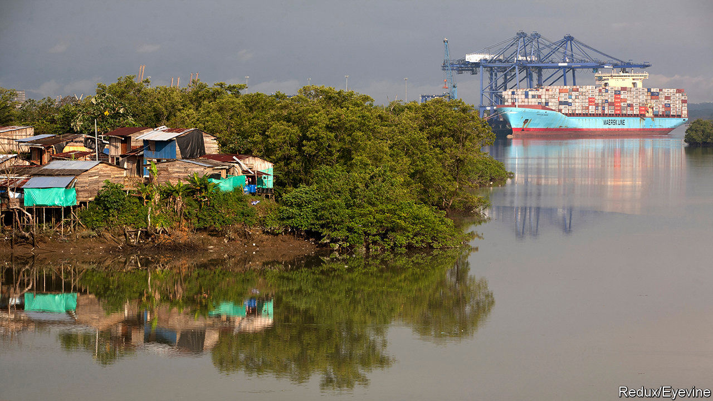
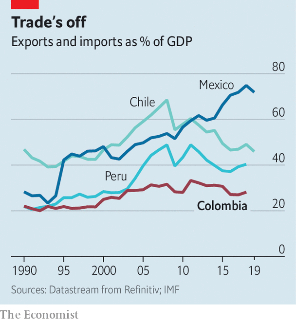

## Wine whinge

# The costs of Colombia’s closed economy

> Importers must run an obstacle course

> Feb 6th 2020CARTAGENA

COLOMBIANS PAY more for wine than most Latin Americans. The price shoots up as soon as a case reaches shore. Each time a shipment arrives, importers must submit at least eight forms to as many agencies. Officials can take up to 15 days to clear it. In the meantime, importers store their bottles in climate-controlled warehouses. When a permit finally comes, bad roads and high trucking charges mean that merchants pay among the highest freight bills in the world to ship the wine to Bogotá, the capital, where most customers are. By the time it reaches a dinner table a bottle of wine costs eight times more than in its country of origin. Its costly journey is the rule, not the exception, for products imported by Colombia.

It used to be easier. The government liberalised the economy in the early 1990s after decades of protectionism. At that time Colombia depended on exports of coffee, the price of which was plummeting. In an effort to diversify the economy and make it more productive, the government reduced tariffs and eliminated lists of items whose import was prohibited.

That openness lasted just a few years. Owners of factories and sugar mills, dairy farmers, rice growers and regional governments, which own distillers of aguardiente, a local tipple, were hurt by competition. They lobbied to restore protection. The government could not reimpose tariffs, in part because of its commitments as a member of the World Trade Organisation. So it put up lots of non-tariff barriers.

Colombia is now as closed as it was in the 1990s, according to a new book*. Total trade has increased fivefold, but the ratio of trade to GDP has not risen much (see chart). Non-tariff measures affect nearly four-fifths of imports, up from 27% in 1992, says the UN Conference on Trade and Development. The government has created new trade-related agencies, and has given existing bodies more power to meddle.

The coddling of domestic producers is one reason why productivity has barely grown since the 1990s. In 2012 farms produced less by value in real terms than they did in 1990. Peru and Chile, which have less variety in their growing conditions but more open economies, have doubled their output over the same period. Pricey imports raise exporters’ costs, making them less competitive.

Ports are suffering. Ships arrive in Buenaventura, the biggest port on the Pacific coast, loaded with containers, but they leave with nothing. Cartagena, on the Caribbean coast, makes its living as a transshipment port, shuffling goods from one ship to another. But that is less profitable than handling exports and imports. Colombia’s “main export is air”, says Anibal Ochoa, the port’s commercial director.

Until now, governments have ignored the costs of Colombia’s closed shop. That is partly because their priority was to defeat the FARC, a guerrilla group that waged a 50-year war against the state. From the early 2000s Colombia earned a decent living from oil and gas, which replaced coffee as the main export. They account for nearly 60% of goods exports.

Now pressure is building to liberalise. A peace agreement in 2016 ended the war. Oil prices fell in 2014 and have yet to recover fully. Reserves are running low. Trade could become the economy’s new engine, says Jorge García, one of the book’s editors.

So far, though, the push to open up has had little support from the top. The government has made some permits easier to apply for, but did not reduce their number or cost. For now, it seems, only rich Colombians will be able to afford wine. Others will drown their sorrows in aguardiente.■

*“Comercio Exterior en Colombia: Política, Instituciones, Costos y Resultados”, edited by Jorge García García, Enrique Montes Uribe, Iader Giraldo Salazar. Banco de la República.

## URL

https://www.economist.com/the-americas/2020/02/06/the-costs-of-colombias-closed-economy
