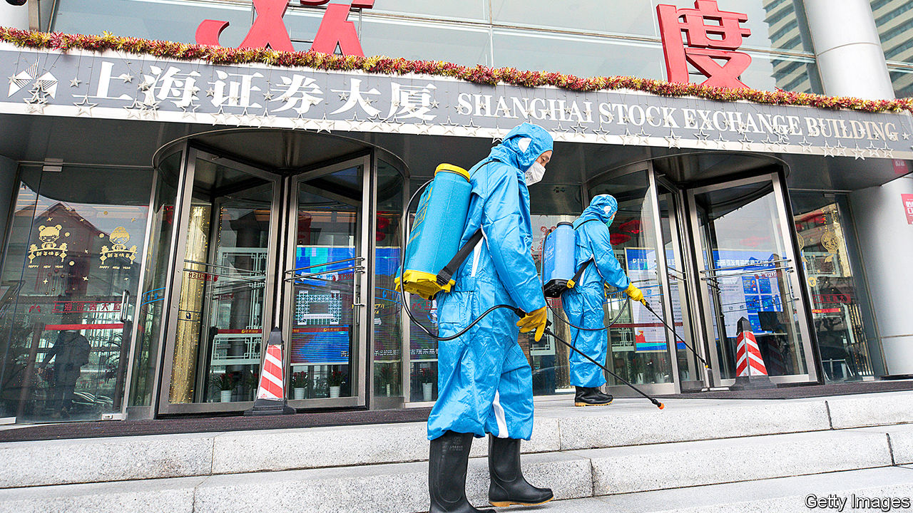

# Business this week

> Feb 8th 2020

The coronavirus crisis in China unnerved the country’s stockmarkets. The CSI index fell by 8% in a day, its worst performance since August 2015, before rebounding somewhat. As an emergency measure China’s central bank injected extra liquidity into the financial system, the biggest such one-day intervention since 2004, and cut some interest rates. Macau closed its casinos for two weeks. See [article](https://www.economist.com//finance-and-economics/2020/02/06/companies-warn-of-an-economic-crisis-as-china-battles-coronavirus).

China is the linchpin in the supply chains of many global manufacturers, but the disruption from the coronavirus lockdown has been most acute in the motor industry. Hyundai halted production at its factories in South Korea because it couldn’t get components from China. Many foreign carmakers in China extended the Chinese new year break and kept their plants closed.

Keeping to one of its pledges in the “phase one” trade deal with America, China’s government said it would cut tariffs on $75bn-worth of American exports. Some said the announcement was timed to cheer the markets. China is also committed to make extensive purchases of American goods under phase one, but that could be difficult amid the coronavirus outbreak.

The price of oil fell sharply, in part because demand from Chinese industry and international airlines is expected to drop because of the Wuhan virus. OPEC and Russia met to discuss emergency cuts to output that could shore up prices.  BP said that the outbreak could reduce projected global growth in oil demand this year by up to 40%.

Along with other international energy companies,  BP reported a plunge in annual income. The company’s headline profit, hurt by lower oil prices, fell by a fifth in 2019, to $10bn. Still,  BP raised its shareholder dividend and said it had completed a share buy-back programme. It was Bob Dudley’s last earnings report as chief executive before handing the reins to Bernard Looney.

Tesla’s share price crashed by 17% on February 5th, bringing an end to a remarkable rally. The carmaker had added more than $40bn to its value over two trading days, taking its market capitalisation to roughly $160bn; Ford is worth less than $40bn on the market. But will the rally resume? See [article](https://www.economist.com//business/2020/02/06/tesla-gains-60bn-in-market-value-in-a-week). 

The British government brought forward a target for a ban on new diesel, hybrid and petrol vehicles from 2040 to 2035. The motor industry slammed the plan as unworkable. SMMT, an industry body, accused the government of moving the goalposts, noting that while new plug-in models are coming to the market, the overall demand for the “expensive technology” still makes up “a fraction of sales”. The government was unable to provide much detail on the cost implications for the industry or taxpayers, simply saying it would result in “a net saving”.

Aston Martin agreed to a rescue deal put forward by a consortium led by Lawrence Stroll, a Canadian businessman. Under the agreement the struggling British sports-car maker will receive a capital injection and issue new shares. Mr Stroll’s Formula One racing team will be rebranded with the Aston Martin name.

Disney+ now has 28.6m subscribers, according to Robert Iger, Disney’s chief executive. That is well above market expectations, less than three months after the streaming service was launched. The cost of rolling out Disney+ has dented profit. Although revenue was up by 36% in the last three months of 2019 compared with the same quarter a year earlier, Disney’s net income was down by 23%.

Tony Fernandes stepped aside as chief executive of  AirAsia for at least two months, after the Malaysian airline was linked to a bribery investigation involving Airbus. Airbus recently settled with Britain’s Serious Fraud Office and regulators in other countries for $4bn. Mr Fernandes, an ebullient entrepreneur, who also owns Queens Park Rangers, a London football club, bought AirAsia in 2001 for 1 ringgit (26 cents) with his business partner, Kamarudin Meranun, who is also standing aside as AirAsia’s chairman. Both men deny wrongdoing.

The American economy grew by 2.3% last year. That was the slowest pace since 2016 but around the annual average since the global financial crisis of 2007-09. An initial estimate found that the euro zone’s GDP grew by 1.2% in 2019, the weakest rate since 2013. See [article](https://www.economist.com//business/2020/02/06/after-a-nervy-year-america-inc-has-a-bounce-in-its-step).

It was a hairy week for the razor industry, as the Federal Trade Commission launched a bid to block the proposed takeover of Harry’s, an online supplier of shaving gear, by Edgewell, which owns the Schick and Wilkinson Sword brands. The FTC described Harry’s as a “uniquely disruptive competitor in the wet shave market” that has broken the duopoly of Edgewell and Procter & Gamble’s Gillette. Harry’s co-founders bristled at the decision; they believe the acquisition should go ahead.

## URL

https://www.economist.com/the-world-this-week/2020/02/08/business-this-week
