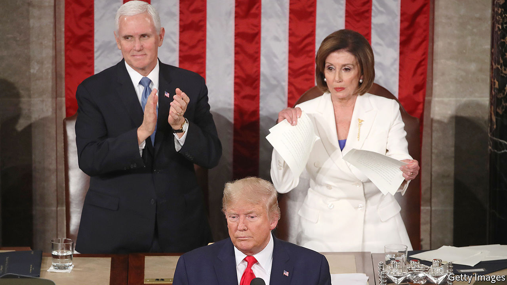

# Politics this week

> Feb 8th 2020

The American Senate acquitted Donald Trump of the impeachment charges laid against him, bringing a swift end to the trial of the president after the Republican leadership decided that no witnesses should be called. Mitt Romney was the only Republican to vote for conviction, denouncing Mr Trump for “an appalling abuse of public trust”. See [article](https://www.economist.com//united-states/2020/02/06/trump-unbound). 

The day before the verdict Mr Trump used his state-of-the-union speech to laud a “great American comeback” under his administration. Congress was in a poisonous mood. Mr Trump refused to shake the hand of Nancy Pelosi, the Democratic Speaker. She ripped up a copy of his speech after he finished speaking.

The Iowa caucuses, the first stage in the race to nominate presidential candidates, were a mess. The state’s Democrats cast their votes for a champion to take on Donald Trump. But owing to a dodgy app and an insanely complex voting system, they struggled to count the results. Both Pete Buttigieg, a bright young moderate, and Bernie Sanders, an ageing socialist, claimed victory. The race now moves on to New Hampshire. See [article](https://www.economist.com//briefing/2020/02/08/the-shambolic-iowa-caucuses-did-little-to-unite-the-democrats). 

The Trump administration added Eritrea, Kyrgyzstan, Myanmar, Nigeria, Sudan and Tanzania to a list of countries from which immigration to the United States is severely curtailed. The restrictions were imposed for failing to meet security criteria. The government said it was confident the countries would make “meaningful improvements” so that the curbs could be lifted.

A tour guide at a Mexican reserve for Monarch butterflies was found dead. Last month the sanctuary’s manager, Homero Gómez, disappeared (see [Obituary](https://www.economist.com//obituary/2020/02/08/homero-gomez-was-apparently-murdered-on-january-13th)). His body was later found in a well. Environmentalists suspect that the two men were murdered by loggers, who operate illegally near the sanctuary in the western state of Michoacán. In a separate incident in the state, nine people were shot dead at an amusement arcade, probably by a drug gang.

A Canadian court rejected a challenge by indigenous groups to the government’s plan to expand the capacity of the Trans Mountain oil pipeline, which stretches from Alberta to the west coast. The court ruled that the government, which owns the existing pipeline, had carried out reasonable consultations with indigenous peoples.

The number of infections and deaths from the Wuhan virus continued to rise. More than 99% of the cases are in China. Several countries, including America and Australia, banned the entry of non-citizens who have recently visited China. Hong Kong announced that visitors from the Chinese mainland would have to undergo quarantine for 14 days; medical workers went on strike, calling for a complete closure of the Hong Kong-mainland border. A Chinese diplomat accused other countries of over-reacting by barring travellers from China. See [here](https://www.economist.com//china/2020/02/06/a-weak-health-care-system-complicates-chinas-coronavirus-battle), [here](https://www.economist.com//china/2020/02/06/the-coronavirus-is-fuelling-tensions-in-protest-racked-hong-kong) and [here](https://www.economist.com//china/2020/02/08/chinas-rulers-see-the-coronavirus-as-a-chance-to-tighten-their-grip). 

India’s government unveiled a budget without any big increase in spending or cut in taxes, dashing investors’ hopes that it might try to stimulate the flagging economy. GDP grew by 4.8% last year, a big drop from 6.8% in 2018.

The vice-president-elect of Taiwan, William Lai Ching-te, said he would attend the National Prayer Breakfast in Washington, DC. He would be the most senior Taiwanese official to visit Washington since America established formal diplomatic relations with China in 1979.

Malawi’s constitutional court nullified last year’s election, saying there had been “systematic and grave” flaws in the process. It is only the second time in African history that judges have overturned an iffy general election. The court ordered that a re-run be held within 150 days. President Peter Mutharika said he would appeal against the ruling. See [here](https://www.economist.com//middle-east-and-africa/2020/02/06/a-historic-day-for-malawis-democracy) and [here](https://www.economist.com//leaders/2020/02/06/a-rigged-vote-is-overturned-in-malawi-why-not-in-congo). 

The wife of Lesotho’s prime minister was charged with murdering his previous wife. Maesaiah Thabane surrendered to police. The prime minister, Thomas Thabane, has also been questioned over the killing, which occurred during a heated divorce.

Daniel arap Moi, Kenya’s former strongman, died at the age of 95. Mr Moi led Kenya from 1978 to 2002, a period of relative stability. But he was also responsible for repression, corruption and ethnic division. See [article](https://www.economist.com//middle-east-and-africa/2020/02/06/the-legacy-of-daniel-arap-moi-still-haunts-kenya). 

Eight Turkish soldiers were killed in the Syrian province of Idlib during shelling by the Syrian army. In response, Turkey claimed to have “neutralised” 76 Syrian troops. Idlib is the last stronghold of the Syrian opposition. Turkey fears that if it falls people will flee over the Turkish border.

Muhammad Tawfiq Allawi, a former communications minister, was named Iraq’s prime minister. Mr Allawi’s predecessor, Adel Abdul-Mahdi, resigned in November amid large anti-government protests during which hundreds of people have been killed.

Iran stopped co-operating with Ukraine’s inquiry into the downing of a Ukrainian passenger jet by an Iranian missile over Tehran last month. The decision was made after Ukrainian TV aired an exchange between Iranian air-traffic control and a stunned pilot who saw the explosion. Iran at first tried to cover up the incident.

Boris Johnson’s government finally pushed Brexit over the line, but events to mark the occasion only underlined the lingering divisions between Leave and Remain supporters. The prime minister’s hope for a Canada-style trade deal was given short shrift, as the European Union signalled that any ambitious agreement would require Britain to commit itself to social and labour protections similar to the EU’s. The pound wobbled. See [article](https://www.economist.com//britain/2020/02/06/the-risk-of-britain-leaving-the-eu-with-no-trade-deal-remains-high). 

The British government set a deadline for the end of February to pass emergency legislation removing the default that convicted terrorists are released after serving half their sentence. This follows the stabbing of two people in London by a jihadist who had just been released. A similar fatal attack last November raised questions about the effectiveness of rehabilitation for violent radicals. Six inmates are due for release in the coming weeks.

A minority administration under the Free Democrats was voted in by the German state of Thuringia, in eastern Germany. For the first time, a state premier took office thanks to support from the xenophobic Alternative for Germany. The vice-chancellor of the federal government said this distasteful alliance threatened to break up the ruling “grand coalition”. See [article](https://www.economist.com//europe/2020/02/06/a-pact-with-the-far-right-in-thuringia-rattles-german-politics). 

## URL

https://www.economist.com/the-world-this-week/2020/02/08/politics-this-week
