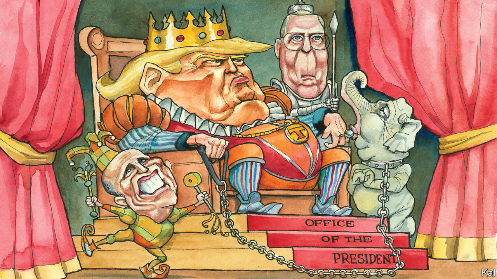

## Lexington

# Trump unbound

> Donald Trump is acquitted by the Senate, adored by his supporters and wholly unrepentant

> Feb 6th 2020

IN ANNOUNCING her decision to vote to acquit Donald Trump this week, Susan Collins said she believed the president had learned a “pretty big lesson” from his impeachment. When next tempted to extort a foreign leader to frame a political rival, the senator from Maine predicted, he would be “much more cautious”. Another view is that, having established Congress’s inability to restrain him, because of the tribalism of Republicans such as Ms Collins, Mr Trump may feel even more emboldened to disregard any rule or convention that stands in the way of his interests. His third state-of-the-union address, delivered to a packed House chamber on the eve of his acquittal on February 4th, offered evidence for that.

Unlike Bill Clinton, who expressed contrition during his mid-impeachment SOTU speech, Mr Trump did not mention his Ukraine scheme or Senate trial it occasioned—which ended in his acquittal on partisan lines the next day: Mitt Romney was the only Republican who voted to convict. Yet he had already repudiated Ms Collins, telling journalists he had nothing to learn, because his approach to President Volodymyr Zelensky was “perfect”. And his SOTU performance underlined that he truly believes this.

For most of American history, the annual presidential report to Congress was delivered by letter, because of Thomas Jefferson’s fear that a live address might seem too kingly. Yet an elected despot, with fawning courtiers and freedom to mingle personal and public interests at will, is what Mr Trump aspires to be. It is what he maintains, in his claim to unbridled executive power and attacks on institutions that would constrain him, it means to be president. On the eve of his party’s final capitulation to Trumpism, his last pre-election SOTU was an enactment of that unAmerican fantasy.

As he entered the chamber, Republicans jostled to shout praise in his ear, touch him, ask him to sign their clothing. At least it was familiar: Democrats drooled over Barack Obama too. The SOTU had become a partisan performance, watched by a president’s supporters and ignored by almost everyone else, before Mr Trump was elected. Yet no recent president has demanded, and received, the fealty that has become a cover for his rule-breaking.

Woodrow Wilson restored the in-person SOTU address with a view to humanising the presidency. Mr Trump uses it to suggest his precedence over not only his party, but all three branches of the government. He snubbed the Democratic Speaker of the House, Nancy Pelosi, refusing to shake her hand (she later responded by ripping up a copy of his speech). He boasted of his efforts to politicise the judiciary, by nominating the “187 new federal judges” his followers are counting on to pass judgments they like. (The smirks of his two Supreme Court appointees, Neil Gorsuch and Brett Kavanaugh, after he named them, probably did more to incite Democratic countermeasures than their elevations.)

Ronald Reagan started the tradition of inviting common folk as SOTU guests to express his modesty and empathy. Mr Trump uses his invitees as props to display beneficence and power. He conferred a surprise scholarship on a poor fourth-grader from Philadelphia, sitting in the gallery. He shocked a service wife by producing her husband, an army sergeant deployed to Afghanistan. He asked his wife Melania to fasten the Presidential Medal of Freedom—then and there!—around the neck of the talk-radio megastar, Rush Limbaugh, cancer-stricken and weeping besides her. Such boons owe less to reality TV than to Medieval kingship.

To what does Mr Trump owe his hold on his supporters? Some Trump defenders urge critics to look beyond the president’s excesses to his achievements. As he noted in his address, the economy is strong. Yet if his record were half as good as his defenders say, why does he misrepresent it so extremely? He claims endless things that are demonstrably false—to have vanquished ISIS though it is resurgent; to have cut the cost of prescription drugs though they have soared; to be guaranteeing health-insurance provisions his administration is suing to dismantle. If his supporters were primarily drawn to Mr Trump by his record, they might be expected to discern the facts from the nonsense; most know he is not honest. Yet, for the sake of political argument at least, they seem to accept whatever he claims. And in so doing they cede Mr Trump a power no other American president has claimed: over truth itself.

The real reason Republicans are so solidly behind Mr Trump is his genius at needling their political resentments and fears—against the liberal media, socialist Democrats, “illegal aliens”. Political scientists call this negative partisanship, and Mr Trump’s SOTU address was a masterclass in it. In the climax of its second half, he mentioned the word “alien” four times; also “socialist takeover”, “brutal rape”, “terror” and “evil”. The frightful language of his partisanship (which he learned from Mr Limbaugh, a fellow disseminator of the racist “birther” slur against the first black president) has helped drive his supporters’ increasing loyalty. Republicans are either scared by the fears he stirs; or having ridden along thus far with Mr Trump’s chauvinism it has become too hard for them to acknowledge. It is no wonder few deserted him over the relatively remote matter of his leaning on Mr Zelensky.

Republicans such as Ms Collins say an election is the only proper means of holding Mr Trump to account. Yet in the grip of their partisan affiliations, few voters will recall Mr Trump’s Ukraine scam next November—and if he wins re-election, will he have a licence to repeat it? Exonerated by the Senate, he may even do worse before then. He has fresh grudges to settle and political cover to do so.

Mr Trump’s sometimes comical strangeness long made the fears of despotism he stirred seem overblown. But think of authoritarianism as a corrosive process, not a dictatorial end-state, and they no longer do. He has never looked more threatening to American democracy. And thanks to Senate Republicans, with one laudable exception, it has never looked more vulnerable to him.■

Dig deeper:Sign up and listen to Checks and Balance, our new [newsletter](https://www.economist.com//checksandbalance/) and [podcast](https://www.economist.com//podcasts/2020/04/24/checks-and-balance-our-weekly-podcast-on-american-politics) on American politics