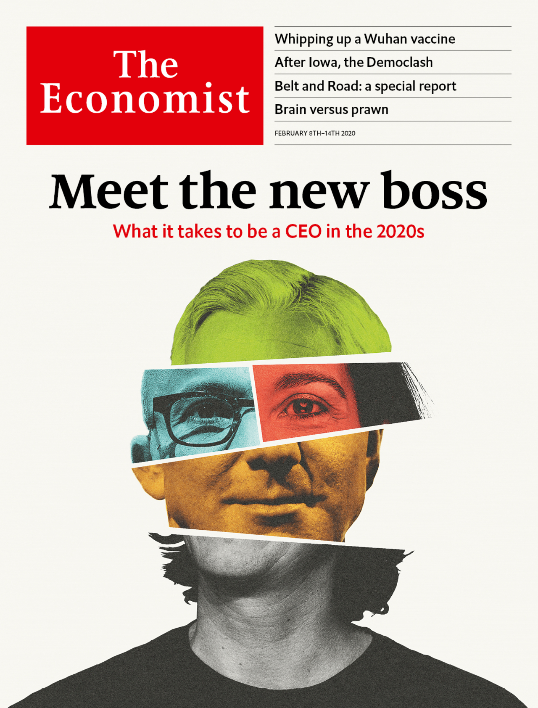

## What it takes to be a CEO in the 2020s

### The world this week
#### [Politics this week](./The%20world%20this%20week/politics-this-week.md)
#### [Business this week](./The%20world%20this%20week/business-this-week.md)
#### [Kals cartoon](./The%20world%20this%20week/kals-cartoon.md)
### Leaders
#### [What it takes to be a ceo in the 2020s](./Leaders/what-it-takes-to-be-a-ceo-in-the-2020s.md)
#### [The democratic primaries will be a contest between radicals and repairers](./Leaders/the-democratic-primaries-will-be-a-contest-between-radicals-and-repairers.md)
#### [Hong kongs economy is in peril but its financial system is not](./Leaders/hong-kongs-economy-is-in-peril-but-its-financial-system-is-not.md)
#### [A rigged vote is overturned in malawi why not in congo](./Leaders/a-rigged-vote-is-overturned-in-malawi-why-not-in-congo.md)
#### [Why hs2 should go ahead](./Leaders/why-hs2-should-go-ahead.md)
### Letters
#### [Letters to the editor](./Letters/letters-to-the-editor.md)
### Briefing
#### [The shambolic iowa caucuses did little to unite the democrats](./Briefing/the-shambolic-iowa-caucuses-did-little-to-unite-the-democrats.md)
#### [Corporate headhunters are more powerful than ever](./Briefing/corporate-headhunters-are-more-powerful-than-ever.md)
### Asia
#### [Indias police are overstretched poorly trained and politicised](./Asia/indias-police-are-overstretched-poorly-trained-and-politicised.md)
#### [How artificial shrimps could change the world](./Asia/how-artificial-shrimps-could-change-the-world.md)
#### [The japanese government wants to build three flashy casinos](./Asia/the-japanese-government-wants-to-build-three-flashy-casinos.md)
#### [How poor pakistanis are tricked into becoming drug mules](./Asia/how-poor-pakistanis-are-tricked-into-becoming-drug-mules.md)
#### [Singaporean ministers can decide what is fake news](./Asia/singaporean-ministers-can-decide-what-is-fake-news.md)
### United States
#### [What donald trump has done with the biggest budget in washington](./United%20States/what-donald-trump-has-done-with-the-biggest-budget-in-washington.md)
#### [Waiting for bernie in new hampshire](./United%20States/waiting-for-bernie-in-new-hampshire.md)
#### [Are test scores the backbone of meritocracy or the nexus of privilege](./United%20States/are-test-scores-the-backbone-of-meritocracy-or-the-nexus-of-privilege.md)
#### [Donald trump threatens to bring his taste to government buildings](./United%20States/donald-trump-threatens-to-bring-his-taste-to-government-buildings.md)
#### [Angelenos are happy to pay for public transport but loth to use it](./United%20States/angelenos-are-happy-to-pay-for-public-transport-but-loth-to-use-it.md)
#### [Trump unbound](./United%20States/trump-unbound.md)
### China
#### [A weak health care system complicates chinas coronavirus battle](./China/a-weak-health-care-system-complicates-chinas-coronavirus-battle.md)
#### [The coronavirus is fuelling tensions in protest racked hong kong](./China/the-coronavirus-is-fuelling-tensions-in-protest-racked-hong-kong.md)
#### [Chinas rulers see the coronavirus as a chance to tighten their grip](./China/chinas-rulers-see-the-coronavirus-as-a-chance-to-tighten-their-grip.md)
### The Americas
#### [Ecuadors trial of the century opens](./The%20Americas/ecuadors-trial-of-the-century-opens.md)
#### [The costs of colombias closed economy](./The%20Americas/the-costs-of-colombias-closed-economy.md)
#### [A share issue in venezuela the worlds worst performing economy](./The%20Americas/a-share-issue-in-venezuela-the-worlds-worst-performing-economy.md)
#### [Latin americas new war of religion](./The%20Americas/latin-americas-new-war-of-religion.md)
### Middle East & Africa
#### [Felix tshisekedi has accomplished little in congo](./Middle%20East%20&%20Africa/felix-tshisekedi-has-accomplished-little-in-congo.md)
#### [The legacy of daniel arap moi still haunts kenya](./Middle%20East%20&%20Africa/the-legacy-of-daniel-arap-moi-still-haunts-kenya.md)
#### [More africans are marrying spouses of different ethnicities](./Middle%20East%20&%20Africa/more-africans-are-marrying-spouses-of-different-ethnicities.md)
#### [A historic day for malawis democracy](./Middle%20East%20&%20Africa/a-historic-day-for-malawis-democracy.md)
#### [The houthi model of government](./Middle%20East%20&%20Africa/the-houthi-model-of-government.md)
### Europe
#### [A pact with the far right in thuringia rattles german politics](./Europe/a-pact-with-the-far-right-in-thuringia-rattles-german-politics.md)
#### [Syrians are putting down roots in turkey](./Europe/syrians-are-putting-down-roots-in-turkey.md)
#### [A museum in russia for a man who never existed](./Europe/a-museum-in-russia-for-a-man-who-never-existed.md)
#### [The rise of sinn fein an irish party that once espoused violence](./Europe/the-rise-of-sinn-fein-an-irish-party-that-once-espoused-violence.md)
#### [Why every norwegian ecowarrior has 200000 petrodollars](./Europe/why-every-norwegian-ecowarrior-has-200000-petrodollars.md)
#### [The parable of the plug](./Europe/the-parable-of-the-plug.md)
### Britain
#### [The risk of britain leaving the eu with no trade deal remains high](./Britain/the-risk-of-britain-leaving-the-eu-with-no-trade-deal-remains-high.md)
#### [Why aristocrats are flocking to the creative arts](./Britain/why-aristocrats-are-flocking-to-the-creative-arts.md)
#### [Hs2 and the return of the fat controller](./Britain/hs2-and-the-return-of-the-fat-controller.md)
#### [How hs2 will transform a forlorn part of london](./Britain/how-hs2-will-transform-a-forlorn-part-of-london.md)
#### [Botched nuclear projects put the future of britains defences at risk](./Britain/botched-nuclear-projects-put-the-future-of-britains-defences-at-risk.md)
#### [British universities are examining how they benefited from slavery](./Britain/british-universities-are-examining-how-they-benefited-from-slavery.md)
#### [Cummings v the blob](./Britain/cummings-v-the-blob.md)
### International
#### [The race to produce a vaccine for the latest coronavirus](./International/the-race-to-produce-a-vaccine-for-the-latest-coronavirus.md)
### Special report
#### [China wants to put itself back at the centre of the world](./Special%20report/china-wants-to-put-itself-back-at-the-centre-of-the-world.md)
#### [Chinese investment in eurasia is not always smooth](./Special%20report/chinese-investment-in-eurasia-is-not-always-smooth.md)
#### [China is making substantial investment in ports and pipelines worldwide](./Special%20report/china-is-making-substantial-investment-in-ports-and-pipelines-worldwide.md)
#### [How the belt and road initiative got its name](./Special%20report/how-the-belt-and-road-initiative-got-its-name.md)
#### [The digital side of the belt and road initiative is growing](./Special%20report/the-digital-side-of-the-belt-and-road-initiative-is-growing.md)
#### [Will china sit again at the heart of its own cosmos](./Special%20report/will-china-sit-again-at-the-heart-of-its-own-cosmos.md)
#### [Sources and acknowledgments](./Special%20report/sources-and-acknowledgments.md)
### Business
#### [After a nervy year america inc has a bounce in its step](./Business/after-a-nervy-year-america-inc-has-a-bounce-in-its-step.md)
#### [Tesla gains 60bn in market value in a week](./Business/tesla-gains-60bn-in-market-value-in-a-week.md)
#### [Talk of succession atop big tech grows louder](./Business/talk-of-succession-atop-big-tech-grows-louder.md)
#### [How modern workers are at the mercy of ratings](./Business/how-modern-workers-are-at-the-mercy-of-ratings.md)
#### [Gold companies try to restore their sparkle](./Business/gold-companies-try-to-restore-their-sparkle.md)
#### [Why indias annual budget is a powerful market force](./Business/why-indias-annual-budget-is-a-powerful-market-force.md)
#### [Away from the headlines defence is boeings next problem](./Business/away-from-the-headlines-defence-is-boeings-next-problem.md)
### Finance and economics
#### [Just how stable is hong kongs economy](./Finance%20and%20economics/just-how-stable-is-hong-kongs-economy.md)
#### [Companies warn of an economic crisis as china battles coronavirus](./Finance%20and%20economics/companies-warn-of-an-economic-crisis-as-china-battles-coronavirus.md)
#### [What the coronavirus means for financial markets](./Finance%20and%20economics/what-the-coronavirus-means-for-financial-markets.md)
#### [Traders lose interest in americas jobs report](./Finance%20and%20economics/traders-lose-interest-in-americas-jobs-report.md)
#### [Why intercontinental exchange wants to buy ebay](./Finance%20and%20economics/why-intercontinental-exchange-wants-to-buy-ebay.md)
#### [Ujjivan is a rare bright spot in indian finance](./Finance%20and%20economics/ujjivan-is-a-rare-bright-spot-in-indian-finance.md)
#### [The culture wars between economists and markets practitioners](./Finance%20and%20economics/the-culture-wars-between-economists-and-markets-practitioners.md)
#### [Economists discover the power of social norms](./Finance%20and%20economics/economists-discover-the-power-of-social-norms.md)
### Science & technology
#### [Using artificial intelligence agricultural robots are on the rise](./Science%20&%20technology/using-artificial-intelligence-agricultural-robots-are-on-the-rise.md)
#### [Scientists reveal the most extensive genetic map of cancers ever made](./Science%20&%20technology/scientists-reveal-the-most-extensive-genetic-map-of-cancers-ever-made.md)
#### [Growing up in a city weakens the brains navigational skills](./Science%20&%20technology/growing-up-in-a-city-weakens-the-brains-navigational-skills.md)
### Books & arts
#### [A new wave of french films tackle social problems and taboos](./Books%20&%20arts/a-new-wave-of-french-films-tackle-social-problems-and-taboos.md)
#### [The temptations of tolstoy on the page and in the flesh](./Books%20&%20arts/the-temptations-of-tolstoy-on-the-page-and-in-the-flesh.md)
#### [How seed rustling in iowa fed american fears of china](./Books%20&%20arts/how-seed-rustling-in-iowa-fed-american-fears-of-china.md)
#### [A mystery that uncovers the underside of modern india](./Books%20&%20arts/a-mystery-that-uncovers-the-underside-of-modern-india.md)
#### [The destruction of dresden the florence of the elbe](./Books%20&%20arts/the-destruction-of-dresden-the-florence-of-the-elbe.md)
### Economic and financial indicators
#### [Economic data commodities and markets](./Economic%20and%20financial%20indicators/economic-data-commodities-and-markets.md)
### Graphic detail
#### [Data from spotify suggest that listeners are gloomiest in february](./Graphic%20detail/data-from-spotify-suggest-that-listeners-are-gloomiest-in-february.md)
### Obituary
#### [Homero gomez was apparently murdered on january 13th](./Obituary/homero-gomez-was-apparently-murdered-on-january-13th.md)
