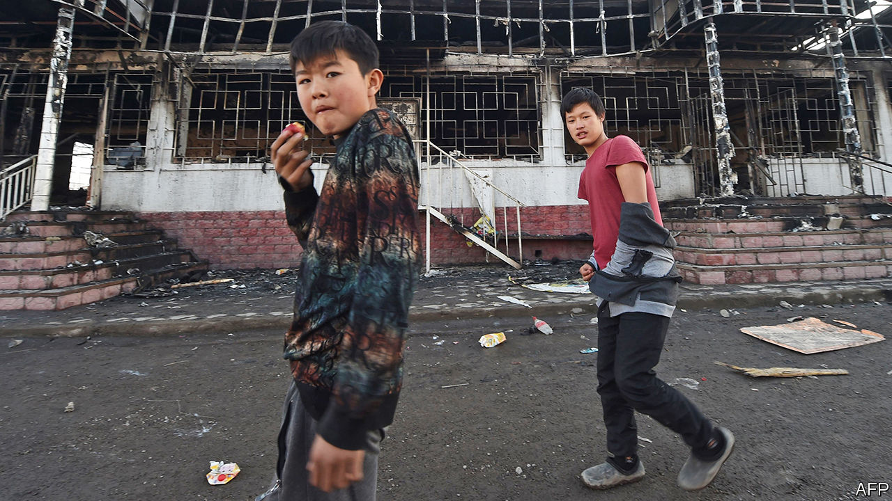

## Fire and fury

# An ethnically motivated attack alarms multi-ethnic Kazakhstan

> A Kazakh mob has attacked Dungans, a minority group of Chinese origin

> Feb 13th 2020MASANCHI

IN A BUCOLIC setting, fringed by the snow-cloaked mountains of south-eastern Kazakhstan, lie two adjoining villages separated by a field of bleating fat-tailed sheep. This week the ethnic Kazakhs of Qarakemer were going about their business as usual, a man trotting down the main street on a horse, children lugging milk home in pails. Their neighbours in Masanchi, a ten-minute walk away, were contemplating a scene of devastation. A distraught villager whose shop had been torched in a mob attack over the weekend gestured at two intact businesses among the charred ruins lining the main street. “Look at that shop, and that one,” he said. “Their owners are Kazakh. They didn’t touch them. Only the Dungans’ shops.”

On the night of February 7th Kazakhs armed with hunting rifles, iron bars, sticks and stones went on the rampage in Masanchi and nearby villages inhabited by Dungans—Muslims of Chinese descent, who have lived in Kazakhstan for centuries but number just 72,000, or 0.4% of the population. The spark for the violence seems to have been a row between drivers about who had the right of way. A rumour spread that Dungans had attacked an old Kazakh man. The attackers beat and shot Dungan villagers and set fire to homes and businesses. Ten people—nine Dungans, one Kazakh—were killed; 178 were wounded, including 19 police officers. Some 24,000 people fled to nearby Kyrgyzstan seeking refuge, although many have since returned.

Such savagery is rare in Kazakhstan, which considers itself a model of ethnic harmony. It is home to more than 100 different minorities. Nursultan Nazarbayev, the president from independence in 1991 until his resignation last year, who still pulls the political strings, decreed this bewildering ethnic mix to be an essential part of the national identity. His intention was to reassure ethnic Russians, in particular, who in 1991 were almost 40% of the population (nowadays they are less than 20%). His laudably inclusive stance helped ward off ethnic strife—no small thing in Central Asia. Hundreds died in communal clashes in Kyrgyzstan in 2010, for instance.

But the ostrich-like taboo on discussing ethnic tensions has not made them disappear. Some Kazakhs, conscious that in Soviet times they became a minority within their own country, feel that they should now be pre-eminent. Minorities, naturally, fear a surge in Kazakh nationalism, especially since Mr Nazarbayev’s semi-retirement has introduced an element of uncertainty into politics.

Kassym-Jomart Tokayev, Mr Nazarbayev’s successor, has reacted forcefully, promising that those guilty of mob violence will be punished and denouncing “criminals” who “shout pseudo-patriotic slogans”. Yet most of the 90-odd suspects arrested during the rampage have been released without charge, and the authorities will not say how many remain in custody. Keeping both Kazakhs and minorities happy while dispensing something that resembles justice will not be an easy task. ■