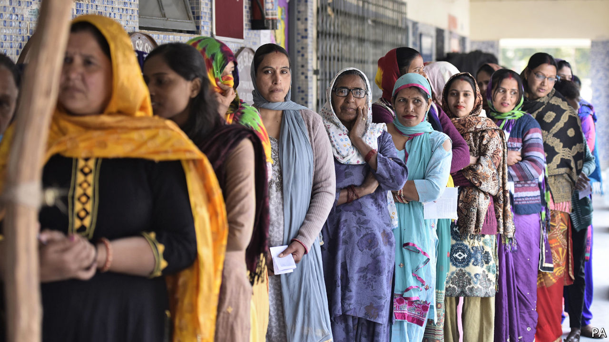

## Capital loss

# India’s ruling party receives a drubbing in Delhi

> Voters seem to have disliked the BJP’s nakedly sectarian campaign

> Feb 13th 2020DELHI

IN MAY Narendra Modi won a triumphant second term as India’s prime minister, with a thumping majority in the Lok Sabha, the lower house of parliament. His Hindu nationalist Bharatiya Janata Party (BJP) did especially well in Delhi. It grabbed all seven of the National Capital Territory’s parliamentary seats. Yet just nine months later, in elections to the territory’s assembly on February 11th, the BJP won a scant eight out of its 70 seats.

This drubbing may be dismissed as a small dent in the Modi juggernaut. Delhi’s 20m people are less than 2% of India’s population, and the party that thrashed the BJP is politically irrelevant beyond the city limits. Even so, the vote represented an early plebiscite, in a part of the country where the BJP has deep roots, on the divisive social policies Mr Modi has adopted in his second term, as well as on his handling of an increasingly shaky economy. It also represented a test for a new, more aggressive style of campaigning. At the hustings the BJP dropped any pretence of inclusivity, engaging instead in one of the loudest and ugliest displays of sectarian bigotry ever witnessed in Indian politics.

There are two obvious explanations for the party’s slide. The one Mr Modi might prefer is that Delhi’s voters draw an unusually stark distinction between national and local elections. There is much truth to this. The local Aam Aadmi Party (AAP), a newish political force that grew out of an anti-corruption movement and has run the city since 2015, has cleaned up schools, built hundreds of affordable local health centres and curtailed petty graft. The image it projects is of folksy modesty with a social conscience. But the AAP’s symbol, a broom, suggests better housekeeping. It does not inspire voters, as Mr Modi does, with visions of national grandeur.

The last time Delhi-wallahs voted for their local assembly, in 2015, the AAP did even better, taking 67 out of 70 seats, again just months after the BJP had snatched all seven of the city’s parliamentary seats. And it is true that despite its failure to increase its seat tally substantially in this week’s election, the BJP did boost its vote share, from just 32% to 39%. The AAP’s share remained much the same, at 54%.

Yet a world of difference separates the two Delhi polls. In 2015 Mr Modi’s party was also relatively fresh and inexperienced. Now it is a behemoth. Not only does the BJP enjoy the lion’s share of political funding and command a pack of gleefully partisan television stations. Its control of central ministries gives it bullying rights over such crucial institutions as the Delhi police and the national election commission.

That the BJP lost despite these advantages suggests that at least some weight should be given to the other explanation for its poor showing: many voters were put off by its campaign. The contest took place against a backdrop of broad national unrest. This was precipitated by new citizenship rules that many Indians, especially minorities, fear will ultimately strip them of rights and erode the secular principle of equality before the law. Among many forms of protest, one particularly noisy challenge has been mounted by hundreds of women in Shaheen Bagh, a working-class, largely Muslim neighbourhood of Delhi, who since mid-December have occupied a busy thoroughfare, refusing to move until Mr Modi backs down. Thousands of others have joined their round-the-clock vigil, turning it into a carnival of opprobrium that has spawned scores of copycat sit-ins across the country.

In its campaign the BJP strove to depict Shaheen Bagh’s mothers and housewives as dangerous incubators of treachery and terrorism. “This fire can anytime reach the households of Delhi,” fulminated Parvesh Verma, one of the party’s MPS. “These people will enter your house, will abduct your sisters and mothers, rape them, kill them!” Mr Verma even screeched that Arvind Kejriwal, the bespectacled, cardigan-wearing former tax inspector who heads the AAP, was a dangerous terrorist. Another MP, the junior minister of finance, whipped a rally into a frenzy against the prime minister’s critics, leading the crowd to chant, “Shoot the bastards! Shoot the bastards!”

Such excesses sparked little adverse comment from the fawning television channels that dominate Hindi-language broadcasting. When the dismal results began pouring in, these outlets tried to explain them away. Commenting on the BJP’s defeat, Sudhir Chaudhary, an anchor on Zee TV, launched a tirade against the voters of Delhi, implying that they were somehow paving the way for the Muslim minority to take over the country, as Muslim invaders did centuries ago. “They do not care that Mughal rule will return…nor are they worried that the country will break up,” he lamented. “The people of Delhi are completely caught up in their daily lives and don’t care two hoots for what happens to the rest of the country.” Mr Chaudhary has it backwards. If the rest of India was watching the BJP’s effort to pump up sectarian fury in Delhi, it might conclude that it was the ruling party that was trying to break up the country. ■