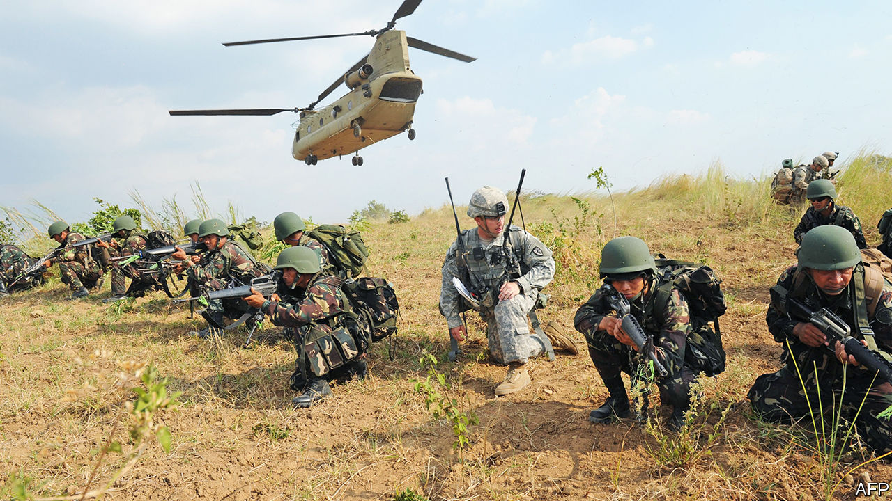

## A treaty for a visa

# The Philippines tears up a defence pact with America

> President Rodrigo Duterte has finally acted on his anti-American rhetoric

> Feb 13th 2020MANILA

SINCE HE BECAME president in 2016, Rodrigo Duterte has talked loudly and often about his disdain for America, which is a former colonial power in the Philippines. But never before have his grievances translated into action. On February 11th he cancelled the Visiting Forces Agreement (VFA), a military pact between the two countries that enabled American troops to participate in joint exercises in the Philippines. The American embassy in Manila declared the decision “a serious step with significant implications for the US-Philippines alliance”.

It also has implications for the region’s security. The VFA adds practical weight to the two countries’ mutual defence pact, which remains in force. Scrapping it might encourage adventurism from South-East Asia’s jihadists (which worries Mr Duterte) and China (which may not). In 2017, when fighters allied to Islamic State captured the centre of the southern city of Marawi, Philippine forces expelled them with the help of intelligence gathered by American soldiers. By the same token, Philippine and American forces have conducted joint exercises in the South China Sea, where China’s expansive claims overlap with the Philippines’. The cancellation of the VFA imperils such co-operation.

“It’s about time we rely on our own resources,” explained Salvador Panelo, the president’s spokesman. “We have to strengthen our own capability as a country relative to the defence of our land.” But there is another explanation: Senator Ronald dela Rosa, a former national police chief who led Mr Duterte’s bloody war on drugs, was recently barred from visiting America. Mr Duterte had threatened to cancel the VFA in retaliation. In January he also banned members of his cabinet from travelling to America. Whether Mr Duterte really intends a strategic pivot to China, or is simply unpredictably irascible, remains as opaque as ever.

## URL

https://www.economist.com/asia/2020/02/13/the-philippines-tears-up-a-defence-pact-with-america
