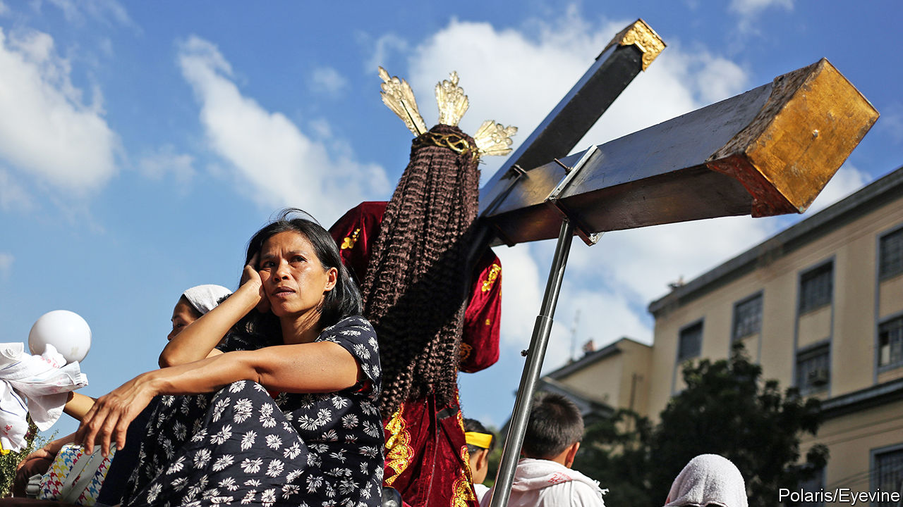

## Papal power

# Why the Philippines is the only country where divorce is illegal

> Except the Vatican, of course

> Feb 13th 2020MANILA

“YOU HAVE to lose before you can win,” explains Jesus Falcis. He is referring to the Supreme Court’s decision to dismiss, on procedural grounds, a petition he filed in 2015 challenging a law which proclaims that marriage can occur only between a man and a woman. Mr Falcis finds a silver lining in the fact that the judges did not see any obvious constitutional impediment to same-sex marriage. But he has little doubt that the effort to secure it will take decades, just as it did in rich countries.

Even by the standards of former Spanish colonies, the Philippines has extremely socially conservative laws. It is the only country in world, bar the Vatican City, to outlaw divorce (except for Muslims). The only way of ending a marriage, short of dying, is to have it annulled, but that can be done only on narrow grounds and at great expense. Abortion is illegal, too, and anyone undergoing or performing one risks up to six years in prison. Contraceptives, although not banned, are the subject of fierce legal battles, as opponents try to prevent the state from distributing them.

This is not simply a legacy of colonialism or a reflection of Filipinos’ piety. Compared with Mexico, say, another country long ruled by Spain where four-fifths of the population considers itself Catholic, the Philippines is uptight. A constitutional amendment and new laws adopted in 1974 guaranteed Mexicans’ access to contraception. Mexico City legalised civil unions for same-sex couples in 2006 and abortion in 2007. A further 17 Mexican states have since legalised gay marriage.

Moreover, Filipinos seem less conservative than the laws that govern them. More than half think divorce should be legal, according to surveys conducted in 2017 by Social Weather Stations (SWS), a pollster. Seven in ten support a law allowing the government to distribute contraceptives to the poor, which was enacted in 2012 but has yet to be implemented fully. Lots of Filipinos are openly gay. Manila’s annual gay pride parade attracted 70,000 participants last year, despite rain. Gay Filipinos enjoy success in all manner of careers, from music to sports. In 2016 a transgender woman won election to Congress. Last year she was re-elected with 91% of the vote.

So why are Filipinos’ views so poorly represented in national legislation? The explanation lies in an unfortunate mix of politics and faith. About three-quarters of Filipinos consider religion “very important”, SWS found in 2018. A study the same year suggests that almost four in ten voters are likely to cast their ballots for a candidate endorsed by their church or religious movement.

In recent years the clout of the Catholic church has diminished somewhat. The share of Catholics attending church weekly has dropped from 66% in 1991 to 46% in 2017. Father Jerome Secillano of the Catholic Bishops’ Conference of the Philippines worries that an erosion of traditional values is under way. The church has struggled to respond to the wild popularity of President Rodrigo Duterte, who has called God “stupid”, the Pope “a son of a whore” and says that a priest molested him as a boy. The Catholic hierarchy has opposed Mr Duterte’s signature policy, a war on drugs that involves cops shooting thousands of suspected dealers, to little avail.

But Catholics’ declining influence over politics has been offset by the growing importance of various Protestant sects. Although only about 10% of Filipinos, or roughly 10m people, describe themselves as Protestants or evangelicals, their relative fervour makes them a political lobby to be reckoned with. They tend to espouse a literal interpretation of the Bible and so are fiercely opposed to divorce, same-sex marriage and abortion, says Jayeel Serrano Cornelio of Ateneo de Manila University.

The most influential movements, which took hold in the late 1970s and 1980s, include Jesus Is Lord, perhaps the country’s largest evangelical movement, as well as the megachurches Victory Christian Fellowship and Christ’s Commission Fellowship. Iglesia Ni Cristo, an indigenous Christian movement founded more than a century ago, also has around 2m adherents in the Philippines. It owns the biggest indoor arena in the world, located near Manila, where 55,000 people can worship at the same time.

Whereas Catholic prelates have become more reluctant to hector politicians, evangelicals often mix religion and politics without compunction. Eddie Villanueva, for example, a deputy speaker of the House of Representatives, is also a prominent television evangelist and the founder of Jesus Is Lord. Manny Pacquiao, who parlayed a career as a boxer into a seat in the Senate, is famous for his zealotry. He has called people in same-sex relationships “worse than animals”.

The nature of the Philippine political system allows such conservatives to thwart liberal reforms fairly easily. Parties are weak, which makes it difficult to build momentum for controversial causes. And the Senate, which must approve all bills before they become law, presents an especially daunting obstacle. Its 24 members are elected in brutally competitive elections from a single, nationwide constituency. Mobilising votes across a country of 106m people is a huge undertaking, making it unwise for candidates to alienate any big, influential group. Small wonder that the opening of a museum dedicated to Iglesia Ni Cristo in September drew no fewer than half the country’s senators. Even the body’s wealthiest member, Cynthia Villar, decided she could not miss it.

Fierce religious opposition helped to delay by 13 years the passage of the law allowing the government to distribute contraceptives. Even after it passed, Congress refused to fund it adequately, leaving many poor Filipinos without access to modern birth control. The Catholic church, meanwhile, persuaded the courts to issue an order to restrict the sorts of contraception that could be provided under the law, on the grounds that some methods were tantamount to abortion.

The ongoing battle bodes ill for the bill to legalise divorce that is currently under consideration in Congress. Mr Duterte’s own marriage was annulled, after a court found he was so prone to affairs that his wife of 27 years had only been a nominal one. Yet so strong is the religious opposition to the bill that not even Mr Duterte supports it. Nonetheless, argues Carlos Conde of Human Rights Watch, a pressure group, the continuing attempts to introduce liberal bills despite their small chances of success are an encouraging sign in themselves. ■

## URL

https://www.economist.com/asia/2020/02/13/why-the-philippines-is-the-only-country-where-divorce-is-illegal
