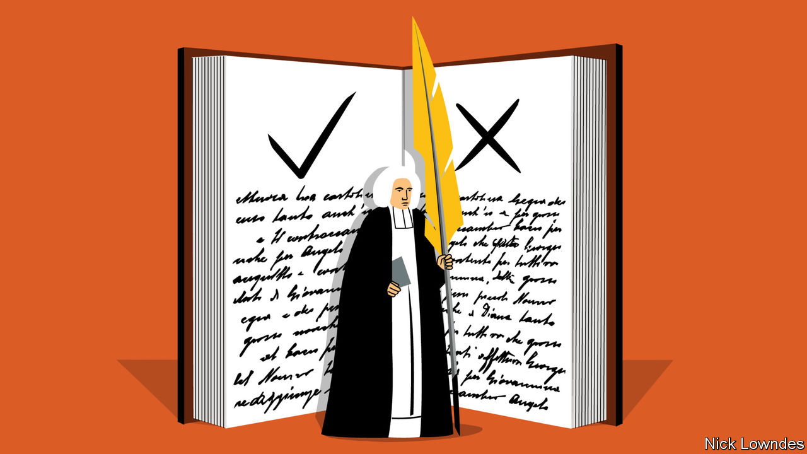

## Johnson

# The original sins of grammarians still plague the rulebooks

> You may not have heard of Robert Lowth. But his prejudices still hold sway

> Feb 13th 2020

WHERE DO THE rules of grammar come from? Even those who care about the subject rarely, if ever, ask that question. The rules are simply the rules, passed down in good grammar books. But who wrote the first one, and how?

If field linguists study an isolated group to write the first grammar of their language, it will be purely descriptive. They will find out what the natives say, what patterns they use (and avoid), and describe them. But most English-speakers have a notion that grammar cannot be just a description of the habits of ordinary people. Many think of proper grammar as a lofty goal that they may never quite reach. Much of that has to do with the way the first grammars of English were written.

In the mid-18th century there were few studies of English grammar, and none was comprehensive or authoritative. Furthermore, the first major grammarians of English were working before modern linguistic methods—based on evidence and comparison—had evolved. They used a combination of logic, Latin analogies and their own instincts. Unfortunately, some of the missteps they made as a result still hold sway. The now obscure but once feted contribution of Robert Lowth (1710-87) is a case in point.

Lowth’s importance to grammar can be compared to Samuel Johnson’s to lexicography. The two men were contemporaries; Johnson’s dictionary appeared in 1755, Lowth’s “Short Introduction to English Grammar” in 1762. Both would go on to be widely imitated, even copied. Today, Johnson is a household name, whereas Lowth’s is confined to nerdish circles. But his role in the development of English grammar rules means that he should be better known.

His grammar was cannily marketed, says Ingrid Tieken-Boon van Ostade, a Dutch linguist. Its print-run was unprecedented. One reader, William Cobbett, is said to have learned its text by heart, and would himself go on to write a popular grammar in 1818. Another follower, Lindley Murray, plagiarised it shamelessly; his own grammar was a runaway bestseller in both Britain and America. These disciples greatly magnified Lowth’s legacy.

Today academic linguists condemn him twice over: for being a scold, and for getting his scolding wrong. Lowth is considered responsible for some of the hoariest non-rules of the English language—proscriptions that were invalid even when he wrote them, but which have nonetheless been imposed on schoolchildren since. The most famous is the injunction not to end a sentence with a preposition. Another is the notion that two negatives equal a positive, so that “He didn’t say nothing” means “He said something.” A third is that “whose” cannot be used with reference to an inanimate noun, as in “an idea whose time has come”.

All these “incorrect” usages were in rude health among fine English authors in the centuries before Lowth. But he thought even the best authors were often wrong; he copiously cites mistakes (and “mistakes”) that he identified in the King James Bible, Swift, Addison, Dryden, Milton, Pope and Shakespeare.

For all that, the charges against him are overdone. Lowth did not say sentences should never end in a preposition; he said it was more elegant if they didn’t. (Dryden said as much before him.) As for the double negative, he acknowledged it had once been respectable. Ms Tieken-Boon van Ostade says it was already on its way out of standard English earlier in the 18th century, so Lowth’s role was probably not decisive. He is sometimes blamed for the (completely baseless) prohibition of the split infinitive—but he said nothing about it. And though he did make analogies with Latin, he also wrote that English “has little concern” with “the rules of a foreign language”.

In the 19th century philologists made great discoveries about the nature of language, mainly by studying systemic, historical change in European tongues. But the popular market went in a different direction—towards rigid dictums rather than open-minded empiricism. The ambitious middle classes demanded books that told them what to do, memorisable strictures with no exceptions. And the market provided them: Lowth’s followers took his often subtle suggestions and turned them into rigid rules, often with added disdain for those who were not familiar with them. Today, the gulf between professional linguistics and practical advice is wide, as if biologists understood the germ theory of disease but bedside doctors still believed in the four humours.