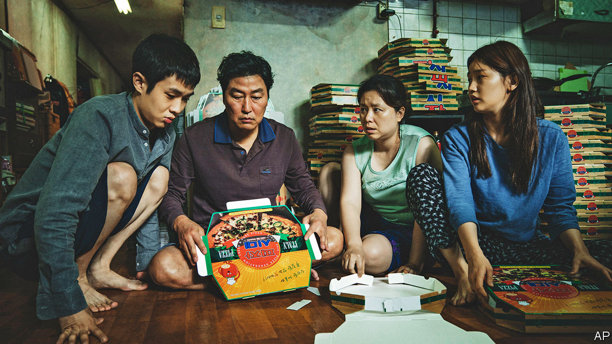

## Creepy crawlies

# The Oscars triumph of “Parasite”

> And of its director, Bong Joon-ho, a persona non grata turned national hero

> Feb 13th 2020SEOUL

HALFWAY THROUGH “Parasite”, the Kims (pictured), a family of grifters who live in a dank Seoul basement, have by hook and (mostly) crook wangled their way into jobs in the ultrachic mansion of the Parks. Twisty as the plot has already been, viewers know more surprises must be in store—but can scarcely imagine what they will be. The screwball shifts in tone somehow cohere into a biting parable of haves and have-nots. On February 9th this South Korean farce became the first foreign-language film to be crowned Best Picture at the Academy Awards. It also took Best Screenplay, Best International Feature Film and Best Director, for Bong Joon-ho.

“Once you overcome the one-inch tall barrier of subtitles,” Mr Bong has observed, “you will be introduced to many more amazing films.” The success of “Parasite” has been seen as a harbinger of the rise of global cinema in the Anglophone world, and of South Korea’s rich film industry in particular. Perhaps—but, even more than usual, it is a triumph for Mr Bong, who has completed a high-speed journey from subversive extremist to national hero. During the administration of Park Geun-hye, from 2013 to 2017, officials kept tabs on him because of his politics; state funding was unavailable for his work. Being blacklisted in this way, Mr Bong said just three years ago, was a “nightmare”. On February 10th he received a warm congratulatory message from Moon Jae-in, the president today.

His rehabilitation chimes with political changes in South Korea. Ms Park’s lieutenants considered Mr Bong’s films—which include “Memories of Murder”, “Mother” and “Okja”—unacceptably disrespectful of the state; more than 9,000 other artists and writers, many less able to support themselves, got the same treatment. (Mr Bong’s English-language sci-fi flick, “Snowpiercer”, faced a different problem in America: Harvey Weinstein’s distribution firm restricted its release when Mr Bong refused to make the cuts Mr Weinstein wanted.) In the end, the cultural McCarthyism did not help its enforcers. A newspaper revealed the existence of the blacklist in 2016; the resulting outrage contributed to Ms Park’s impeachment and eventual imprisonment for corruption and abuse of power, and the election of Mr Moon.

Some conservatives are still wary of Mr Bong, whose work criticises capitalism and social hierarchies. But despite its themes of inequality and class resentment, South Koreans’ jubilation over “Parasite” transcended politics. The many who had been breathlessly following the Oscars ceremony erupted in pride when the best-picture envelope was opened. Cinemas swiftly added new screenings for the few laggards who had not yet seen the film (more than 10m tickets were sold when it was shown in South Korea last summer). A pizza joint and supermarket that feature in the story were overrun by reporters. The municipal government promoted tours of the film’s locations, including a grimy underpass.

Little good the enthusiasm will do the city’s strugglers—at least, if “Parasite” itself is any guide. Nothing avails the Kims, neither crime nor (when they try it) going straight. Still, for all its fatalism, part of the appeal of Mr Bong’s zany movie is that it is never simplistic. The Kims aren’t saints, and the Parks are more blithe than villainous; they just cannot help noticing the odour that seems to emanate from the servants. If audiences stop to think about it, the grisly denouement is only a slight inflection of a reality in which, sometimes, the poorest are left to feed on scraps. ■