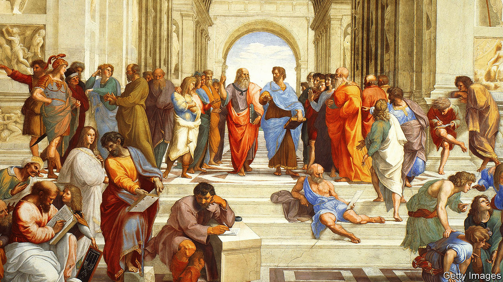

## Too much of a good thing

# Why an excess of democracy can lead to poor decisions

> Cutting back on people power can be beneficial, thinks Garett Jones

> Feb 13th 2020

10% Less Democracy: Why You Should Trust Elites A Little More and the Masses A Little Less. By Garett Jones.Stanford University Press; 248 pages; $28 and £22.99.

GARETT JONES, an economics professor at George Mason University in Virginia, knew he was on to a good thing when he got a call from the campus police. A student journalist had written a report on a lecture that he had given suggesting that rich countries would be better off if they were less, rather than more, democratic. The hostile reaction, which spread beyond the university, included a call threatening enough to trouble the university’s private security force. Mr Jones concluded that he had an idea powerful and contentious enough to make into a book. The result is “10% Less Democracy”.

This is a fertile time for critiques of democracy. In light of the use of state apparatus by elected leaders to undermine an opponent in America, murder people in the Philippines, render a religious minority stateless in India, threaten judicial independence in Poland, and rob the public purse in South Africa, the system which has long provided the rich world with a satisfying mix of moral superiority and stable government is looking a bit ropy. A report last month from the Centre for the Future of Democracy at Cambridge University found that support for democracy had declined sharply in most of the world since the 1990s, including in America and western and southern Europe. The world’s biggest autocracy, meanwhile, is bringing prosperity to its own population and extending its influence round the world.

But as Mr Jones discovered, criticising democracy in the West is still a bit like launching a broadside against the pope in 15th-century Europe—or against a modern-day authoritarian president. You can suggest that all is not going to plan, but you will get a friendlier reception if you pin the blame on dodgy advisers or foreign interference, rather than on the concept itself.

David Runciman’s recent “How Democracy Ends” attributed democracy’s woes to decadence. The system was healthier, he argued, when change or conflict—the expansion of the franchise in the first half of the 20th century, the second world war—had given it a shot in the arm. Pankaj Mishra, in “Age of Anger”, maintained that the problem lies in the growing gap between a political system that promises equality and an economic one that leads to inequality.

By contrast, Mr Jones plants responsibility squarely on the shoulders of the voters. As an economist, he approaches democracy as a production system whose output is governance, and examines how it can be tweaked to improve the product. The core of “10% Less Democracy” is thus research on whether more or less democracy produces better or worse outcomes for countries and citizens.

As the title suggests, Mr Jones’s critique operates within a narrow band. He concedes that massacres and famines are less likely to happen in democracies than in autocracies, and that there is a clear correlation between democracy and prosperity. But he takes issue with Daron Acemoglu’s claim, in the title of a paper published last year, that “Democracy Does Cause Growth”. The paper found that when undemocratic countries became democratic, they grew faster, raising GDP per head by an average of 20% in the long run.

But democracy, Mr Jones points out, is not like virginity: countries can be a bit more or a bit less democratic. No modern country, not even Switzerland, is as insanely democratic as ancient Athens, where citizens voted to recall their military leaders from Sparta. All democracies limit popular participation in collective decision-making, be it by handing over responsibility to elected representatives to make big decisions, or by appointing judges and other public servants. Mr Jones believes that, because people do not always vote for what is good for them, those countries that have made it to the top quartile of the democracy scale should set slightly tighter limits.

A study by Alberto Alesina and Lawrence Summers in 1993, for instance, showed that inflation was lower in countries with independent central banks. There was no cost in terms of growth or employment; it was a free lunch. The trick was simply to hand over responsibility for the money supply to an official who had no interest in using it to boost growth in the run-up to elections. (In the best—or only—joke about central bankers, a student visits his former professor, who has become one. The phone rings. “No…no…no…no…yes…no…no,” says the central banker. Hanging up, he explains that the caller was the finance minister. “What did you answer ‘yes’ to?” wonders the student. “He asked if I could hear him.”)

Likewise, regulators’ backbones are stiffened by independence. A study in Europe showed that the less dependent on politicians they are, the more likely they are to stand up to government-owned utilities. Free trade, too, benefits when farther from democracy. The closer politicians are to an election year, the less likely they are to vote for measures to liberalise trade.

In America, which has historically been devoted to democracy, all sorts of officials are elected. State-by-state variations allow comparison of their performance with the appointed type. It turns out that elected judges make worse judgments and elected city treasurers cost their taxpayers more (though not many are as improvident as the man who consulted a psychic to help him manage the voters’ money—and eventually bankrupted Orange County).

Mr Jones musters plenty of convincing evidence that fewer elections and more distance between voters and decisions make for better governance. But he stretches the argument for limiting democracy far beyond that observation. He is attracted by the idea of “epistocracy”, or rule by clever people; he advocates giving an official role in decision-making to bondholders, who already constrain governments’ freedom by raising the costs of lending to badly managed countries.

These arguments expose the flaw at the centre of this interesting and enjoyable book. Mr Jones looks at democracy as an economic system. But for most people, democracy’s moral component is also essential. It is an expression of the belief that everybody is equal in the sight of God or the presence of the ballot box, and that a country’s people should have power over their government. Less democracy may mean more sensible outcomes, but it also means less legitimacy.

Recent events illustrate that point. Hong Kong is in many ways a splendidly governed place, with reliable social order and a thriving economy—and very limited democracy. The result of last year’s election, in which voters supported pro-democracy protesters, was a clear message to the territory’s Chinese overlords that its people wanted more of a say, even at the cost of less stability.

For its part, the European Union is a model of co-operation and rational decision-making. Yet it has just lost one of its larger members, in part because British voters felt no connection with its governance structures. Technocrats may make sensible decisions, but democracy without legitimacy is a ship without a sail. ■

## URL

https://www.economist.com/books-and-arts/2020/02/13/why-an-excess-of-democracy-can-lead-to-poor-decisions
