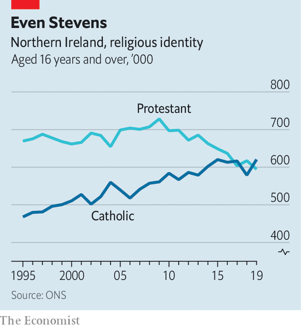
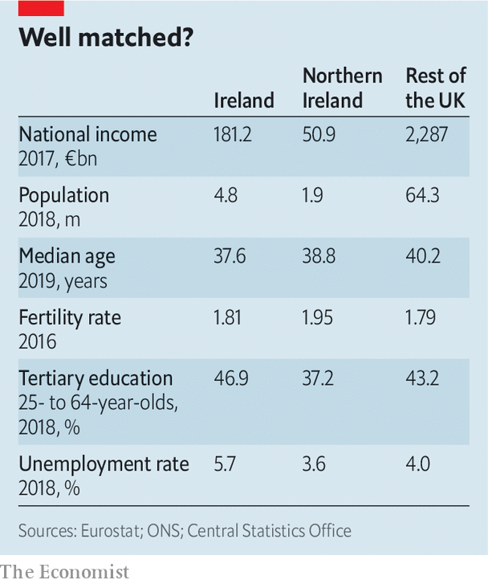
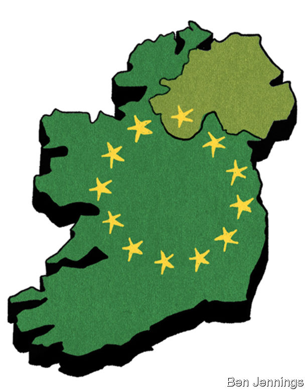

## Is some revelation at hand?

# Brexit and Sinn Fein’s success boost talk of Irish unification

> It would not be an easy process

> Feb 13th 2020BELFAST, DUBLIN, LONDON AND WASHINGTON, DC

UNDER THE cavernous roof of the Royal Dublin Society’s Simmonscourt Hall, Mary Lou McDonald, the president of Sinn Fein, is facing a gaggle of reporters. The atmosphere is electric; the day before, February 8th, Sinn Fein had won more first-choice votes in the general election than any of Ireland’s other parties, which was a stunning upset. “We asked people to give us a chance, a chance to deliver the platform that we have set out,” Ms McDonald says, “and that platform is about solving the housing crisis, it’s about getting to grips with the crisis in our health services, it’s about giving families and workers a break, giving them some breathing space.”

The words could belong to any European politician whose insurgent party has broken up a staid political establishment. But Sinn Fein is also something more. All major political parties in the republic are, in principle, committed to seeing the six counties which remained in the United Kingdom in 1922 rejoin the 26 counties which gained their independence, and thus create a united Ireland. Sinn Fein, though, sees that cause as a real and pressing ambition. The party has international standing; as well as now being a force in the Irish Dail, it is the second-largest party in Northern Ireland. And it has a deeply troubling past. From the 1970s on, it was the political wing of the Irish Republican Army (IRA), a paramilitary organisation which tried to push the British state out of Northern Ireland through terrorism.

Sinn Fein’s new popularity does not have much to do with all that. Pundits attribute its success instead to its promise to spend more on public services and to the widespread desire to vote for a party beyond the centre/centre-right duopoly of Fianna Fail and Fine Gael. The fact that, under Ms McDonald, Sinn Fein has lost a lot of the stigma produced by its terrorist association also helped. But if its newfound prominence does not derive from a fresh thirst for Irish unification, it is still one of three reasons why that prospect is starting to look like an unexpectedly big issue.

Of the other two reasons, the most obvious is another political upset: Brexit. In 2016 52% of the United Kingdom voted to leave the EU. But 56% of Northern Ireland voted to stay. Michael Collins, who was the Irish republic’s ambassador to Germany at the time, remembers that “The first call I got at 7.30 [the morning after the Brexit vote] was from a member of the German Bundestag, saying ‘Does this mean now that we have Irish Unity?’” Not in the short term. But the fact that unification would allow Northern Ireland to rejoin the EU is now a big part of the debate.

For the third reason, step away from the hurly-burly of electoral politics to take in the deep tides of demography. When the six counties of Northern Ireland opted out of independence in 1922, they thought they were ensuring that a part of the island would always remain under Protestant control; Protestants outnumbered Roman Catholics there by two to one.

That edge has been dulled. Analysis by The Economist of the censuses of 2001 and 2011, along with results of Britain’s quarterly labour-force survey, strongly suggests that Catholics are now the single biggest confessional grouping in Northern Ireland (see chart). Gerry Adams, who was president of Sinn Fein from 1983 to 2018, and who is widely believed also to have been a senior figure in the IRA—a charge he completely rejects—once quipped that though “outbreeding unionists may be an enjoyable pastime...it hardly amounts to a political strategy.” Yet it has still brought about a change. If the 2021 census bears this out, the finding will add to the fears of unionists.

The unionists, who have dominated Northern Ireland since partition, are for the most part Protestants whose identities are bound up with Britishness—whether through support for the British government itself, British traditions or the idea that the royal family is the ultimate defender of their faith. Even before Sinn Fein’s success in the south, Peter Robinson, the former leader of the Democratic Unionist Party, the biggest party in Northern Ireland, was warning his fellow unionists to prepare for a referendum. 

The possibility of such a referendum is enshrined in the Good Friday agreement (also known as the Belfast agreement). Reached in 1998, this deal marked the end of the decades of violence which grew out of civil-rights protests against the province’s unionist-dominated parliament in the 1960s and the backlash against them. In 1972 that parliament was dissolved and the province, garrisoned with British soldiers, ruled directly from London. Over 3,500 people died during these “Troubles”, a majority of them civilians, a tenth of them British soldiers; some 2,000 were killed by the IRA and other republican paramilitaries, half that number by paramilitaries on the unionist side.

The Good Friday agreement created a new devolved government in the north in which power would be shared between the two communities. It recognised that Northern Ireland was part of the United Kingdom and that the republic of Ireland had an interest in its people, who would have the right to be recognised as Irish, British or both. It also provided a political path to a united Ireland, should the people north and south of the border both want it. But none of those involved thought that path would be walked down any time soon.

The decades since have been mostly peaceful, and the north has become a much more “normal” place. But although its workplaces are increasingly mixed and its police force reformed, in their schools and their houses the communities remain separated. Because it is hard to close religious establishments to make way for integrated ones, over 90% of the population is still segregated at school (though not at university). The threat of violence has left public housing mostly segregated. Six-metre “peace walls” mark places where troublemakers from one community might mount incursions against the other. Remnants of the old paramilitary organisations persist; they are mostly concerned with drug crime and extortion, but they still sometimes engage in political violence.

The route to unification that the agreement sets out is fairly simple. “If at any time it appears likely” to the British secretary of state for Northern Ireland that a majority would back reunification, Britain must call a referendum and honour its result. “Appears likely”, though, does give the minister room for manoeuvre. The Constitution Unit at University College London says he should take into account a number of factors. A consistent majority for unification in opinion polls would certainly be one, as might a Catholic majority, or a nationalist majority in Northern Irish elections. None of these has as yet been seen. But opinion polls have been showing increasing support for unification since the Brexit vote, and some now have it neck and neck with the status quo; Catholics may already be a plurality; and although unionists got more votes than nationalists at the British general election last December, the nationalists won more seats.

Since February 8th, Ms McDonald has warned that Britain, and “London in particular”, need to get ready for unification, because “constitutional change is coming.” If Sinn Fein is to enter into a coalition, or provide any support to a governing party, its price is likely to include the beginning of preparations for a referendum. Aengus Ó Snodaigh, a Sinn Fein parliamentarian, says the as-yet-undefined Irish government would have to bring people together from across the island “to sit down and figure out what type of society we want.”

If the north were to vote for unification, the south’s constitution would have to be changed, which would require its people, too, to have a vote. In “A Treatise on Northern Ireland”, Brendan O’Leary, a political scientist at the University of Pennsylvania, suggests that the “rational order” would be for such a vote to take place after some time spent negotiating the form of unification.

That is, at the moment, an open issue, and one which would not just be up to Ireland. Richard Humphreys, an Irish high-court judge, points out that, even after unification, the Good Friday agreement would still give Britain a role as a guarantor of citizenship, and its devolved institutions would be expected to function in Ireland as they do now in the United Kingdom. In the longer term, Mr O’Leary outlines three plausible outcomes to a unification process: a unitary state run from Dublin; a devolved government in the north not unlike today’s; or a confederation of two states. Each would raise different questions about the workings of the new state, including the courts, the army and public services.

Constitutional implications aside, issues of identity and economics are likely to drive any initial decision. Both are being changed by Brexit. Take identity first. The Good Friday compromise rested, to some extent, on the idea that all British Islanders were European. As John Hewitt, a Northern Irish poet, put it in 1974:

I’m an Ulsterman, of planter stock. I was born in the island of Ireland, so secondarily I’m an Irishman. I was born in the British archipelago, and English is my native tongue, so I’m British. The British archipelago consists of offshore islands to the continent of Europe, so I’m European.

Quite a few Northern Irish people, of all confessions and none, feel that Brexit has stripped them of their European identity. There are a lot of people who are not against the idea of a united Ireland but have long wondered whether it is worth the trouble. Now that unification would bring a return to the EU—the European Council has confirmed that the “entire territory” of a united Ireland would be part of the union—they may be swayed in that direction.

Many in the north also realise that life in a united Ireland would feel a lot less alien to them today than it would have in the republic’s clerically policed past. A country where, 30 years ago, contraceptives were tightly controlled, abortion banned and gay rights unheard of, now boasts, in the person of Leo Varadkar, still taoiseach (prime minister) at the time The Economist went to press, a national leader who is both gay and of mixed race. A woman who wants an abortion in Dublin is better placed than her sister in Belfast, where unionists have opposed liberalising abortion law. Gay marriage is legal in Northern Ireland only because Westminster mandated it over unionist objections.

All this said, identity is about little things as well as big ones, and there would be an almost limitless number of them to fiddle with and take umbrage over. “When I opened my curtains in the morning [after Northern Ireland rejoined the republic], is the postbox still red or is it green?” asks Mike Nesbitt, a former leader of the Ulster Unionist Party (UUP). Mark Daly, a senator for Fianna Fail, argues that there need to be agreements made in advance to prevent nationalists from rubbing their victory in unionists’ faces. What would stop nationalists naming Belfast’s main airport after Mr Adams, for example? Other questions abound. Would there be a new flag? A new national anthem? Would the state commemorate British soldiers from the north who died in the Troubles? The national conversations Mr Ó Snodaigh envisages would have issues galore to chew on.

Then there is the economy. It has long been a reason for persuadable voters in the north to stick with the status quo, and for Irish politicians supportive of unification in principle not to strive for it in practice. As Mr Collins’s early-morning caller knew, the last reunification of a partitioned country was remarkably expensive. In the 30 years after the fall of the Berlin Wall, some €2trn ($2.2trn) was spent rebuilding the economy of the east.

Northern Ireland, though poorer than the south, is nothing like as badly off as East Germany was compared with the west. In 1989 West Germany boasted four times the east’s GDP per person. But it also had four times its population, whereas the republic of Ireland is less than three times larger than the north (see table). And the north’s economy is in a long-standing mess, scarred by the Troubles and “left behind” by deindustrialisation. Harland and Wolff, which laid the keel of Titanic in 1909, went into administration last August; its two gigantic cranes, Samson and Goliath, tower over the Belfast skyline as silent monuments to decline. Official data suggest that the public sector in Northern Ireland accounts for well over 50% of local GDP and that it raises enough tax to pay for only two-thirds of its spending. The British government makes up the difference. 

Nationalist economists claim that Northern Ireland’s fiscal deficit is artificially inflated by statistical trickery. They say, for instance, that if the region broke free from Britain it would not have to repay the portion of Britain’s public debt built into those figures. There is precedent here. In the 1920s Ireland’s republican leaders negotiated down the British government’s initial demand that their new nation take on a pro rata share of public-debt and pension liabilities. On the other hand, during the run-up to the Scottish independence referendum in 2014 the British government insisted that a newly independent Scotland would have to assume responsibility for its share of British public debt.

Covering Northern Ireland’s fiscal deficit would be a tall order for the republic. It would have some help. In a recent interview Mick Mulvaney, President Donald Trump’s chief of staff, told The Economist that “we expect that both philanthropists and the private sector in America would stand ready to help Northern Ireland in the event of reunification.” The EU would obviously play a role. But providing just half of the north’s current subsidy would cost the republic some 3% of its national income.

This strongly suggests that in a newly united Ireland the north would face spending cuts—as might the south. That is grist to the mill of unionists who argue against unification on the basis of poor public services (the issue which, ironically, just boosted Sinn Fein’s vote). “You’re given Scandinavian rates of taxation with southern European standards of health care and services,” says Steve Aiken, the leader of the UUP. “I just don’t know why people in the Irish republic put up with it.” The National Health Service performs worse in Northern Ireland than in any other part of the United Kingdom. But it is free at the point of need. Many northern nationalists, never mind unionists, shudder at the thought of the south’s insurance-based model.

Brexit further complicates the economics of Irish reunification. To some, it is another argument for remaining part of Britain. Northern Irish businesses sell twice as much to the mainland as to the republic. But for others, Brexit makes it essential to leave Britain. An official analysis of the effects of a free-trade agreement between Britain and the EU sees it lowering Northern Ireland’s national income by 8% over the long run, compared with just 5% for the United Kingdom as a whole.

On top of this, the possibility of a further political upset looms. Brexit did not just take the people of Northern Ireland out of the EU against their will; it did the same for the people of Scotland, 62% of whom had voted to stay in. The Scottish National Party, which currently forms a minority government in Edinburgh, sees being taken out of the EU against its will as grounds for Scotland to have a second vote on independence. It has no mechanism for forcing the Westminster government to go along with this, but that does not mean it will not happen. And this time the nationalists might win.

Given the strength of the ties between Northern Ireland’s Protestants and Scotland, such a vote would be a heavy blow to unionists. “A lot of people here would feel they had lost the mothership,” says James Wilson, an Ulsterman and former British soldier. A United Kingdom consisting just of England, Northern Ireland and Wales would look fundamentally incoherent—not a fatal flaw in a state, but a serious one.

For the time being, only Sinn Fein is arguing for a unification process to start soon. The more common nationalist position still cleaves to the spirit of St Augustine: “Lord, give me a border poll—but not yet.” Claire Hanna, an MP for the Social and Democratic Labour Party, the north’s other nationalist party, says that although a united Ireland is now on her agenda in a way it was not before Brexit, reconciliation (see [article](https://www.economist.com//britain/2020/02/13/atonement-and-forgiveness-in-belfast)), the economy and public services remain her priorities.

One observer in Dublin holds unification to be “like the pursuit of happiness—it can’t be pursued directly, it can only ensue from a position of harmony and peace.” It is a nice, if somewhat quietist, sentiment. But it is one that just a couple more political surprises could put to severe test. ■

## URL

https://www.economist.com/briefing/2020/02/13/brexit-and-sinn-feins-success-boost-talk-of-irish-unification
