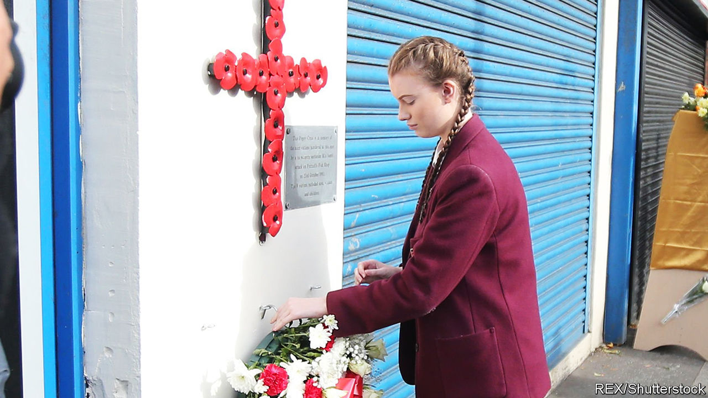

## Northern Ireland

# Atonement and forgiveness in Belfast

> Northern Ireland faces a choice in dealing with past wrongs. It is taking the more dangerous path

> Feb 13th 2020BELFAST

JUDE WHYTE’S mother Peggy was a devout Catholic and part-time taxi driver, well-known in the market district of Belfast. In 1983, a member of a Protestant paramilitary group tried to bomb the family home and injured himself horribly in the attempt. She nursed him as he lay in the street. Her son thought this kindness might spare the family further attacks, but a year later the same group attacked the house again, this time killing Peggy and a policeman.

Yet Mr Whyte, a social-work lecturer, says that if he knew the name of his mother’s killer, he would not tell the police. He sees no benefit in incarcerating a man who would now probably be around 60, like himself, and can hardly have understood the conflict in which he was involved. “In my mother’s name, I forgive him,” he says, explaining that although he has not inherited his mother’s faith he tries to emulate her empathy.

On the Northern Irish spectrum, Mr Whyte is an extremist in his advocacy of forgiveness. A commoner position is that of Alan McBride, a Protestant whose wife and father-in-law were killed, along with eight others, when republicans bombed a fish shop in the Shankill Road, the heartland of loyalism, in 1993. He cannot quite forgive Sean Kelly, the surviving bomber, but says he has no desire to see him suffer. After a struggle to overcome bitterness, he has come to the point where what happens to the bomber is a “matter of indifference” to him, and no longer keeps him awake at night. He devotes much of his life to counselling victims of the 25-year conflict and to advocating reconciliation between the communities.

Jim Wells, an evangelical Protestant politician whose views on sexuality proved too hardline even for the socially conservative Democratic Unionist Party, is—like many of the more intensely religious participants in this debate—at the opposite end of the spectrum to Mr Whyte. By the lights of his faith, he says, a wrongdoer can seek forgiveness only by owning up to his misdeeds, begging the pardon of those he has wronged, accepting the penalty that is due and mitigating the damage done. “That is how our Baptist congregation would treat a member who did wrong,” he says. In a land in which there is no consensus on what amounts to a misdeed, that bar is hard to reach.

Like most places recovering from violent conflict, Northern Ireland is divided on the question of whether past wrongs should be forgiven or atoned for. Forgiveness may help a peace process, but leave justice undone. Atonement may satisfy the wronged, but punishing wrongdoers risks reviving conflict: among the issues that could blow apart the newly re-established power-sharing government in Stormont, the cluster of questions known as “legacy” ranks high. And on the scale between forgiveness and atonement, Northern Ireland is moving towards atonement.

Both the Democratic Unionist Party (DUP), which is backed by most Protestants, and Sinn Fein, the Irish republicans who reliably gain a plurality of Catholic votes, have trenchant views on legacy, a catch-all term which includes judicial redress, truth discovery and financial compensation for people affected by the Troubles. Neither talks much about empathy for the other side, let alone forgiveness. Both sides want their set of grievances aired. And the direction of travel in Northern Ireland suggests that both are going to get their way.

When the Good Friday agreement was signed in 1998, Tony Blair, the then prime minister, gave secret written assurances to 200 or so top members of the Irish Republican Army that they would not be prosecuted. But last December a court overturned that assurance in the case of John Downey, who is awaiting trial for the killing of two part-time soldiers. That case has given momentum to the DUP’s demand for other prosecutions, and police have said that some may be imminent. Sinn Fein, meanwhile, is anxious to seek judicial redress for what it calls “state killings” and to demonstrate that the army and police worked in collusion with loyalist paramilitary groups to kill ordinary Catholics.

As part of the deal that restored power-sharing last month, it was announced that a raft of legacy-related institutions, first agreed to in 2014, would be established under a law that Britain vowed to introduce within 100 days. The most contentious of the proposed agencies is a powerful new Historical Investigations Unit which would function outside the police (critics call it a parallel police force) and work to reopen unresolved cases. Whatever the original intention, the unit is now widely seen as an instrument for investigating the behaviour of British security forces during the Troubles. Arlene Foster, the DUP leader and first minister, has proposed that its remit should be curbed, whereas her deputy Michelle O’Neill, from Sinn Fein, wants it to be robust and wide-ranging.

Boris Johnson is said to feel “blindsided” by the legacy aspects of the power-sharing agreement, and his concerns are reported to be behind the sacking of Julian Smith, the Northern Ireland secretary, as part of a cabinet reshuffle on February 13th. The government has promised to protect old soldiers who served in Northern Ireland from “vexatious” prosecutions related to historic incidents. It wants, in other words, to minimise the number of cases like that of “Soldier F”, the only paratrooper charged in relation to the killing of 13 civilians in Derry-Londonderry in 1972.

Denis Bradley, a former Catholic priest who has played an important role in legacy debates, shares the widespread fear that clashes over dealing with the past could wreck the fragile new experiment in power-sharing. “The past has always been a mucky field, and it now risks turning into a swamp,” he says.

Given that the DUP and Sinn Fein face opposing pressures from their voters, the best hope of a constructive approach to the legacy issue lay in London and Dublin continuing to play an active role in balancing truth discovery with vindictiveness, says Mr Bradley. But if Sinn Fein becomes a partner in the Irish government, as looks possible after the election on February 8th, and if the British Conservatives are determined above all to protect their soldiers, the two governments’ ability to act jointly as honest brokers will diminish fast. ■

## URL

https://www.economist.com/britain/2020/02/13/atonement-and-forgiveness-in-belfast
