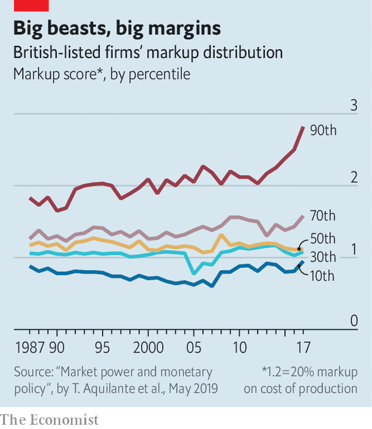

## Competition policy

# Ripping into the rip-off merchants

> Why competition policy is getting more political

> Feb 13th 2020

POLITICAL CROSS-DRESSING is often a good indicator of a change in a party’s identity. So it was with the Tory party’s attitude to business. When Ed Miliband, then Labour leader, called in 2013 for energy prices to be capped it was described as “Marxism”, but within five years Theresa May had introduced a price freeze.

Under Boris Johnson, the Conservative Party’s shift away from business has taken a more economically literate turn. The Tory manifesto in last year’s general election pledged to give the Competition and Markets Authority (CMA) “enhanced powers to tackle consumer rip-offs and bad business practices”. Polling shows declining trust in large firms and, as a former government adviser puts it, “using competition and consumer policy to give them an occasional whack is pretty popular”—hence the announcement on Feb 7th that the CMA would review the state of competition in Britain.

In Britain, as in much of the rich world, corporate concentration has been on the rise. A report from the Resolution Foundation, a think-tank, in 2018 found that concentration ratios in product markets (the combined market share of the top firms) had risen since 2000. Markups have also increased, suggesting that consumers may be paying the price. A recent Bank of England study found that markups across the British economy rose from around 1.2 in 1987 to almost 1.6 in 2017 (meaning that firms were charging 60% more than their incremental production costs). Economic theory suggests that in well-functioning markets markups should be a little over 1 in the long run.

The increase in markups was above the average rise found in the G7 group of advanced economies, but below that in America. And it was concentrated among the largest and most successful firms (see chart). That tallies with similar findings in global studies conducted by the IMF and OECD. The finding is more intriguing when paired with another Resolution Foundation finding: that concentration in labour markets has fallen, with the largest 20 firms in a sector employing 42% of that sector’s workforce on average, down from 46% in 2003-04. In combination these findings paint a picture of employment-light, successful firms pulling away from the rest and exploiting their market power to boost profits.

But concentration and markups are only partial measures of competition. Concentration can reveal only so much because what matters are not industries but markets. Firms may compete with rivals from another industry; and, in an open economy like Britain, international competition plays a large role. The British car industry is highly concentrated but many cars are imported. There are few British supermarkets but the business is fiercely competitive. Markups, for their part, require careful interpretation, because they involve trying to disentangle a firm’s variable and fixed costs—a tricky job. If high markups are not accompanied by abnormally high profits, it suggests something has gone wrong in the calculation. And in recent years Britain’s firms have not, on the whole, enjoyed the unusually high profits that have been apparent in corporate America.

What might the future of Britain’s competition policy look like? Now that it has left the EU, powers over large mergers, which had been ceded to Brussels, return to Westminster. In practice, they are unlikely to be used much, since in a major cross-border merger the EU and America will call the shots. But there is plenty of scope for the review to bring about innovation and improvement.

Asking the CMA to map the state of competition across the economy as a whole could be a useful exercise if it helps identify specific markets where there are problems. “This stuff isn’t hard,” argues a competition lawyer, “you just look for sectors where firms or senior management keep earning a lot and then go poke around a bit.” But some worry that the regulator could lose focus. “There’s no point in trying to map out some abstract idea of competition across the economy as a whole. What matters are individual markets,” says a former policymaker.

In any event it would be sensible to implement the recommendations of the Furman Review on digital competition, carried out for the Treasury in 2019. It had good ideas on how to develop a code of competitive practice for the dominant firms in digital industries as well as how to incorporate personal data concerns into policy.

British regulators would do well to look at innovations in mainland Europe, too: the Germans have, for instance, lowered the threshold for investigating tech mergers, on the grounds that mergers involving tiddlers—such as Google’s with YouTube and Facebook’s with Instagram—can turn out to be troubling. And there is a strong case for increasing both the CMA’s investigatory powers and its budget. Muscular competition policy isn’t just good for the government: it’s also necessary for restoring public trust in business. ■

## URL

https://www.economist.com/britain/2020/02/13/ripping-into-the-rip-off-merchants
