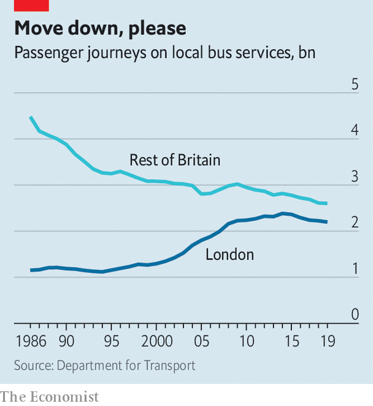

## Public transport

# The paradox of Britain’s buses

> Everybody wants buses. They just don’t want to use them

> Feb 15th 2020

NEVER MIND the snazzy, expensive railway line that the government grudgingly approved on February 11th. What really stirs politicians’ hearts is the humble bus. Both the just-sacked chancellor of the exchequer, Sajid Javid, and the mayor of London, Sadiq Khan, are the sons of bus drivers, as they are not shy of saying. Boris Johnson, the prime minister, claims to love buses so much that he models them out of wine crates. This week he promised to throw more money at them.

This will go down well. Buses account for more public-transport trips than trains, tubes and trams put together. People love them, in theory: one poll by Transport Focus, a consumer group, found that 74% of young people think they are a good way of getting around and 85% believe it is important for a place to have a good bus service. There is just one problem. In practice, Britons are taking buses less and less (see chart). Powerful forces are driving this trend—probably too powerful to be counteracted with a dollop of public money.

Until recently, the decline in bus use could be put down to bad policies and austerity. In 1986, with Margaret Thatcher in her pomp, bus transport outside London was privatised and deregulated. Bus companies piled in to the best routes; the less popular ones were neglected, especially after the financial crisis, when subsidies were cut. Fares have risen, which deters more people from taking the bus. “It’s a cycle of decline”, says Darren Shirley of the Campaign for Better Transport.

But if deregulation, service cuts and higher fares are the problem, why are London buses emptier? They have suffered none of those things. Yet the decades-long rise in bus trips in the capital—which was driven by good management, subsidies, a booming economy, rapid population growth, ever more unpleasant driving conditions and costly parking—appears to have reversed. Something else is up.

One thing that has changed is young people’s behaviour. The young are heavy bus users when they travel. But, increasingly, they do not travel. According to Transport for London, the average 17- to 24-year-old took 2.3 transport trips per day in the fiscal year 2011-12 but only 1.7 in 2018-19. The National Travel Survey confirms that no group has cut back harder on travel since the early 2000s than teenagers. Young people are more diligent these days, and stay in school for longer. They can do the things that young people love to do—flirting and cracking up their friends—on their phones, without going out.

The other big bus users are the poor (who have few other options) and the old (who can travel for nothing). Especially outside London, both are shunning buses for cars. Since 2002 the proportion of households in the poorest quintile who have no car has fallen a bit, from 49% to 46%. The fall among the second-poorest quintile is sharper: 36% to 28%. Relaxed lending standards have made cars easier to acquire; a fuel-tax freeze and frugal engines make them cheaper to run. Cars are ever more comfortable and idiot-proof, with parking-assist technology and lane-drifting alerts to help doddery drivers. Outside London, the average free bus pass was used 90 times in the fiscal year 2010-11 but only 74 times in 2018-19, according to the Department for Transport.

Finally there is the gig economy. Online shopping and Uber probably substitute for bus trips as well as private car journeys. And they put new vehicles on the roads, which slows everything down. The number of light-goods vehicles in London has risen by 28% since 2012. Tony Travers of the London School of Economics points out that bus speeds have fallen slightly in the capital, even though private cars have almost been purged from the city centre. The average London bus now travels at 9.3 miles per hour. Just as people become less inclined to run after buses, they are becoming easier to catch.■