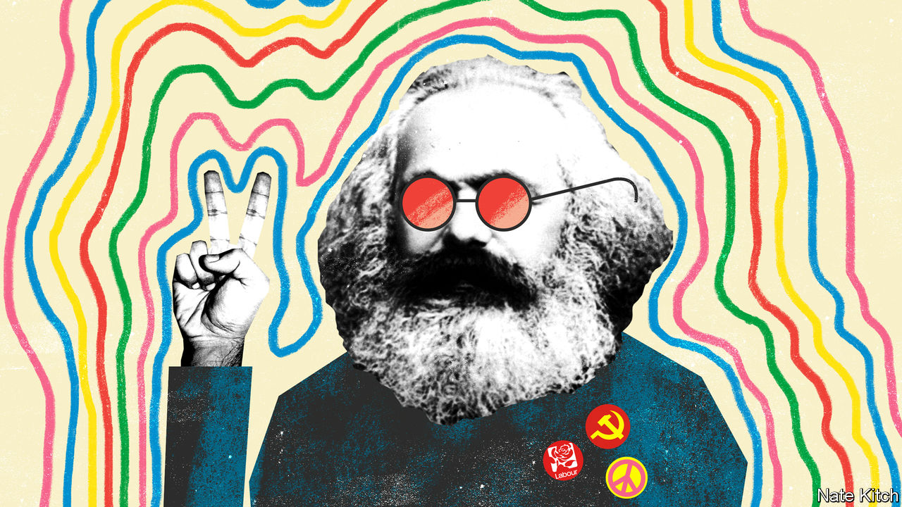

## Bagehot

# The perils of Lennonism

> Labour will not return to power until it changes its ideas about class

> Feb 13th 2020

“A  WORKING-CLASS HERO is something to be,” sang John Lennon. That certainly seems to be the view of the candidates for the Labour Party leadership, for they never miss an opportunity to boast about their proletarian credentials. Sir Keir Starmer’s father was a toolmaker who named his son after the Labour Party’s first MP, Keir Hardie. “I actually never had been in any workplace other than a factory until I left home for university,” he told the BBC. “I’d never been in an office.” Emily Thornberry was so poor when she was growing up—on a council estate, naturally—that her family had to have their cat put down to save money. Rebecca Long Bailey is the daughter of a dock-worker and trade-union activist; she insists that the next Labour leader should be “as comfortable on the picket line as at the dispatch box”.

The Labour Party can be forgiven some of its obsession with class given the shock of its defeat in the general election. It went into the election offering the biggest transfer of power to the workers in history only to see more workers vote for an Old Etonian with the middle name of de Pfeffel than for Comrade Corbyn. It lost working-class seats in the Midlands and the north that are not just bits of land but parts of its soul. This year’s Durham Miners’ Gala—a celebration of working-class culture and Labour Party muscle—will take place surrounded by Conservative-held seats. A period of mourning is in order.

But mourning should not permanently cloud thinking, and a celebration of working-class identity should not degenerate into a replay of the Monty Python’s “Four Yorkshiremen” sketch. The Labour Party’s naive Lennonism is blinding it to radical changes in Britain’s class structure. Its leadership candidates still talk as though Big Capital faced Big Labour across a battlefield of picket lines, ignoring the transformation of the economy brought about by globalisation and technology. In 1987—the last time the Tories saw a victory comparable to Mr Johnson’s—62% of Britain’s electorate was working-class (defined by people whose heads of household held or had held a manual job). Today the figure is 43%, according to Peter Kellner, former president of YouGov, a pollster. Companies have embraced flexible production and contracting out. Trade unions have shrunk and migrated to the public sector. A rise in general affluence has gone hand-in-hand with an increase in the number of people who are homeless or using food banks.

The biographies of the leadership candidates reflect these changes. Sir Keir and Ms Long Bailey may have been born working-class, but they rocketed up the social hierarchy: Sir Keir spent five years as director of public prosecutions; Ms Long Bailey, a solicitor, lives in a fancy Manchester suburb. Ms Thornberry, aka Lady Nugee, knew poverty as a child because of divorce rather than deprivation: her father was a United Nations official who dumped his family. She became a successful barrister and married an even more successful one. Lisa Nandy, an outsider on whom the odds are shortening, is a red princess whose immigrant father became a professor and helped to found the Equal Opportunities Commission, and whose grandfather was a distinguished Liberal MP.

The party’s membership has undergone a similar transformation. Almost 80% of members are now middle-class. Activists in Crouch End in London are so worried about the middle-class takeover that they have suggested creating separate working-class sections in constituency parties to ensure that the voice of the proletariat is not drowned out; the branch secretary is an emeritus professor at London Metropolitan University. If Jeremy Corbyn reversed Blairism ideologically, he intensified it sociologically, making the party even more middle-class and southern. The big difference is that Mr Corbyn’s middle-class tribunes are under the illusion that they’re working-class heroes sticking it to The Man.

Lennonism is also blinding the party to the emergence of a new form of class struggle from the ashes of the old. These days social class is defined less by relationship to the means of production than by educational qualifications. And class struggle is driven by quarrels about identity and values rather than about remuneration and working conditions. In his new book “The New Class War: Saving Democracy from the Managerial Elite”, Michael Lind, of the New America Foundation, a think-tank, argues that the clash between the credentialled and the non-credentialled is shaping politics across the world. This is particularly true of Britain, which enthusiastically embraced policies favoured strongly by the credentialled elites (globalisation, free markets, social liberalism), only to summon up a mighty backlash in the form of Brexit.

In this new class war the Labour Party is on the side of the “haves” rather than the “have nots”. The majority of the party’s members have university degrees. Party activists pride themselves on their cosmopolitan values: they associate nationalism with xenophobia, strongly oppose Brexit and wage ceaseless war on all forms of bigotry. Harold Wilson once said that the Labour Party is “a moral crusade or it is nothing”. These days the moral crusade frequently takes the form of members of the cognitive elite ticking off non-members for being insufficiently enlightened. That is good for mobilising the votes of the educated but not for much else: in December the Labour Party beat the Tories among degree holders by 43% to 29% but lost among people who have only GCSEs (or lower) by 25% to 58%.

In many ways Boris Johnson’s majority is built on sand. The Tory dream of a property-owning democracy is dying: new figures from the Office of National Statistics show that people in their mid-30s to mid-40s are three times more likely to rent than they were 20 years ago. The shock of Brexit is yet to hit: Michael Gove, the chancellor of the Duchy of Lancaster, this week warned companies that they will have to prepare for border checks on goods flowing into and out of Europe from next January. But the Labour Party has no chance of winning power until it abandons Lennonism and works out what it is for in a post-industrial society. ■

## URL

https://www.economist.com/britain/2020/02/13/the-perils-of-lennonism
