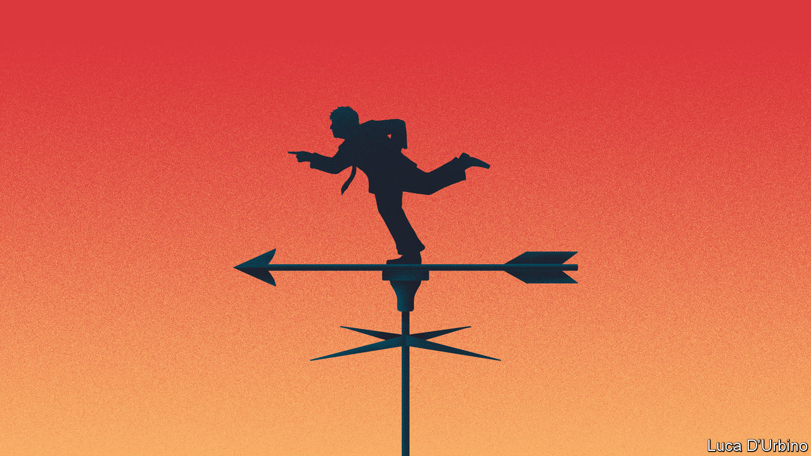

## Politics

# Why Britain’s Conservative government is shifting leftward

> Boris Johnson seems strangely attracted to the policies of Ed Miliband, the former Labour leader

> Feb 15th 2020

DENIS HEALEY, the Labour chancellor of the exchequer in 1974-79, supposedly said that he wanted to squeeze the rich until the pips squeak. Thanks to New Labour’s conversion to the gospel of wealth, and the party’s dismal electoral record since the post-Blair era, it is a long time since the nation echoed to the sound of squeaking. But the new Conservative government may be about to change that.

The government is said to be contemplating two radical moves in the budget due on March 11th—imposing a “mansion tax” on owners of expensive homes and cutting pension tax relief for higher earners. The mansion tax may take the form of an annual levy on expensive homes or a higher council tax band. The pension reform may mean cutting tax relief on people who earn more than £50,000 a year from 40% to 20% to raise an extra £10bn a year. Other raids on capital gains, inherited money and profits are reportedly being considered.

These particular speculations may be hot air, but there are other straws in the wind. Boris Johnson has publicly aired his ambivalence to business, and his manifesto commitment to revitalise competition policy—never a friend of capitalists—is already bearing fruit (see [article](https://www.economist.com//britain/2020/02/13/ripping-into-the-rip-off-merchants)).

In the longer term, two ineluctable forces will force him to raise taxes on the rich. The first is fiscal: the government needs to raise money to finance ambitious infrastructure projects such as the HS2 rail link to the north. The second is political: the government needs to revise its tax-and-spend policies to reflect the fact that the Tories are now the party of ex-mining towns such as Blyth as well as well-heeled shires such as Buckingham. To hold onto those northern gains, Johnsonian Conservatism will need to be more open-handed than the Cameroonian variety.

This points to one of the oddities at the heart of British politics: that even as the Tory party consolidates its grip on the country—it has been in power either as part of a coalition or in its own right since 2010 and is likely to remain so until 2025—politics is moving to the left, at least on economics. In 2015 the Tories mocked “Red Ed” Miliband for proposing crazy socialist measures such as nationalising railways and imposing a mansion tax. Now the government has nationalised Northern Rail, may do the same to other rail companies and is expected to bring the whole network under tighter state control.

The government’s embrace of Milibandism is causing alarm among Tory MPs (particularly in the more affluent parts of the country) and Tory activists (particularly on the Thatcherite right). The Bruges Group tweeted that “had we wanted Labour we’d have voted for Corybn”. The head of the Taxpayers’ Alliance has warned the government that voters want lower taxes and smaller government. The Daily Telegraph has run a series of splenetic articles and editorials, including one warning that the mansion tax might have a devastating impact on the owners of country estates, illustrated with a picture of a 40-bedroom Elizabethan country house and its unhappy-looking owner. There is more fury to come, as the party discovers that fulfilling Disraeli’s dream of One Nation Conservatism comes with a heavy price tag. ■