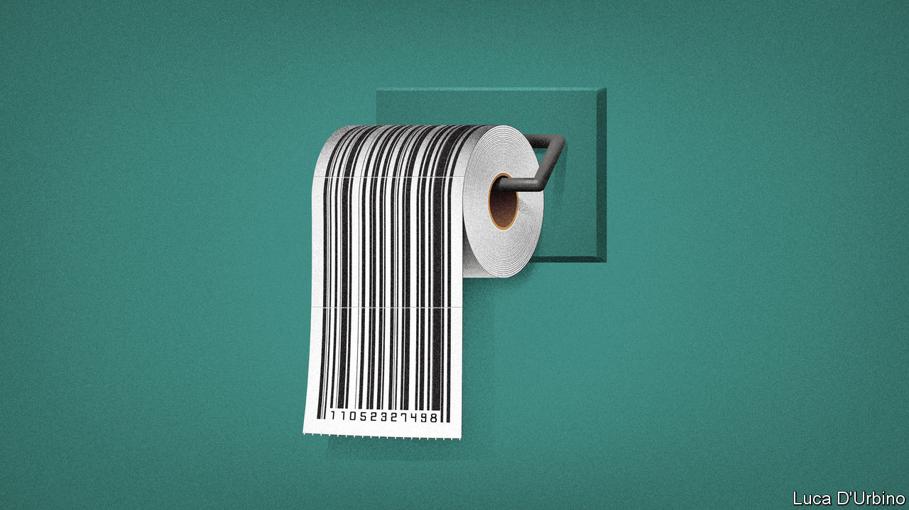

## Spending a penny

# Why Britain’s public conveniences are anything but

> Campaigners want Britons to be able to “pee for free” in private loos

> Feb 15th 2020

ANTOINETTE, A ROUGH sleeper in the Finsbury Park area of north London, doesn’t feel safe going to the toilet. The one public toilet nearby is often dirty, she says, and people take drugs in there. A pub near the underground station allows non-customers in, but men use it for another kind of relief. She prefers a branch of Costa, a coffee chain, but the door requires a passcode that is handed out only to customers. So she relies on friendly baristas slipping her the code.

A guerrilla Twitter campaign called London Loo Codes aims to help. It collects and distributes codes for toilets across London, to allow more people to “pee for free”. It has collated a list of more than 175 facilities in the capital, including ones that are already unlocked. The initiative has trickled down to other cities, including Edinburgh, Sheffield and Oxford.

Most firms turn a blind eye, reluctant to be seen as heartless toilet gatekeepers. Some, though, have taken to changing their codes more often. Staff in the Costa branch that Antoinette frequents are unenthusiastic about the influx, since they have to clean up its consequences.

The campaign is on to something. Public toilets were once a source of municipal pride. George Jennings, an engineer, showed off the country’s first flushing public toilet in Hyde Park in 1851. The Victorians, famous for their sanitation fascination, developed a network of public loos.

But councils are under no legal obligation to provide toilets and, after budget cuts under successive governments, town halls are hardly flush. Toilets, which are costly to keep in good nick, provide a convenient target for cost-cutters. In 2017 the City of London spent nearly £1m running four loos, despite charging users between 20p and 50p each time. London councils have stopped maintaining 13% of conveniences since 2010, according to the BBC. Several Victorian lavatories have been refashioned as quirky cocktail bars. One, in Clapham, is still called WC, though that now stands for wine and charcuterie rather than “water closet”. Nobody knows exactly how many public loos London has, but the number would fall way short of Paris’s 400.

After Bristol City Council closed all of its public toilets in 2018, it replaced them with a “community toilet scheme”, under which a group of local businesses has opened 84 loos to non-customers. But many of the firms listed on the scheme’s website do not display signs in their window indicating that their toilet is free to use. Staff in two of the businesses that signed up had only dimly heard of the initiative. If such schemes are not publicised, they will go down the pan. ■

## URL

https://www.economist.com/britain/2020/02/15/why-britains-public-conveniences-are-anything-but
