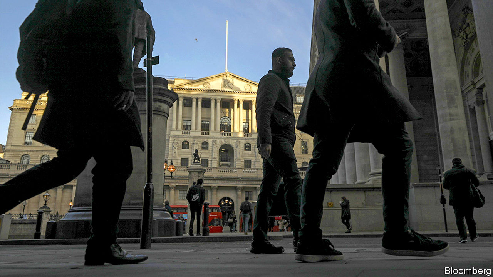
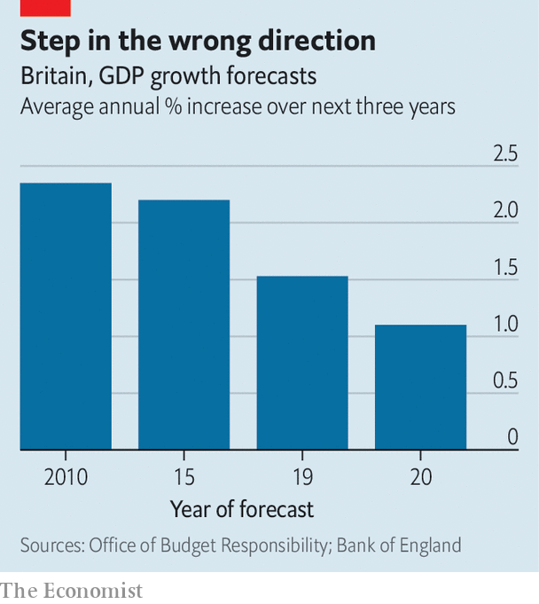

## Growth

# Why trend growth is collapsing in Britain

> The economic speed limit has fallen more sharply than elsewhere

> Feb 13th 2020

OVER THE past decade Britain has combined sluggish growth with booming employment. The government has been keen to talk up “the jobs miracle” and less keen on its counterpart: weak productivity growth. The latter can often be dismissed as a long-run problem, less pressing than immediate concerns like unemployment or inflation. But the long run may at last have arrived.

In its most recent forecasts, the Bank of England has pencilled in the medium-term potential growth rate at just 1.1%—less than half of what was thought possible ten years ago. Potential output growth can be thought of as an economy’s natural speed limit, the pace at which it can grow without pushing up prices.

Estimates of potential trend growth have fallen globally, but the decline in Britain is sharper than in other major economies. In part, it reflects a lower forecast for population growth, as immigration drops after Brexit. But mainly it results from a gloomier view of productivity. Private-sector forecasters are more upbeat than the Bank: they think the British trend rate is around 1.5%.

If the Bank is right, in the short term lower potential growth will keep up the pressure on the public finances, as tax receipts have less room to grow. The medium-to-longer-term picture is more worrying still. Weaker output growth means slower improvement in living standards. To avert that, policymakers will have to focus on solving the great British productivity puzzle.

## URL

https://www.economist.com/britain/2020/02/13/why-trend-growth-is-collapsing-in-britain
