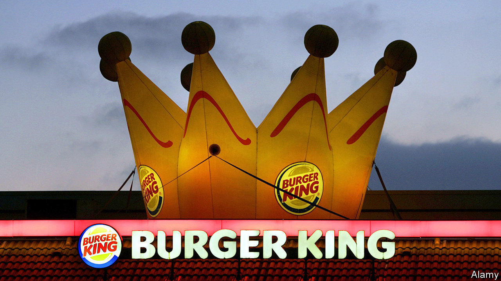
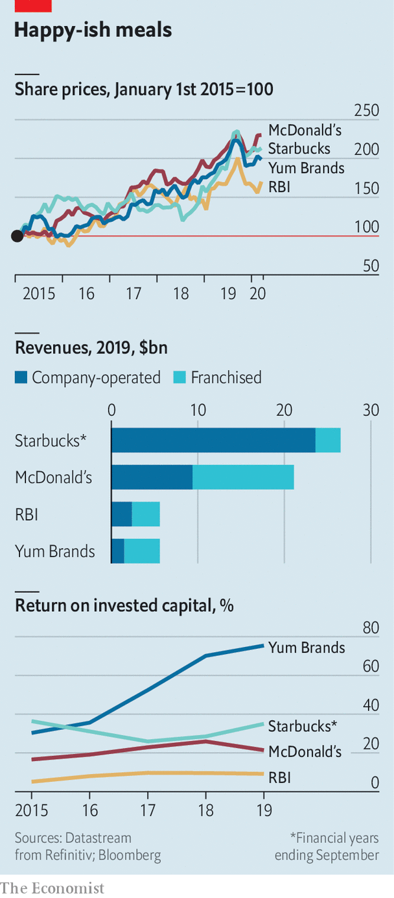

## Chasing Ronald

# Burger King’s owner tries to regain its sizzle

> Fast food does not automatically equal fast growth

> Feb 13th 2020

THE OWNER of Burger King had a less than royal 2019. After a sizzling start to the year Restaurant Brands International (RBI) shed a fifth of its market value between August and December. Although it earns 58% of revenues from a capital-light franchise business, a bigger slice than McDonald’s, its return on invested capital is lower, partly owing to a string of pricey acquisitions (see chart). On February 10th investors once again digested disappointing quarterly results from Tim Hortons, a Canadian doughnut chain which accounts for 60% of RBI’s sales. The group’s overall earnings beat forecasts thanks to Popeyes, another of its chains. RBI needs more spinach to catch up with rivals such as Yum Brands (owner of KFC, Pizza Hut and Taco Bell) and Starbucks—let alone McDonald’s, whose market value and net income are roughly that of the other three firms combined. ■

## URL

https://www.economist.com/business/2020/02/13/burger-kings-owner-tries-to-regain-its-sizzle
