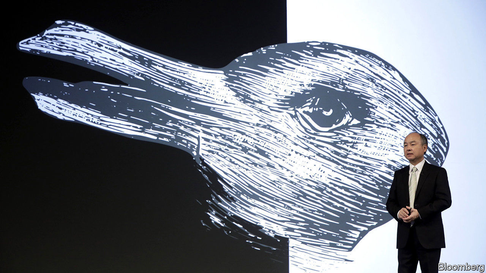
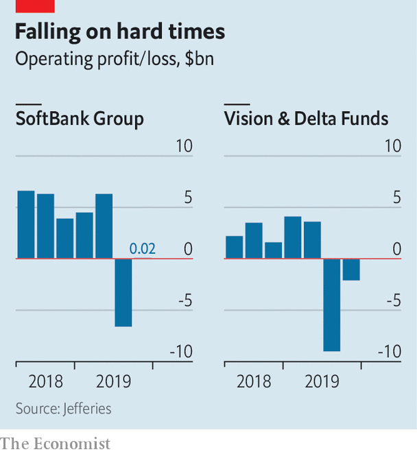

## Singer-Son time

# Elliott Management guns for SoftBank

> The activist investor wants the Japanese technology group to reform. Good luck

> Feb 13th 2020

MOST BOSSES dread Elliott Management, an American activist hedge fund whose tactics the traumatised chairman of a German company once described as “psycho-terror”. After news leaked on February 6th that Elliott had taken a 3% stake, worth over $2.5bn, in SoftBank Group, a Japanese telecoms-and-tech conglomerate, its flamboyant founder, Son Masayoshi, seemed less perturbed. As he presented SoftBank’s results on February 12th, Mr Son professed to be “thankful that such a distinguished investor has joined us as a friend”. He has reason to sound welcoming. SoftBank’s languishing share price leapt by 7% on the news of Elliott’s stake.

Elliott’s main focus at SoftBank is the Vision Fund, Mr Son’s $99bn tech-investment arm. Although SoftBank’s stake in the fund amounts to only 13% or so of the group’s total gross assets, the vehicle is causing a crisis of confidence. Last year its handling of WeWork led to the scuttling of the loss-making property firm’s listing, followed by a costly bail-out. That is when Elliott began to build its stake in earnest.

SoftBank’s earnings also disappointed. Overall the group eked out only $24m of operating profit. The Vision Fund lost $2bn in the last quarter, better than the $8.9bn loss in the previous three months but far worse than the market was expecting. This month, one Vision Fund investment, an e-commerce startup from San Francisco called Brandless that received around $100m from Mr Son two years ago, became the first in the portfolio to fold. A rare bit of good news came on February 11th when an American judge approved the $26bn takeover of Sprint, a mobile operator majority-owned by SoftBank, by T-Mobile, a competitor. The merger would allow SoftBank to shed about $40bn of Sprint debt. SoftBank’s shares gained 12% the next day, though reports later surfaced that T-mobile might want to renegotiate the deal.

Even that leaves the firm’s market value, at ¥11trn ($104bn), well below what its assets would imply. It owns $270bn-worth of stakes in big listed companies (Alibaba, Sprint and its Japanese telecoms firm) and unlisted firms like Arm, a British chip-design firm. SoftBank is trading at a discount to fair value of around 60% after accounting for debt. To close the gap Elliott’s boss, Paul Singer, is urging the firm to buy back as much as $20bn of its shares—and to improve its corporate governance.

A buy-back is likely after the Sprint deal is complete, says Chris Lane of Bernstein, a broker. SoftBank will probably add independent directors at its shareholder meeting in June; it currently has two. Mr Son may refrain from deploying a second, $108bn Vision Fund, after it became clear that the original’s troubles put off big institutional investors. SoftBank could instead use a small bridge fund to carry on investing, Mr Son said on February 12th.

Elliott wants SoftBank to create a new board committee to guide Vision Fund investments, which Mr Son has sometimes directed with little regard to opposition from colleagues. Mr Singer could agitate for the fund to be reduced in size over time.

If SoftBank’s shares keep gaining in value, Elliott might simply cash in and exit. That would be easier than forcing the strong-willed Mr Son, who owns roughly a quarter of SoftBank, to reform. But Mr Singer is unlikely to depart without trying some of his signature psychological warfare. ■

## URL

https://www.economist.com/business/2020/02/13/elliott-management-guns-for-softbank
