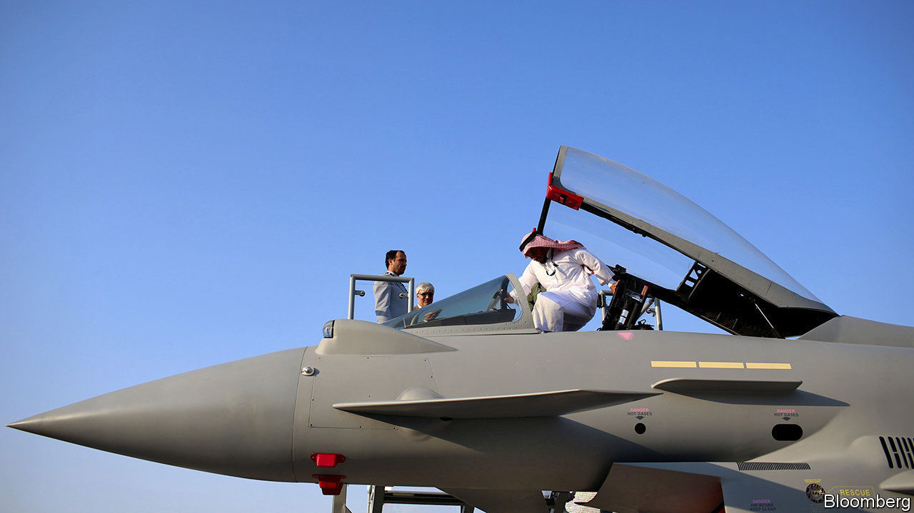
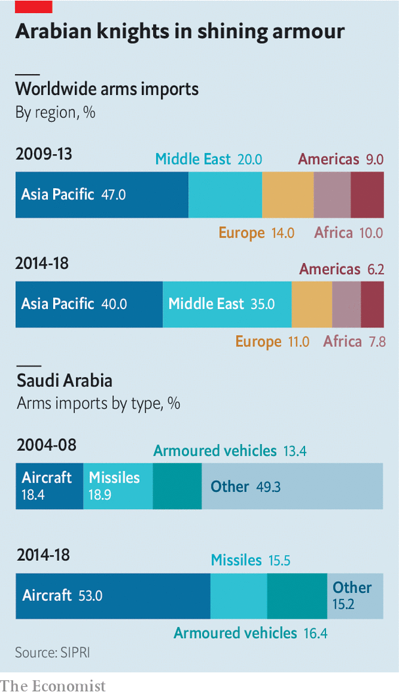

## From muskets to missiles

# The battle for the Middle Eastern arms market is heating up

> Chinese, Russian and local companies want to conquer market share from Western defence giants

> Feb 13th 2020DUBAI

THE FLOW of foreign arms to the Arabian peninsula began in earnest 150 years ago. As European armies adopted modern breech-loading rifles, a stock of old-fashioned weapons was left surplus to requirements. Rivalries among Arab tribes created a ready-made market for ageing arms. A combination of the region’s chronic instability and oil riches has since continued to fuel weapons sales. Most of them still come from the West. Now the shifting sands of geopolitics have left an opening for others.

At the Dubai air show last November Viktor Kladov of Rostec, a state-run firm that handles exports from Russia’s defence companies, told The Economist that Russian weapons exports to the Middle East apparently hit an all-time high of $13.7bn in 2018. With a candour unusual in his industry, Mr Kladov put this down to Russia’s willingness to sell most things to most people. Europeans and Americans can indeed be queasy about sending some weaponry to places with mixed human-rights records. The war in Syria, Mr Kladov said, was a chance to “showcase” Russian arms. Chinese firms, similarly unconstrained, are also piling in. And Middle Eastern countries are keen to build their own defence industries. The battle for the world’s fastest-growing arms market may be about to heat up.

Big Western defence firms mostly rely on their domestic markets for sales and profits. Exports account for less than a third of revenues for Lockheed Martin, the world’s biggest armsmaker. But the global export market is big—and getting bigger. The Stockholm International Peace Research Institute (SIPRI), a think-tank, put it at $100bn in 2018. Overseas revenues help smooth over downswings in domestic defence budgets and support the gargantuan investments required for big projects.

A growing share of these revenues comes from the Middle East. In 2014-18 the region received a third of the world’s arms exports, second only to Asia Pacific, according to SIPRI (see chart). Countries there imported 87% more weapons in that period than they had in the previous five years. In 2018 Saudi Arabia splurged $68bn on military kit, more than anyone bar America and China. The United Arab Emirates (UAE) was the seventh-biggest spender in 2014-18; tiny Qatar and Oman made the top 20.

America’s massive weapons-makers, whose home market is responsible for 36% of global defence spending, dominate the industry. All but eight of the world’s 20 biggest defence firms by sales are American. America’s industry accounted for 36% of global exports in 2014-18, reckons SIPRI. Countries in the Middle East snapped up over half of American exports in that period, as well as 60% of Britain’s, 44% of France’s and 25% of Germany’s. In 2018 the Middle East contributed $3.6bn, or around 7%, to the revenues of Lockheed Martin. Raytheon, the fourth-biggest producer, made 15% of its overall sales in the region (including north Africa), which were worth roughly $4bn.

Most Middle Eastern cash goes on air power. Buying, arming and maintaining combat jets is an expensive business, accounting for nearly two-thirds of global exports in the past decade. Saudi Arabia has amassed the world’s eighth-largest fleet of combat aircraft. A contract signed in 2011 for 84 new F-15 fighters and upgrades to 70 existing planes is worth $24bn to Boeing and its suppliers, which include Raytheon and Britain’s BAE Systems. BAE sold 72 Typhoon jets to the desert kingdom in 2007 in a deal said to be worth around $7bn (which the firm is keen to extend). Saudi Arabia has procured antimissile systems from Lockheed Martin and Raytheon.

But there are some things that American firms will not—or cannot—sell. International arms treaties to which America is party bar signatories from exporting ballistic missiles, as well as certain cruise missiles and armed drones. China, which has stayed away from these compacts, faces no such constraints. Once limited to supplying communist revolutionary movements with small arms, it has become one of the world’s biggest arms exporters.

Strategic rivals like India (the world’s second-biggest arms importer behind Saudi Arabia), will not touch Chinese wares. But China’s armsmakers are making forays into Africa and the Middle East, especially with armed drones. Although these may not be as advanced as American ones, they can be just as effective—in 2018 the UAE used a Chinese drone to kill a Houthi rebel leader in next-door Yemen, where it is fighting an insurgency in a Saudi-led coalition. And they cost a quarter as much.

Peter Navarro, President Donald Trump’s trade adviser, has complained that the Wing Loong II, made by the Chengdu Aircraft Industry Group, is a “a clear knock-off” of the Predator drone built by America’s General Atomics (GA). Rainbow CH-4 drones, developed by the China Aerospace Science and Technology Corporation, look an awful lot like GA’s smaller Reaper. Mr Trump has sought to ease restrictions on exports of the American models. Nevertheless, points out Pieter Wezeman of SIPRI, the deals allow the Chinese to build relationships in the region, paving the way for future sales of other systems. Qatar already has Chinese-made ballistic missiles.

Russia, with domestic sales in decline since 2016, also covets more Middle Eastern custom. Like Chinese kit, some of its technology is cut-price and comes with no strings attached. Though a lot of it is no match for the best European or American equipment, “it’s good enough”, sums up one industry insider.

Russian firms have yet to break into the Gulf’s lucrative market; in Dubai the affable Mr Kladov seemed keenest to flaunt non-military kit, such as a wine-storage system made of military-grade materials and a Kalashnikov passenger hydrofoil. But they have been supplying deadlier products to Egypt, temporarily denied American arms after a military coup in 2013, as well as to Syria and Iraq. Russia’s government says it is in talks to sell Sukhoi’s SU-35 combat jets to the UAE (though Emirati airmen would prefer, and will probably get, America’s snazzier F-35s). The Saudis are discussing acquisition of the S400 anti-aircraft missile systems made by Russia’s Almaz-Antey. America would be miffed if the kingdom turned to Russia. When Turkey (a NATO ally) agreed to buy the S400s, America reacted by refusing to sell it F-35s.

Chinese and Russian firms also look poised to benefit from an arms embargo which some northern European countries have imposed on Saudi Arabia over its conduct of the war in Yemen and the murder of a dissident journalist. Germany has banned weapons made or co-developed by German firms, or containing German components, from going to the Saudis. Canada’s government is under pressure at home to block an $11bn contract to furnish Saudi Arabia with armoured vehicles made by General Dynamics. Britain has suspended new export licences for equipment that might be used by the Saudi-led coalition in Yemen. BAE’s £5bn ($6.5bn) deal to sell more Typhoons may be in jeopardy.

The last threat to Western dominance may come from the importers themselves. Big defence contracts typically involve joint ventures with local companies. These, says Lucie Béraud-Sudreau of the International Institute for Strategic Studies, another think-tank, enable the customers to develop weapons themselves. Australia, Pakistan, South Korea and Turkey have all developed local defence industries from scratch, notes Strategy&, a consultancy, partly through offsets but also because of policies to help domestic suppliers.

At the Dubai show the UAE unveiled Edge, a consortium of 25 defence firms. Saudi Arabian Military Industries (SAMI), another national group, was set up in 2017. The Saudis want to localise half their spending on arms by 2030, from 2% in 2017. They are enlisting foreign executives and experts. China has built a drone factory there; SAMI is run by a German. It will be a while before local companies rival the Western giants. But the days when the West could sell the sheikhs out-of-date muskets are not coming back.■

## URL

https://www.economist.com/business/2020/02/13/the-battle-for-the-middle-eastern-arms-market-is-heating-up
