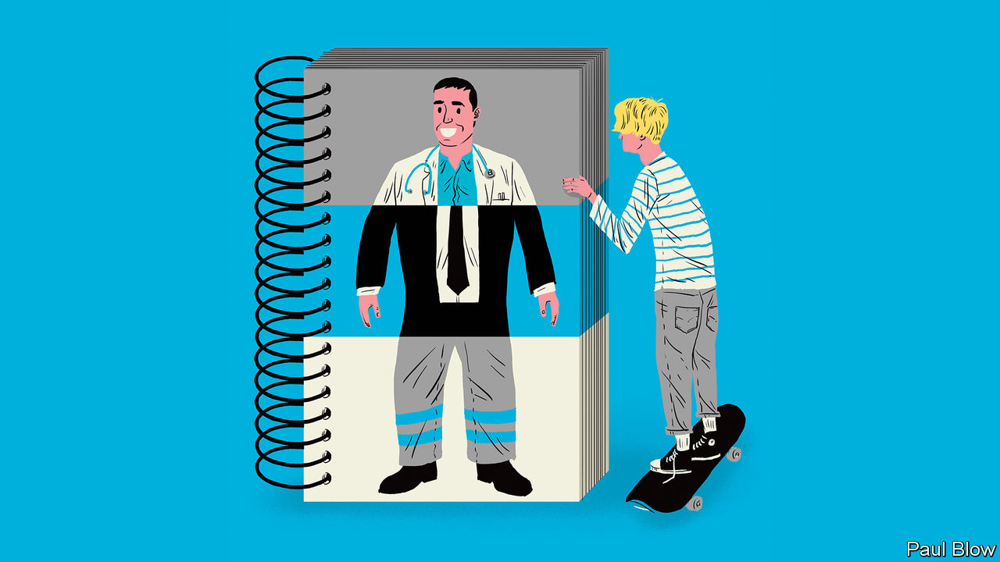

## Bartleby

# Youngsters’ job preferences and prospects are mismatched

> Teenage picks

> Feb 13th 2020

THE WORLD of work is changing. Are people ready for the new job outlook? A survey of 15-year-olds across 41 countries by the OECD, a club of mostly rich countries, found that teenagers may have unrealistic expectations about the kind of work that will be available.

Four of the five most popular choices were traditional professional roles: doctors, teachers, business managers and lawyers. Teenagers clustered around the most popular jobs, with the top ten being chosen by 47% of boys and 53% of girls. Those shares were significantly higher than when the survey was conducted back in 2000.

The rationale for this selection was partly down to wishful thinking on the part of those surveyed (designers, actors and musical performers were three of the top 15 jobs). Youth must be allowed a bit of hope. When Bartleby was a teenager, his ambitions were to play cricket for England and become prime minister; neither ambition was achieved (a lucky escape for the country on both counts).

Furthermore, teenagers can hardly be expected to have an in-depth knowledge of the minutiae of labour-market trends. They will have encountered doctors and teachers in their daily lives. Other popular professions, such as lawyers and police officers, will be familiar from films and social media. But many people end up in jobs they would not have heard of in their school years. You settle for what is available.

The OECD points out that some of the fastest-growing occupations are rarely mentioned by young people. But surely the surprise is not that “user support technician” is ranked only 158th out of 543 professions and “computer user support specialist” appears in 229th place. Rather, it is astonishing that young people know that such jobs exist at all.

At least teenagers who want to tackle climate change, as many profess to, are in luck. America’s Bureau of Labour Statistics (BLS) predicts that the two fastest-growing occupations over the next few years will be solar-photovoltaic installers and wind-turbine technicians.

Some parts of the OECD survey are disturbing. Even though top performers in maths or science are evenly matched among males and females, a gender gap persists in terms of aspiration. More boys than girls expect to work in science or engineering—the average gap across the OECD is more than ten percentage points. The problem continues in higher education; with the exception of biological and biomedical sciences, degrees in STEM subjects (science, technology, engineering and maths) are male-dominated. In America women earn just 35.5% of undergraduate STEM degrees and 33.7% of PhDs.

Things are even worse in technology. In Britain only one in five computer-science university students is a woman—a big problem at a time when the World Economic Forum predicts that technology will create more than a quarter of all jobs in newly emerging professions. But women are underrepresented in some important fields of technology; they have only 12% of jobs in cloud computing, for example. Something about the tech industry puts off female applicants.

Women play a much bigger role in the health- and social-care sectors, which are also poised for expansion. The BLS forecasts that eight of the 12 fastest-growing jobs in America over the next few years will be in those areas, with roles ranging from occupational-therapy assistants to genetic counsellors. The snag is that some of these jobs are not very well paid. Home-health and personal-care aides (with the third- and fourth-fastest growth rates, respectively) had median annual salaries in 2018 of just over $24,000.

Some jobs in health care are extremely lucrative, of course. But another gender imbalance emerges here: women make up only one-third of American health-care executives. In contrast, they tend to dominate the poorly paid social-care workforce. In Britain 83% of social-care workers are female. That suggests men shun the field, perhaps because they do not perceive caring to be a masculine trait.

The biggest problem in the labour market, then, may not be that teenagers are focusing on a few well-known jobs. It could be a mismatch: not enough talented women move into technology and not enough men take jobs in social care. Any economist will recognise this as an inefficient use of resources. Wherever the root of the problem lies—be it the education system, government policy or corporate recruiting practices—it needs to be identified and fixed.

## URL

https://www.economist.com/business/2020/02/13/youngsters-job-preferences-and-prospects-are-mismatched
