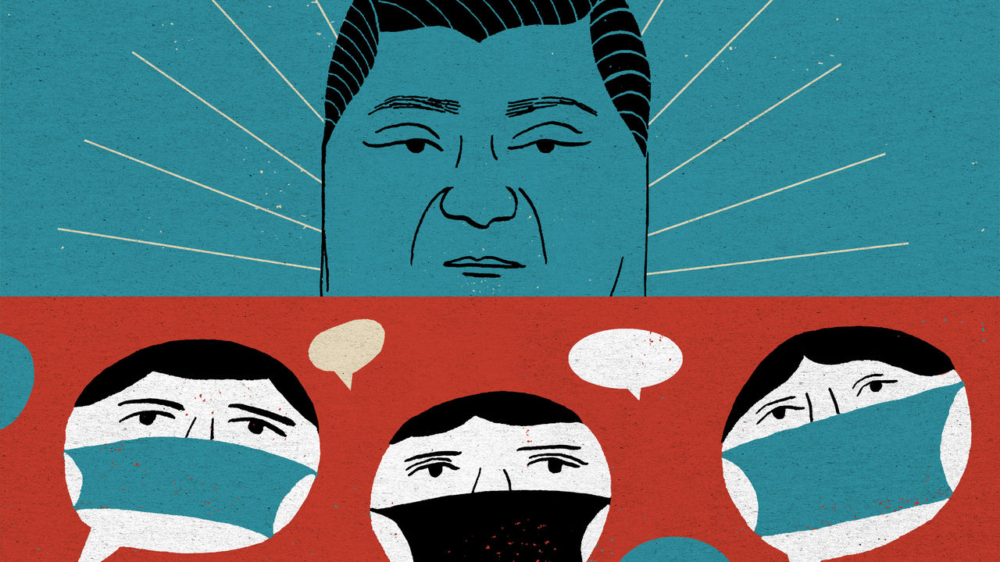

## Chaguan

# Li Wenliang’s death exposes the costs of China’s authoritarianism

> Public anger over the virus-related tragedy will fade, but those who feel the ground shake never forget

> Feb 13th 2020

THE DEATH of Li Wenliang has shaken China like an earthquake. He was a young doctor who was reprimanded by Chinese police for alerting colleagues to a new virus that has now killed more than 1,300 people, Dr Li among them (see [article](https://www.economist.com//obituary/2020/02/13/li-wenliang-died-on-february-7th)). There was nationwide soul-searching when the ophthalmologist told Chinese media, days before his death on February 6th in Wuhan, Hubei province, that silencing truth-tellers can make a country sick. “I think there should be more than one voice in a healthy society,” he said.

There is special outrage that this everyman-physician died with the charge of rumour-mongering still on his police file. “What kind of society have we created?” asked Chinese netizens, with a mixture of anger and shame. In the hours after Dr Li’s death nearly 2m of them shared or viewed a hashtag meaning “I want freedom of speech”, before it was deleted by censors. Open letters and petitions have called on the Communist Party’s leaders to honour the constitution’s neglected guarantee of free expression, arguing that truth-telling saves lives. “We should learn from Li Wenliang’s death,” said an academic in Wuhan behind one petition.

Party leaders will not learn to embrace free speech or political pluralism. They know their history and that in Chinese tradition the death of an honest man, wronged by those in power, can be a potent, dangerous event. Many times over the centuries, public gatherings to mourn such people have sparked political crises, including in Communist times. Party chiefs have duly rushed to co-opt Dr Li as a hero whose suffering should be blamed on isolated, local wrongdoing. To bolster that idea, officials have been sent from Beijing to look into his case. Global Times, a nationalist tabloid, has stressed in its reporting that Dr Li was a loyal party member. It alleges that calls to honour Dr Li’s memory are being whipped up by “anti-China forces” abroad and in Hong Kong.

After a few days in which Xi Jinping, the country’s leader, was relatively invisible, the propaganda machine has now cleared front pages for accounts of his virus-control work. Mr Xi made a rare public appearance, visiting hospital and community offices in Beijing. Three days later he reshuffled the leadership of Hubei, the worst-hit area. The state news agency, Xinhua, called him the “commander of the people’s war against the epidemic”. To some readers, the martial title may sound stirring. Others may fear it leaves little room for scientific debate or scrutiny by outsiders such as journalists, notably those brave Chinese reporters who have done remarkable work in recent weeks in their efforts to cover the virus’s spread. In a war instructions from the top are orders.

Censorship is being tightened, ending a brief period of unusual liberty for social-media users. The country’s largest internet platforms have been placed under “special supervision” by cyber-regulators, with extra controls on anything resembling citizen journalism. Yet shows of authority cannot stop the public from brooding about Dr Li. As millions of Chinese read and share accounts of his short life and tragic death, they are being forced to devote unusual attention to their social compact with the country’s authoritarian rulers.

Sometimes adherence to that compact seems almost painless—for instance last October, when many Chinese expressed deep, unfeigned pride on the 70th anniversary of a People’s Republic with shiny mega-cities, high-speed trains and aircraft-carriers that awe the world. Unbidden, many Chinese credit one-party rule with offering efficiency and stability, especially when democratic countries seem mired in dysfunction.

Such confidence is harder now. Dr Li’s last weeks on Earth oblige his fellow citizens to confront the costs of a system without free speech, an uncensored press or independent legal system. Many have read the humiliating letter that police in Wuhan made him sign, agreeing that his truth-telling was in fact a lie that “gravely disturbed social order”. Not content with forcing the doctor to deny reality, police added school-bully phrases, asking him to write “I can” and “I understand” when asked if he would now calm down and heed the police, or face legal penalties.

Lots of patriotic, law-abiding Chinese have glimpsed for themselves the casual, swaggering sadism of a system without accountability, in which the law is just another instrument for frightening the defenceless. They can see how, when agents of the state fear no external checks and balances, it is rational for them to bury bad news, right up until a crisis becomes too big to hide: a dynamic that builds instability into the way China is run.

Even today’s tight censorship is teaching bleak lessons to millions of apolitical folk who normally never see their posts deleted, or notice when news reports vanish after causing too much fuss. Some may be comforted by familiar propaganda about good national leaders let down by bad apples in the provinces. Such tales draw on traditions with deep roots, involving virtuous, faraway emperors and local tyrants. The gains are short-term, however. Each attack on local corruption or bungling stokes public distrust and makes the case for further centralisation. But China is too big to be ruled from its capital, let alone by one man. Even those who think Mr Xi a great commander know that he needs good lieutenants.

None of this presages a revolution. The virus is a hard test for the party, but it has survived worse. A vanishingly small number of Chinese see a viable alternative to the social compact that binds them to their rulers. Still, Dr Li’s death has obliged an unusually broad range of citizens to contemplate the unhappy compromises needed merely to survive in a bossy, paranoid dictatorship. After some good years, a fresh crisis has reminded millions of Chinese that their rulers define truth as they see fit. Public anger about Dr Li’s fate will fade, just as countries recover from earthquakes. But those who feel the ground shake never forget or trust in its solidity the same way again. ■