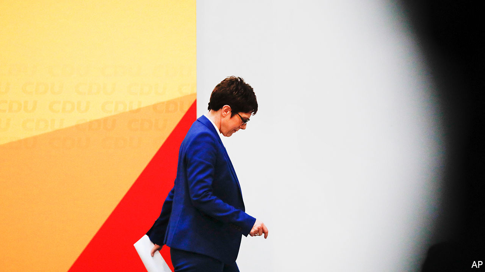
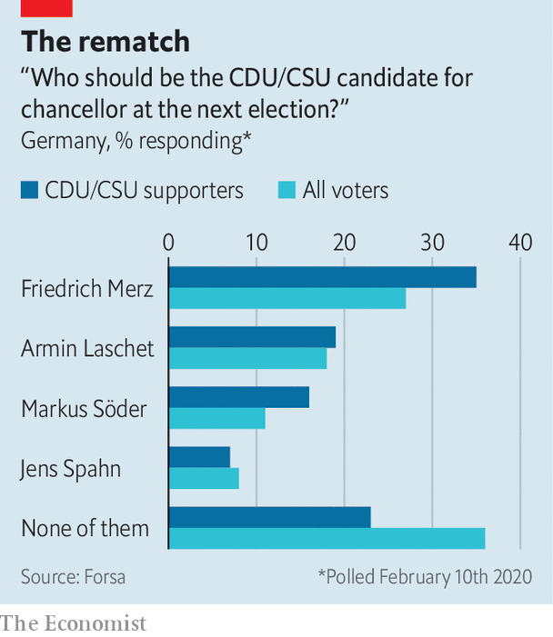

## Trouble at the top

# Angela Merkel’s presumed successor quits as party boss

> Annegret Kramp-Karrenbauer’s resignation starts a scuffle for power

> Feb 13th 2020BERLIN

FOREIGN NEWSREADERS might have celebrated. But otherwise there was little to cheer when Annegret Kramp-Karrenbauer, universally known as AKK thanks to her tongue-twisting name, announced on February 10th that she would resign as leader of Germany’s ruling Christian Democrats (CDU) and not stand as its candidate for chancellor at the next election. By forcing her party to confront its deep divisions, Ms Kramp-Karrenbauer has thrown German politics into a new era of uncertainty.

Ms Kramp-Karrenbauer was tripped up by a debacle in the east German state of Thuringia, where the CDU had voted with the far-right Alternative for Germany (AfD) to install a member of a third party as state premier. This “dam break”, the first time AfD votes had secured such an office, so horrified Germany that Ms Kramp-Karrenbauer had to try to repair the damage. But her efforts floundered, the party split and she was undermined when Angela Merkel, the chancellor, chimed in to condemn the result from a state visit in Pretoria, over 5,000 miles (8,000km) away. Ms Kramp-Karrenbauer’s unsteady leadership had already left her future in doubt. A recent appointment as defence minister, a job she will retain, did little to help. But Thuringia tipped the balance. The decision, she said, had “matured in her for some time”.

In 2018 Mrs Merkel quit the CDU leadership after 18 years. When the party elected Ms Kramp-Karrenbauer to succeed her, the road to the chancellery looked clear. Her decision to bow out thus blows German politics wide open. What happens next is unclear. Ms Kramp-Karrenbauer wants to remain in charge while the party follows an old timetable to choose its candidate for chancellor at the next election, due in autumn 2021. But that could mean she hangs around until a CDU congress in December, and few MPs believe their party can dither that long. Markus Söder, leader of the Christian Social Union (CSU), the CDU’s Bavarian partner, urges a faster pace, fearing an extended airing of the CDU’s agonies would affect his own party’s fortunes.

Mrs Merkel’s decision in 2018 to split the job of chancellor and party leader is starting to look like a grave misjudgement. In a rare, if camouflaged, flash of disloyalty towards her mentor, Ms Kramp-Karrenbauer said as much in her resignation speech. The positions of leader and chancellor-candidate should now be fused, she said.

Yet aside from the procedural complexities (the CSU must back a joint chancellor-candidate but has no role in the CDU’s leadership race), whoever takes up the job will face the same problem that bedevilled Ms Kramp-Karrenbauer: how to retain authority when real power resides with a chancellor who may be in office until the end of next year. With her succession plans in ruins, some say the best way for Mrs Merkel to clean up the mess she caused would be to resign, probably triggering an election.

But this is unlikely in stability-obsessed Germany. And so the contenders to lead the CDU/CSU into the next election will have to tread carefully. Besides Mr Söder, who is probably happy with his perch in Munich, three names stand out. Start with Armin Laschet, the premier of North Rhine-Westphalia. Affable, moderate and subtly subversive, Mr Laschet’s biggest asset is his control of Germany’s most populous state (and the CDU’s largest branch); as a country it would be the EU’s sixth-biggest economy. In style and substance Mr Laschet would represent the closest thing to continuity Merkel, which is precisely what puts off a large chunk of the CDU membership.

A flintier proposition would be Friedrich Merz, a former leader of the CDU’s parliamentary group. The plain-speaking Mr Merz quit politics for business in 2009 only to make a spectacular return in 2018, when he gave Ms Kramp-Karrenbauer a close run for the party leadership. He has maintained a steady profile since, flying to party meetings around Germany (often personally: he has a pilot’s licence), where adoring crowds lap up his pro-business, socially conservative line. Mr Merz reckons that fishing in the pool of AfD support can restore the CDU to over 35% of the vote. Early polls give him a head-start (see chart).

The final contender is Jens Spahn, the 39-year-old health minister, who also stood in 2018. Mr Spahn made his name as an abrasive right-winger on economics and migration, but has mellowed into a hard-working official with a loyal following. Unlike Mr Merz, who carries an unmistakable whiff of the 1990s, Mr Spahn can credibly claim to stand for a new start.

The air in Berlin is thick with scheming and the CDU is quivering with anxiety. Germany’s original Volkspartei (people’s party), capacious enough for everyone, now risks splintering across its many faultlines: centrist v conservative; for and against Merkelism; how to handle the AfD in the east—Thuringia remains unsolved, and may not be a one-off. Some in the party fear further infighting might cause the CDU to fall behind the surging Greens.

That seems unlikely; for all its problems the CDU is still likely to provide Germany’s next chancellor. That will give the succession race the fevered air of a party primary in a safeish seat. Yet there is a palpable contrast with 2018, when Messrs Merz and Spahn immediately declared their interest and the prospect of internal competition electrified the CDU. So far, the same pair have merely hinted at possible candidacies, while Mr Laschet has kept his counsel. As all three hail from North Rhine-Westphalia, CDU peacemakers hope they might broker a deal among themselves rather than air the party’s cleavages in a public contest. “There is zero appetite among my colleagues to go into a divisive leadership election, because it risks tearing us apart,” says Andreas Nick, a CDU MP.

During Mrs Merkel’s long reign the CDU’s repeated election wins trumped concerns over her mushy centrism and lethargic leadership. Now the CDU must ask itself what sort of party it wants to be in a far more complex political scene. “The disruptive potential is much bigger than most realise,” says Andreas Rödder, a historian at the University of Mainz and CDU member. For many months the tensions inside the CDU have been bubbling away like subterranean magma. After Ms Kramp-Karrenbauer’s decision, they threaten to erupt. ■

## URL

https://www.economist.com/europe/2020/02/13/angela-merkels-presumed-successor-quits-as-party-boss
