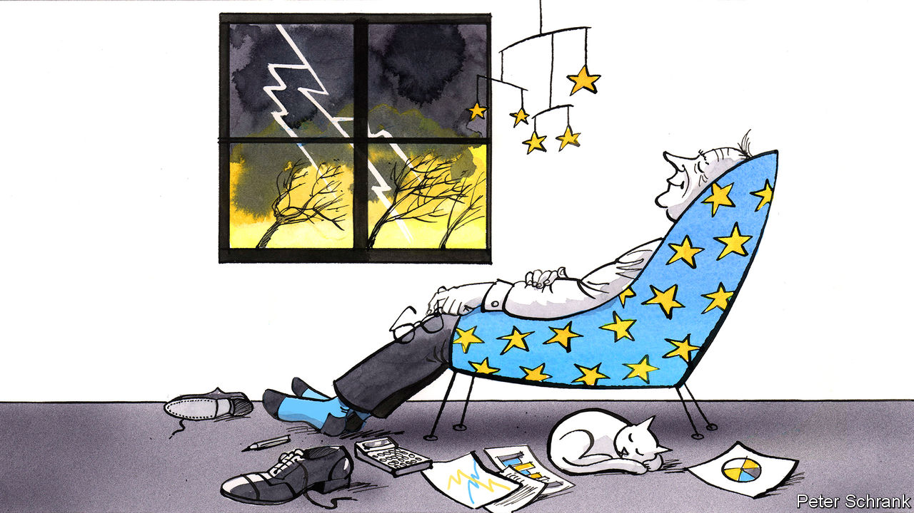

## Charlemagne

# Make Europe Boring Again!

> The EU celebrates an outbreak of dull stability by having petty rows

> Feb 13th 2020

FOR MUCH OF the past decade, if you asked a Eurocrat: “What’s on your mind?”, the response was usually dramatic. At the start of the decade the euro teetered on the edge of collapse. In the middle of it, Greece came close to being kicked out. A crisis flared when nearly 3m asylum-seekers arrived from Syria and other troublespots. Shortly after that, Britain, then the EU’s second-largest economy, voted to leave without a serious plan for doing so. Meanwhile, populists from across the spectrum itched to upturn the comfy order that those in Brussels were attempting to build. In short, life in Brussels was exciting. For years, officials had treated the city like a visit to a proctologist: necessary but disagreeable. Suddenly, the EU’s de facto capital became like a political rollercoaster—terrifying, but strangely thrilling, too.

Those days are over. Brussels has become reassuringly dull again. Ask a passing Eurocrat what’s up and the answer is prosaic: haggling over the EU’s budget. When EU leaders next visit Brussels on February 20th, it will be to discuss the bloc’s spending. Britain’s departure has left a hole of €60bn in the EU’s funding. Spread over seven years and between 27 countries, the sum becomes easier to swallow. The upshot is that, to keep spending roughly the same, EU countries are being asked to cough up between 1% and 1.1% of gross national income—only a whisker more than last year.

To spice things up, diplomats from both ends of the debate are behaving as if a gap of 0.1% of their income—the equivalent of a cold snap in winter or a few wet weeks in summer—is a fiscal Mariana Trench. A hard-core gang consisting of the Netherlands, Denmark, Sweden and Austria have demanded that the EU spend no more than 1% of its members’ GNI. Another group, led by those countries from central and eastern Europe that gorge on handouts from Brussels, are refusing to sign off on anything so paltry as a budget of 1%. “They want the till to open!” despaired one diplomat from the tightwad camp. With no agreement in sight, leaders from 27 member-states will spend at least two days arguing over a pitiful amount of money, like monks having a punch-up over the number of angels dancing on the head of a pin.

Charles Michel, who has the task of stewarding the meeting as European Council president, has threatened to keep the negotiations running until they are resolved. Unfortunately, no one believes him. At one summit during the height of the Greek crisis, Donald Tusk forced leaders to stay and hammer out a deal on bail-out terms rather than risk Greece falling out the bloc. This time, heads of government are well aware that they can simply come back in a few months and try again. Politics often takes time. In his former life, Mr Michel was a Belgian prime minister. Negotiations for him to secure that job took 138 days.

Such pettiness could be seen as the EU at its worst. Rather than deal with great affairs of state, EU leaders will waste time fighting over pocket change. The fiscal fight is a near-perfect example of Sayre’s law, named after Wallace Stanley Sayre, an American political scientist: “In any dispute the intensity of feeling is inversely proportional to the value of the issues at stake.” If the net contributors are routed and surrender at every turn, the budget will be about 1% of gross national income. If the Frugal Four emerge triumphant, the budget will be about 1% of gross national income.

But there is a more positive way of looking at it. An outbreak of internal stability means the EU has space to sweat the small stuff. The haphazard, shantytown of economic policy erected during the financial crisis has proven relatively sturdy. Gatherings of the Eurogroup, the club of finance ministers that once dictated the fate of nations, are now as dramatic as a meeting featuring the finance ministers of Finland and Luxembourg ought to be. Steps taken during the migration crisis to stem the number of people entering Europe, such as bunging Turkey cash and turning Greek islands into de facto prison camps for migrants, were horrifying but effective. EU officials now, perhaps overconfidently, pooh-pooh any prospect of a repeat of the migration crisis of 2015-16. Brexit, once seen as a schism in the Western alliance and the first raindrops of a populist storm, is now a dry debate about the mundanities of data transfers, equivalence of financial rules and fish. Boredom surely beats crisis.

There are no legislative big bangs expected from the European Commission. The EU no longer rips up its treaties, the fundamental rules of the bloc, every five years or so as it did from the early 1990s, leaving voters discombobulated or angry. Such grand projects are now the preserve of a few federalists in the European Parliament, and no longer the near-universal mission of the continent’s elite. Rather than a bold new frontier, projects such as the commission’s “green deal”—a glut of green legislation due in early March—are simply the EU functioning as it should, coming up with collective policies to deal with a collective problem.

An emphasis on the more humdrum aspects of the bloc’s existence comes as the EU’s problems have inverted. For years, the EU’s most pressing problems were internal, from its collapsing currency to its half-baked migration strategy. The cry of alarm was coming from inside the house. Now, the threats are external. A ring of instability surrounds the EU, from Russia to Africa via Turkey. It now even includes Britain, given its geopolitical mid-life crisis. While national capitals jealously guard their foreign policies, those in Brussels are left to feast only on political scraps, rather than the main course. Schemes to “Make Europe Great Again” are thin on the ground. Instead, Eurocrats are happy to have made Europe boring again. Better a brawl over the budget than over something more consequential. As the past decade more than demonstrated, excitement is overrated. And it may yet come roaring back. The problems of the 2010s may have simmered down, but they have not been solved. Enjoy the boredom while it lasts. ■