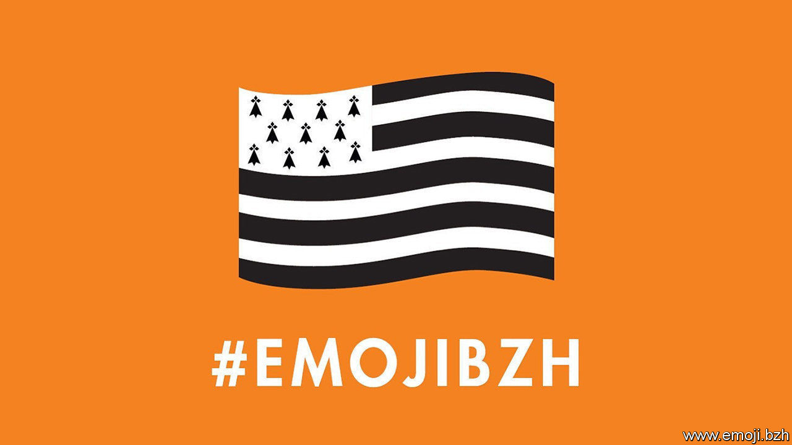

## Not just a smiley face

# The struggle to give Brittany its own emoji

> A proud French region, home of Asterix, wants its flag in every phone

> Feb 15th 2020PARIS

THE FRENCH foreign minister, Jean-Yves Le Drian, is a man of few words and many air miles. When he does comment, it is usually to deplore events in Syria, say, or Iran. But on February 9th the minister let his inner passion get the better of him. The reason? An emoji. “The countdown is on!” Mr Le Drian tweeted excitedly. All Bretons, he urged, should mobilise on social media by tweeting a hashtag, as part of a campaign to secure an emoji for the Brittany flag, known as the Gwenn ha du. “Go on, tweet our #emojiBZH and don’t let up!”

Mr Le Drian, born in the Brittany town of Lorient, was merely the latest to join an effort to turn the black-and-white striped Brittany flag into a digital icon. Promoted by www.bzh, which runs the Breton internet domain name, and the Brittany region, the campaign first stirred interest in 2017. On “world emoji day” that year, to Bretons’ delight, the Gwenn ha du was voted the second most-wanted emoji worldwide. (It narrowly lost to mate, an infusion popular in Latin America.) Last month a fresh effort was made to demonstrate to the Unicode Consortium, a global tech-backed body that approves new emojis, popular backing for the Brittany flag. Within hours, the hashtag #emojiBZH was trending at the top of Twitter in France.

Competition for new emojis is fierce. Raclette, an Alpine melted-cheese dish, was rejected as too obscure. Unicode says approximations preclude the need for certain additions. A squirrel, it insists, can be represented by a chipmunk emoji. Requests for an emoji for the Tibetan and Catalan flags are still pending—although there is one for the Isle of Man, and the French island of La Réunion.

An independent kingdom in the 9th century, Brittany became part of France in 1532. But regional identity has been fiercely defended, with periodic revolts, ever since. Today Breton pride and powerful networks endure. François Pinault, a luxury-goods tycoon, flies the Breton flag from the Venetian palace that houses his art collection. In 2018, when introducing Mr Le Drian to the pope, President Emmanuel Macron joked that “Bretons are everywhere, it’s the French mafia!” Now, though, Mr Macron has swung behind the emoji. When his official photographer, a Bretonne, tweeted in its favour, he gave it the presidential “like”.