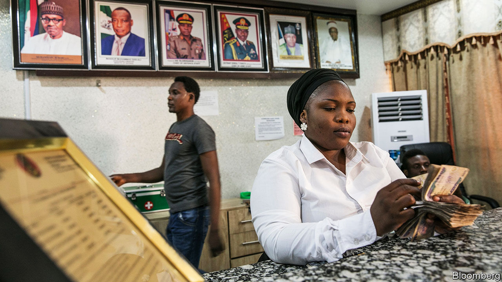

## Value judgments

# African countries like their currencies strong

> A tendency for strong currencies is built into the structure of their economies

> Feb 13th 2020KAMPALA

IN 1979 AN IMF negotiator met Julius Nyerere, Tanzania’s socialist president, and urged him to weaken the country’s currency. “I will devalue the shilling over my dead body,” Nyerere fumed afterwards. Over the next decade, many African leaders took similar stands. But faced with worsening terms of trade and foreign-currency shortages, they eventually let their currencies slide. Tanzania bowed to the inevitable in 1986, after Nyerere had left office. Most African exchange rates are now about where markets think they should be.

Could governments go further? An undervalued currency makes a country’s exports cheaper, and so acts as an implicit subsidy to firms that sell abroad. That can counterbalance institutional failures, such as the difficulty of enforcing contracts, which hurt exporters more than they do local businesses—barbers, taxi-drivers and the like. Exposure to world markets also helps companies learn and improve.

Dani Rodrik of Harvard University argues that governments in developing countries should not simply aim for an “equilibrium” exchange rate, as the IMF would urge, but actively engineer undervaluation. That may entail measures such as capital controls or reserve accumulation. Some Asian countries, including China, adopted this strategy as they industrialised. Empirical studies suggest that undervaluation boosts growth, and more so in poor countries than in rich ones.

Strange, then, that those African countries that do manage their currencies are still trying to prop them up. Nigeria restricts access to foreign exchange to keep the naira strong. Ethiopia’s drive to become an Asian-style hub for export manufacturing has been hindered by an overvalued birr (though a new IMF programme could weaken it). A group of eight mostly francophone west African countries are changing the name of their currency but not, tellingly, the rate at which it is pegged to the euro. The last devaluation, in 1994, sparked riots.

A tendency to keep the currency strong is built into the structure of African economies. Commodity exports and aid inflows raise demand for local currencies, making them stronger. Governments fear depreciation because they depend on imported capital to finance infrastructure projects; a weak currency forces them to raise more revenue to pay back foreign debts.

Depreciation also pushes up the cost of imported goods, including food, medicine and fuel. Those are mostly consumed by city folk, who are more prone to protest than those in the countryside. Inflation hits industry, too. Nigerian firms buy much of their machinery and inputs from abroad and so are hurt by higher import prices, says Segun Ajayi-Kadir, the director-general of the Manufacturers Association of Nigeria. Ethiopian factories import about half of their raw materials. Garment firms ship in fabric; shoemakers, leather.

Left unchecked, inflation erodes any boost to exports. Consider a 10% depreciation in the “nominal” exchange rate—that is, the rate advertised in newspapers or at a bureau de change. If domestic prices also rise by about 10% then there is no change in the “real” exchange rate, which measures relative prices of domestic and foreign goods, and that is what counts. In practice prices rarely jump that much: in 2012 IMF researchers estimated that in sub-Saharan Africa a 10% depreciation typically results in domestic price rises of only 4%. But to maintain an undervalued real exchange rate, governments would have to limit inflation by containing local demand, for example by trimming public spending, notes Abebe Aemro Selassie, the director of the IMF’s Africa department. As this is difficult, countries do not typically contemplate strategic undervaluation.

Perhaps this is not a surprise. Much like tackling corruption or fixing the myriad other problems African economies face, strategic undervaluation is hard to pull off. It imposes real wage cuts on the workforce, notes Christopher Adam of Oxford University, so “you’re imposing the cost on current workers and consumers for the benefit of future generations.” No wonder politicians prefer their exchange rates strong. ■