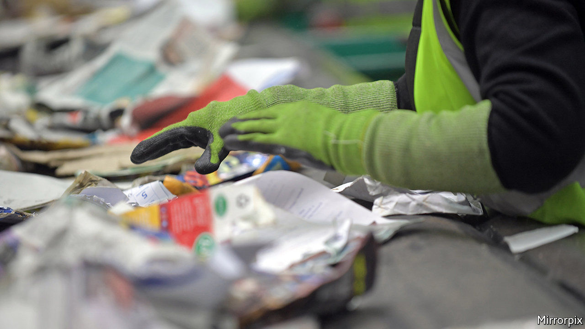

## Green paper

# Companies are tying their loans to measures of do-goodery

> Sustainability-linked loans now account for a quarter of green-debt issuance

> Feb 15th 2020

EARLIER THIS month WSP, a mid-size Canadian consultancy, announced that it had amended the terms of a loan of $1.2bn. What made it unusual was that the interest rate hinges on hitting three targets. The company wants to reduce greenhouse-gas emissions from its operations, increase revenues from green sources, such as renewable energy, and raise the share of women in management. For every goal that it meets (or misses), its interest payments will fall (or rise) by a set amount.

Such sustainability-linked loans are booming. The first loan was made in 2017; two years later issuance had risen to $122bn, according to BloombergNEF, an energy consultancy. They now make up a quarter of sustainable-debt issuance (which is itself around 1% of global debt issuance). That is less than green bonds, which tie the proceeds of bond issues to investment in environmentally friendly projects. But the newfangled loans are quickly making up ground.

Sustainability-linked loans are not linked to specific projects. Borrowers simply get rewarded (or penalised) based on their performance on some environmental, social and governance (ESG) measures. Green metrics, such as carbon emissions, are common.

That flexibility over how the money is spent explains why the loans are so popular. Good public relations is another reason. Many firms in industries blamed for the world’s ills have issued loans. The single biggest issuer last year was Shell, an oil giant, with $10bn linked to reducing its carbon footprint. Other borrowers include fast-food chains and airlines. Interest rates may be nudged down by around 0.05-0.1 percentage points for good behaviour.

As with many forms of sustainable finance, greenwashing is a worry. One potential problem is the data on which the change in borrowing costs depend. Mike Wilkins of S&P Global, a credit-rating agency, says that the use of self-reported figures is a concern. Another option is to rely on ESG scores calculated by specialist data firms and some credit-rating companies. Dozens of loans are based on these. But the ESG-raters use opaque methods and rarely agree on which companies are sustainable.

Even with reliable data, it is unclear how ambitious the targets are. Many issuers do not publicly disclose their exact goals, which are usually thrashed out with the lenders. Some companies have started asking if their pre-existing ESG targets qualify them for a cheaper loan, says Dan Shurey, of ING, a bank. Many expect that regulators will eventually set standards.

The idea has spread to the bond market. In September Enel, an Italian energy company, issued the first sustainability-linked bond. If it does not increase the share of renewables in its total generation capacity from 46% today to 55% by 2021, the interest rate will go up from 2.7% to 2.9%.

Investors are keen. Enel’s bond offering was almost three times oversubscribed. A similar bond issue the next month by the company was even more popular. Both big institutional investors and smaller, sustainability-focused ones are getting on board. Linked lending offers them a way to add to their ESG portfolio and burnish their green credentials. And if the company fails to hit its target, they make more money into the bargain. ■

## URL

https://www.economist.com/finance-and-economics/2020/02/15/companies-are-tying-their-loans-to-measures-of-do-goodery
