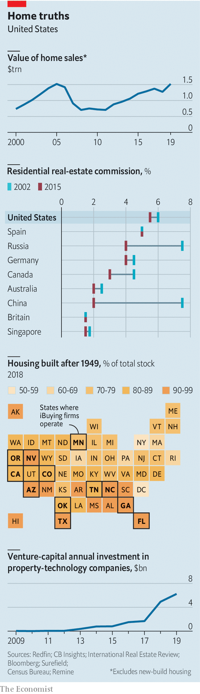

## Tearing down the house

# Technology is poised to upend America’s property market

> At long last, the world’s biggest asset market will be shaken up

> Feb 15th 2020DALLAS, LOS ANGELES AND SEATTLE

FROM FAR enough away most houses look the same. At cruising altitude over Dallas, Los Angeles and even much of New York, most dwellings are nondescript: beige- or grey-roofed, laid out in neat patterns. In sunnier climes the monotony is punctuated by the bright turquoise oblongs of swimming pools. When it comes to valuing a home, though, the details matter. The site, square footage, number of rooms, the finishing and a thousand other factors determine whether a home is worth $200,000 or $2,000,000.

For this reason real estate has long been a fragmented, local market. There are 2m estate agents in America, according to the National Association of Realtors (NAR), just over 1% of America’s workforce. An agent does a number of tasks—appraising houses, marketing properties, organising tours—for a handful of transactions each year. An agent might dominate the market in a single neighbourhood—a few streets in Beverly Hills, say. But zoom out to Los Angeles and its sprawling suburbs and his market share quickly drops to nearly zero.

Real estate is the biggest asset market in the world. The value of residential property in America—at around $34trn—rivals the market capitalisation of all listed American companies. Throw in commercial and retail property, together worth around $16trn, and its value easily eclipses that of public firms. For decades the market has been characterised by low volumes and extortionate transaction costs (see chart). Just 7% of American homes change hands each year. Homeowners traded property worth $1.5trn in America in 2019, forking over some $75bn in commission to agents, or around 0.4% of GDP. The fees for trading many other financial assets pale in comparison. Around $40trn-worth of stocks are traded annually in America. The fees paid by institutional investors to brokers have halved from their peak, to less than $10bn.

On top of the brokers’ fees paid to sell a home in America, which amount to 5-6% of the price, other levies—government taxes, mortgage fees—mean that the total cost of moving exceeds a tenth of the price. The expense could help explain why owners are staying in their homes for longer. In the 1950s, 20% of households in a county moved each year. Today 9% do.

This antiquated model is on the verge of being disrupted. In America rules on commissions and data-sharing have so far kept fees higher than in other rich countries. But now regulators and courts are considering again whether practices in the real-estate industry are anticompetitive.

Technology also promises to make moving home quicker, easier and cheaper. As recently as 2012 venture capitalists invested just tens of millions of dollars in property technology, or “prop tech”, each year. By 2019 that had climbed to $6bn. The four biggest prop-tech firms, Compass, Opendoor, Redfin and Zillow, have a combined valuation of $23bn. These offer a range of services, from online listings to tools that make estate agents more productive. Some act as “intermediate buyers”, making cash offers to sellers to speed up the process of homebuying.

Technology has already transformed other big asset markets. Fifty years ago trading company shares was opaque, illiquid and expensive. Ray Dalio, who worked on the trading floor of the New York Stock Exchange in the early 1970s before founding Bridgewater Associates, now the world’s largest hedge fund, bemoans practices that were once considered normal. “Dealers had to entertain fund managers, and no one would know what the prices were.” But technology has taken over more and more aspects of trading. Today markets are transparent and liquid. Transaction costs are close to zero.

The market for houses is structurally different from that for stocks. Every share of Microsoft is identical, but no two homes are exactly alike. Emotion plays a bigger role in the decision to move house. Most buyers and sellers are links in a chain. Two-thirds of Americans selling a home are also looking to buy another. A delay at one point in a chain holds up transactions all along it.

But these difficulties cannot justify the fees Americans pay. Fees across much of the developed world have fallen, thanks to the entry of online platforms that allow would-be buyers to search for properties themselves. American brokers argue that they provide a more holistic service than estate agents elsewhere. But a bigger factor may be the network effects associated with the multiple-listing service (MLS) through which nearly every broker lists and searches for homes, and the NAR, the industry association that regulates it.

All agents that are registered with the NAR must post their listings to the MLS in return for access to other listings. The convention in the industry is for sellers to pay the buyer’s broker, with the listing specifying the fee. Maisy Wong of the Wharton School of the University of Pennsylvania finds that brokers steer buyers away from properties that offer less than 3% commission, keeping fees high.

This used to prevent online platforms from allowing buyers to search for properties, because agents could opt out of having their listings posted on other brokers’ websites. But in 2008 the Department of Justice (DOJ) ruled that MLS listings data could not be restricted this way, and should be shared with online platforms. Zillow and Redfin now publish MLS listings. But commission norms still make it hard for “discount” brokerages to get a footing. Purplebricks, a British company that expanded into America in 2017, offered to sell homes for a fee of around $4,000 regardless of price. After two years of making losses, it withdrew. REX, a brokerage founded in 2015, will return half of the fees it collects to the buyer. But such rebates are illegal in many states.

Disgruntled home-sellers have mounted class-action lawsuits against their estate agents for anticompetitive behaviour. They want to cut the ties between buying and selling fees, arguing that they are forced into paying inflated fees for buyers’ brokers. The DOJ is also investigating anticompetitive practices in the industry. It is looking into whether brokers can search listings by commission rates.

A better comparison for real estate might be the market for bonds rather than shares. Bonds vary by tenor (the length of time till they fall due) and coupon (interest) rate. That makes matching buyers with sellers harder. To create liquidity, institutions such as investment banks act as intermediaries, holding an inventory of corporate bonds and guaranteeing to buy from or sell to clients at any time. Fees are a little meatier than those paid to trade stocks—but still much lower than real-estate commissions.

Similarly, intermediaries known as instant buyers, or “i-buyers”, are muscling into the property market. Opendoor, founded in San Francisco in 2014, now operates in more than 20 cities. Zillow and Redfin began i-buying in 2018.

These firms use vast quantities of data and whizzy machine-learning algorithms to appraise homes and make an initial offer, often within hours of a seller asking for one. A couple in Covina, in greater Los Angeles, requested an offer from Zillow on Christmas Eve 2019, had their home inspected on December 26th and accepted the bid the next day. They chose to set a closing date in March 2020, but could have opted for December 28th. Once they move Zillow will sell the house on—often within 30 to 90 days. The fee is typically around 6-7%, almost the same as a seller would pay an agent—but for a much quicker and easier process. Knock, another prop-tech firm, follows a different model, buying a new home for a homeowner and selling the old house once they have moved.

At the national level, i-buyers are still small. They bought 60,000 homes worth $8.9bn in 2019, or around 0.5% of transactions. But in the 18 markets in which they buy, their share is 3%. It is even higher in places like Phoenix, Arizona and Raleigh, North Carolina, where i-buyers have operated for several years.

Some markets are better suited to i-buying than others. The model works best when homes are new and homogenous. Parts of the suburbs of Dallas are packed with cookie-cutter houses. These are easy to price, because it is likely that a similar house has sold recently. Two identical homes built next door to each other in 2010 can only be a little different. By contrast, adjacent Brooklyn brownstones built in the 1920s could be entirely different beasts. Some markets might be too idiosyncratic for i-buying, says Sean Black of Knock. Prices jump in Palo Alto, a town south of San Francisco that is popular with tech workers, when a large company goes public. Loft apartments in Tribeca, a neighbourhood in Manhattan near the downtown financial district, soar in years when banker bonuses are fat.

Alex Rampell of Andreessen Horowitz, a venture-capital firm that has invested in Opendoor, says i-buyers create a pool of liquidity, allowing investors keen to buy rental properties to do so at scale. “Institutional investors buy to achieve a certain rental yield, so they are less sensitive to price uncertainty.”

The success of i-buyers also depends on whether their algorithms get the price right. The most important factor is location, says Bridget Frey of Redfin. It interacts with other factors, too. “You need location to tell the algorithm what weight to put on the thousands of other variables you might look at.” Swimming pools add value in San Diego but tend to decrease it in New Jersey. In Atlanta proximity to a golf course is highly prized. Before Zillow launched there a worker traced every golf course on Google Maps, so that it could be added as a variable. For years Rich Barton, Zillow’s founder, found it odd that the algorithm assigned a negative value to extra bedrooms. “It seemed backwards. But once you’ve factored in square footage, extra rooms actually deduct from the value of a house.”

The process is not entirely devoid of human input. At Zillow’s offices in Seattle a group of youthful workers spend their days on Google Maps zooming in on pictures of houses that sellers have requested prices for, verifying that nothing looks too out of the ordinary. Ms Frey would like to get to a point where the algorithm beats the human. But at present Redfin also uses agents to conduct home inspections, and defers to them if their assessment differs from that of the algorithm.

The bosses of the teams building the algorithms all talk about their “buy-boxes”. Rather than buying the most expensive or the cheapest homes in any neighbourhood, they prefer the 60% or so in the middle. They find it easier to provide an offer for average homes with confidence; over more unusual homes there tends to be greater uncertainty. And the more uncertainty, the lower the offer they might have to make—if they make one at all. “We sometimes can’t quite figure out why that particular home is so much cheaper or more expensive than the rest,” says Stan Humphries of Zillow.

That said, where i-buyers do operate, they seem to get close to offering fair value. Research by Zillow finds that, when sellers decline the firm’s initial offer, their eventual sale price is only 0.2% different. An independent study by Mike DelPrete of the University of Colorado found that, on average, the offers made by Zillow and Opendoor were 98.6% of the price that standard industry models suggest, implying a 1.4% discount compared with the market.

Getting value right is critical to how the model works, says Glenn Kelman, the boss of Redfin. “If we start buying homes cheap, or trying to fix them up too much, our business will start to be valued like a real-estate investment firm. That is the opposite of what we want.” Tech firms tend to trade at higher valuations than property investment companies. I-buyers say they are in the business of providing convenience and liquidity, not flipping homes for profit.

A big question, though, is whether i-buying can be profitable. None of them yet make any money. Zillow’s home-buying business spends $1.40 for each $1 of revenue it receives. The firm makes most of its revenue selling leads on buyers to agents it is partnered with.

Other innovations are nibbling away at the many other tasks that estate agents do. Redfin and Opendoor use remote electronic locks, which can let buyers into a home by themselves. Your correspondent let herself into a lovely two-bedroom flat in Santa Monica using Redfin’s app. Had she wanted to buy it, she could have done so without consulting an agent, by filling out an offer form on the app.

But not all of the biggest prop-tech companies in America are betting on estate agents becoming redundant. Redfin’s focus is on lowering agents’ costs. Sellers who list their home with Redfin pay commission as low as 1%, instead of the usual 3% (though sellers must still pay traditional commission rates to the buyers’ broker).

Compass, which was founded in 2012 and is now worth more than $6bn, is the most focused on helping agents. Its tools take the drudgery out of their work, in order to make them more productive. Its platform for agents analyses the best time to list properties and automatically sends them listings their buyers might like. Robert Reffkin, its founder, claims that agents who use Compass make more deals. “If Compass fails it is because my faith in the role of the agent is misplaced.”

Lower fees, therefore, need not mean a big hit to agents’ pockets. They might boost productivity. They could encourage people to move house more often, offsetting the fall in fee rates. Clients, meanwhile, would undoubtedly benefit. People rank buying a home second only to divorce as the most stressful time of their lives. If it becomes a little less so, and cheaper into the bargain, that would be a welcome change. ■