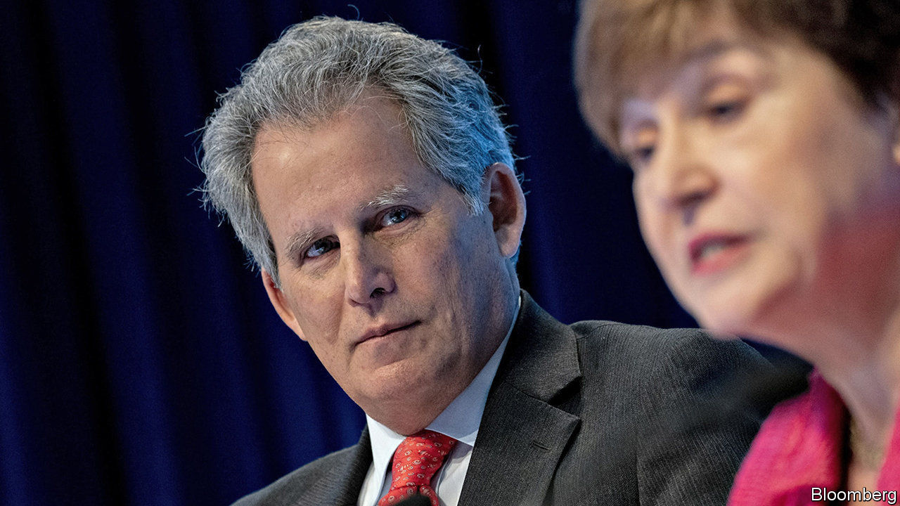
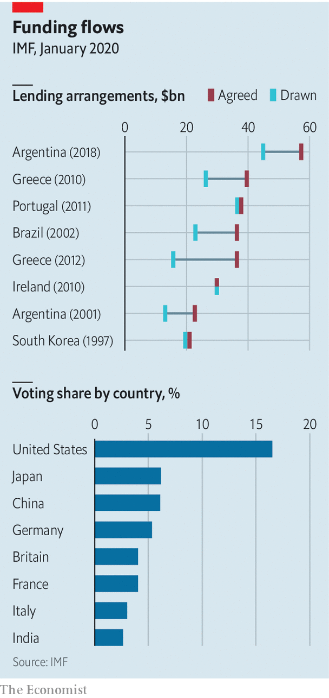

## An adjustment programme

# The IMF undergoes structural reform

> Kristalina Georgieva makes her mark

> Feb 15th 2020WASHINGTON, DC

THE IMF is familiar with unwelcome edicts. Its job as the world’s lender of last resort often involves demanding reform. But its staff may be discovering the unpleasantness of being on the receiving end. Kristalina Georgieva, the fund’s boss, is reorganising the institution.

Ms Georgieva took over as the IMF’s managing director in October 2019 on a wave of good publicity. As the first boss from an emerging market, she regaled audiences with her own experiences of an IMF programme—in the 1990s she saw hyperinflation in Bulgaria wipe out her mother’s savings in a week.

She arrived with a reputation for being able to manage large bureaucracies, having previously been chief executive officer of the World Bank. A few months in, she has managed two senior deputies out. On February 7th she announced that David Lipton, the first deputy managing director, and Carla Grasso, another deputy managing director, would leave at the end of the month.

Mr Lipton’s reputation for diligence and technical expertise meant that the news of his early exit—his term had been due to end in August 2021—was not well received by staffers old and new. A rumour swirled that his departure was a ploy by President Donald Trump’s administration to choose his successor. By convention, America appoints the first deputy managing director.

In fact it seems that Mr Lipton’s departure was Ms Georgieva’s doing. Her predecessor, Christine Lagarde, had been content to be the IMF’s public face while Mr Lipton handled much of the day-to-day management. Ms Georgieva, though, is a more hands-on manager, making Mr Lipton’s role, as currently defined, redundant. And so he went. Ms Grasso, whose renewed term had started only five days before her departure was announced, is leaving partly because her job is, unusually, one for which Ms Georgieva can pick a successor.

That would allow her to nominate someone to help realise her vision for the fund, which includes doing more to help fragile states and tackling climate change. In her first speech as the fund’s chief, she called for governments to enact domestic reforms that achieve “stronger and more resilient growth”, and for those with remaining fiscal firepower to deploy it. She has promised to collaborate more with the World Bank, particularly regarding countries that have received the fund’s help. Ms Georgieva may want to remove the impression that theIMF cares only about restoring stability to crisis-ridden countries at the expense of jobs and growth.

It is hardly unusual for new bosses to make management changes, including at the fund. It could benefit from a shake-up that flattens its hierarchical management structure. Its policies could also be improved. Its programmes sometimes crimp growth, such that countries miss its rosy GDP forecasts. Its engagement with fragile states can be lacklustre.

The risk, though, is that Ms Georgieva’s reforms backfire. If she wants the most able staff to work on fragile states, she will have to butter them up. Mr Lipton’s departure means one fewer set of capable hands to help in a crisis. Some fear that without him there will be an increase in “clientitis”—country directors being too soft when demanding reforms. One near-term challenge is Argentina, the recipient of the fund’s biggest ever loan (see chart). On February 12th fund officials began talks with the government, which is seeking to restructure its debt.

There are also concerns that Mr Lipton might be replaced by someone less capable. The Trump administration has resisted the idea that Mr Lipton’s job be abolished altogether. It is floating the name of Geoffrey Okamoto, an acting assistant secretary of the Treasury, as a potential replacement. For Ms Georgieva’s strategy to work, she needs someone pliable in the role. But if they are too weak, the institution could eventually suffer.

Ms Georgieva still needs to convince some fund-watchers that she is updating its mission not diluting it. New ambitions require resources—or a sense of which old tasks will be cut to make way for new ones. Structural reforms need not do damage. But they should be enacted with care. ■

Correction (February 14th 2020): By convention America appoints the first deputy managing director of the IMF, not the first managing director, as we originally wrote.

## URL

https://www.economist.com/finance-and-economics/2020/02/15/the-imf-undergoes-structural-reform
