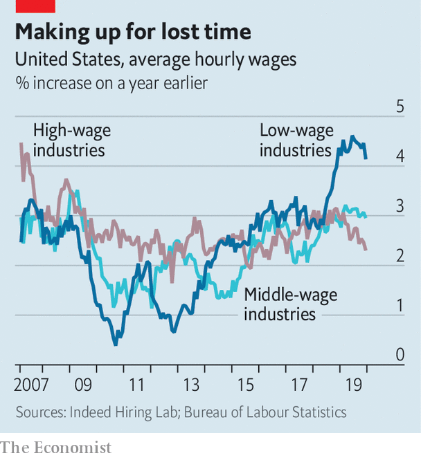

## Free exchange

# Wage gains for low earners have helped sustain America’s economic expansion

> Trickle-up economics

> Feb 13th 2020Trickle-up economics

AT 128 MONTHS and counting, America’s economic expansion is the longest on record. Longevity has not come easily. The expansion trundled along despite global manufacturing downturns in 2016 and 2019, conflicts over trade, and a bout of monetary tightening by the Federal Reserve. The recovery ploughed ahead last year even as business investment decelerated and residential-construction investment shrank, thanks to rock-steady growth in personal consumption. The durability of spending is a testament to one of this expansion’s more unusual features: faster growth in wages for workers at the bottom of the income distribution than for high earners. Improved fortunes for low-wage workers may, it seems, be an underappreciated contributor to the sustainability of economic booms.

Since the turn of the millennium demand, not supply, has been the binding constraint on economic growth. Quiescent inflation suggests that spending has only rarely bumped up against the economy’s production capacity over this period. Annual inflation has been just 1.8% on average, down from about 3.5% during the preceding 20 years and 4.5% in the two decades before that. Economists have offered several explanations for chronically weak demand, from the ageing of the workforce to a suppression of investment appetites caused by a slowdown in technological progress. Inequality is also thought to have played an important role.

Richer households are far more likely to save an additional dollar earned than poorer ones. Rising inequality, by raising the income share of the well-off, thus tends to drain the economy of demand. Between 1979 and 2018 the real wages of workers in the 90th percentile of the income distribution rose by 34%, according to a recent analysis by Jay Shambaugh and Ryan Nunn of the Brookings Institution, a think-tank. Pay for those at the tenth percentile, in contrast, rose by less than 5%, and wages for those at the fifth percentile declined. Spending suffered accordingly. In an analysis published in 2012 Alan Krueger, a labour economist, reckoned that, were it not for the increase in inequality between 1979 and 2007, consumption across the American economy would have been 5% higher. That would add stimulus of about $700bn to today’s economy.

As ever more of the income generated in the economy flowed to thrifty households, the Fed found itself working ever harder to coax enough spending to keep job growth and inflation from falling. The average level of the Fed’s main policy interest rate, which was just under 10% in the 1980s, dropped to below 1% in the 2010s. Purchasing power eventually made its way into the hands of those more likely to spend—but through the extension of credit rather than through fatter pay packets. Household debt in America, as a share of GDP, roughly doubled between 1979 and 2007. It leapt by nearly 30 percentage points between 2000 and 2007 alone, when the flow of money from savers to spenders was turned into a gush by low interest rates, soaring house prices and a collapse in mortgage-lending standards. Without so much borrowing America’s economy might well have only stumbled along in a state of permanent sluggishness.

The recent recovery looks very different from the pattern established in the 1990s and 2000s. From 2014 to 2018 pay in low-wage industries grew about as quickly as that in other parts of the economy, according to a recent analysis by economists at Indeed Hiring Lab, a labour-market research group. And over the past two years wage growth at the bottom has been substantially faster than that in better-paying industries (see chart). Rising pay for low earners has put more cash in the hands of those most likely to spend, supporting consumption and helping the economy weather a soft patch. At the same time household debt, which plunged immediately after the global financial crisis, has continued to fall as a share of GDP over the past few years. Lower debt levels have in turn contributed to a more durable expansion—one that is less likely to be choked off by changing credit conditions or higher borrowing costs stemming from interest-rate increases, like those imposed by the Fed from 2015 to 2018.

Rising wages reflect the gradual tightening of the labour market over the past decade. As the recovery proceeded, the unemployment rate dropped to its lowest level in half a century, forcing firms to search ever harder to find the worker they needed. And as employment growth has continued, the share of working-age adults participating in the workforce has risen. People on the margins of the labour market have been lured in by firms offering more generous wages.

Much of the unusually rapid growth in the pay of low-wage workers, however, is probably due to increases in minimum-wage rates. Although the federal minimum wage has been stuck at $7.25 an hour for over a decade, many state and local governments have in recent years passed increases that push the rate far above it. As a consequence Ernie Tedeschi, an economist at Evercore ISI, a research firm, found in 2019 that the average person working at the minimum wage actually earns close to $12 per hour. This effective wage, once adjusted for inflation, has jumped by roughly a third over the past ten years.

Continued strength in wage growth for low earners cannot be taken for granted. For now, companies are still keen to hire more staff. And political enthusiasm for minimum-wage rises continues to grow. Most Democratic presidential candidates favour a federal minimum wage of at least $15 an hour. But the forces pushing in the direction of higher inequality are mulishly persistent. An analysis published in December by the Congressional Budget Office projects that the share of pre-tax income flowing to the top 1% will have begun rising once more by 2021. Strikingly, and in part due to President Donald Trump’s tax reforms, growth in income after taxes and transfers are taken into account is forecast to be even more skewed in favour of the rich. But policy can change. And the prospect of a strong and sturdy expansion ought to prove powerfully persuasive. ■

## URL

https://www.economist.com/finance-and-economics/2020/02/13/wage-gains-for-low-earners-have-helped-sustain-americas-economic-expansion
