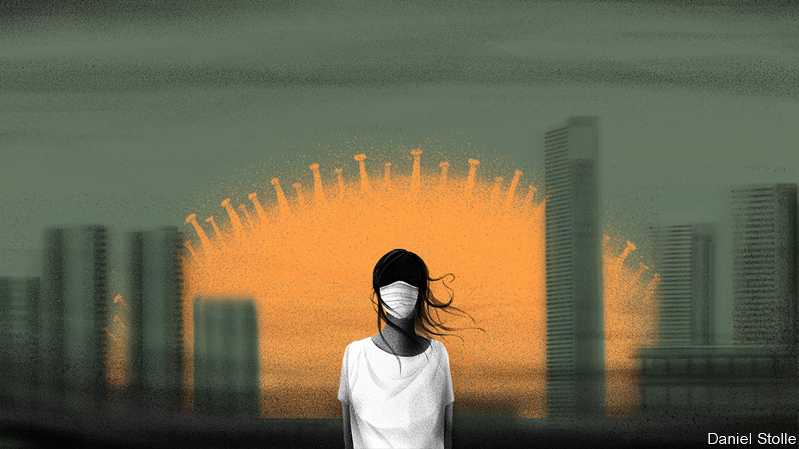
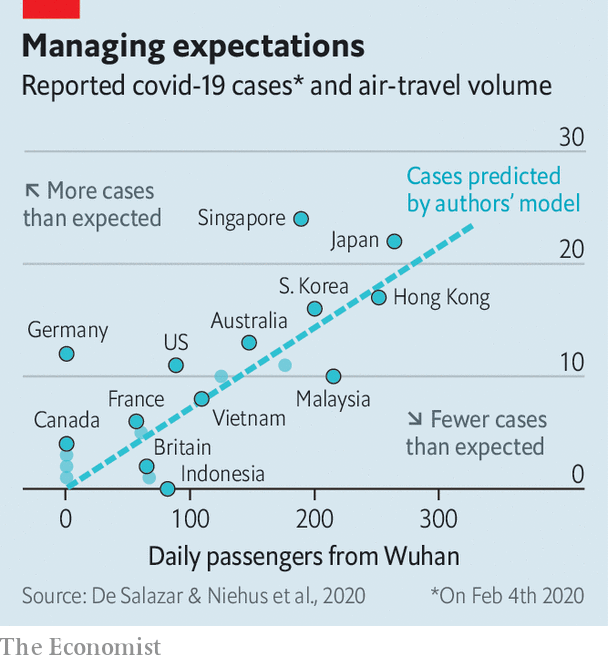

## Curbing the Asian contagion

# China’s neighbours are rushing to contain the spread of the new coronavirus

> Singapore is a model for others

> Feb 13th 2020JAKARTA, SINGAPORE AND TOKYO

THE DIAMOND PRINCESS, an 18-deck cruise ship, has been marooned in the waters off Yokohama, a port city near Tokyo, since February 3rd. Japanese officials in protective suits have brought fresh supplies on board. No passengers are permitted to disembark. Some 3,700 holidaymakers and crew have been quarantined since an 80-year-old passenger, who left the ship in Hong Kong, tested positive for the new coronavirus sweeping China. Since then, 218 of those on board have been infected. Any infection spreads rapidly on such vessels so passengers are mostly confined to their cabins. Some are relying on sudoku puzzles delivered to their rooms by staff for entertainment. Others have had wine delivered by drone. All are anxiously counting the days until February 19th, when their two weeks of isolation should end.

Most confirmed infections of covid-19, as the World Health Organisation has just renamed the disease, are in China. But the disease is now spreading throughout Asia. Singapore confirmed its first infection on January 23rd. It has since detected 49 more. The first 14 identified had all travelled there from Wuhan, the Chinese city where the outbreak began. The first cases of local transmission, traced to a traditional medicine shop frequented by Chinese tourists, were announced on February 4th.

The arrival of the new coronavirus in the city-state was predictable. China is Singapore’s largest trading partner. But it is spreading elsewhere. Japan says 28 people have been infected—not including those confined to the Diamond Princess. Thailand has identified more than 30 and Malaysia 18. Along with Singapore they have all confirmed cases of local transmission. So has Vietnam, where 16 people have caught the disease and 10,000 have been quarantined. In the Philippines one person has died—one of two known deaths outside mainland China. Laos and Myanmar, which share long land borders with China, say they are dealing with only a few suspected cases, though the numbers will surely rise. Armed insurgent groups in Myanmar, such as the Kachin Independence Organisation, have launched public-health campaigns promoting handwashing.

Others insist they are unaffected by the virus. Indonesia, with its 6,000 inhabited islands and 267m people, denies it has a single case. That would be surprising (see chart), given that 2m Chinese tourists visit every year. Some 5,000 Chinese visitors to Bali extended their stay there, fearful of returning home and exposing themselves to the virus. Amin Soebandrio, director of the Eijkman Institute for Molecular Biology in Jakarta, maintains that the country is more than able to detect anyone infected. And yet 238 Indonesians who were evacuated from Wuhan were quarantined but not tested for covid-19. The health ministry said that this was because the arrivals appeared healthy and the tests are expensive.

Experts suspect there are many more infections than have been reported. “Any country that has significant travel back and forth with China and hasn’t found cases should be concerned,” cautions Marc Lipsitch, a professor of epidemiology at Harvard University. Covid-19 has arrived in Singapore; it would be foolish to think that it has not spread more widely, he says.

The disease has killed over 1,300 people and infected around 60,000 in China (there is great uncertainty over the totals). It seems to be transmitted through droplets from coughs and sneezes, and mostly as a result of close contact with someone who is already ill. But experts fear that some people with no symptoms could infect others. Tracing the contacts of those who have been infected is like “looking through the dark”, says Oshitani Hitoshi, an expert in infectious diseases at Tohoku University in Japan. Rich countries such as Singapore are particularly well placed to monitor and care for those who are ill and people in contact with them. But poorer countries with weaker health systems will struggle.

Singapore has prepared for an outbreak of this kind since SARS caught Asia unawares in 2003. The country has raised its outbreak alert to orange, the second-highest threat level. It has barred those who have been to China in the past 14 days from entering the country. Quarantine awaits anyone who has been in close contact with an infected individual. And people entering hospitals and offices must have their temperature taken first. Inter-school sports fixtures have been cancelled until the end of March. The largest dormitory for migrant workers in the country stands ready if any of its occupants need to be quarantined. Pink pillows lie on single beds, empty so far, widely spaced to ensure that any patients are more than two metres apart in designated rooms. Singapore is using a tough new law against fake news to try to prevent the spread of inaccurate information, such as a rumour that the country has run out of face masks.

Japan is taking many similar steps. The government is scared that the virus might wreck the Olympic Games in Tokyo this summer. Earlier this month it banned foreigners who had visited Hubei, the province in China where the outbreak originated, and those with passports issued there, from entering Japan. The country’s two biggest airlines have stopped all flights to Beijing from one of Tokyo’s international airports and halved their flights from another.

So far India has detected cases only in Kerala. This may be because Kerala is the Indian state with the strongest health-care system, so cases there are more likely to be detected. Infections elsewhere may simply not have been noticed yet. However, India’s government has been quick to react. It was among the first countries to evacuate its citizens from Wuhan and is monitoring almost 10,000 people for covid-19. Also, India is less well connected to China than air hubs such as Singapore and Thailand, and its relative isolation may protect it somewhat. Indeed, it has sent medical equipment including masks and protective clothing to China. The government has, however, also claimed that ayurvedic remedies and homeopathy could help manage the disease, suggestions for which evidence is entirely lacking. Meanwhile Pakistan has told its citizens in Wuhan to stay put. Its health system is already strained and China is one of its most vital allies.

All countries must balance their fear of the human and economic costs of the virus against the damage caused by measures to contain it. For less well-off countries, the trade-off is especially painful. Tourism generates more than a tenth of Thailand’s GDP. In 2018 about a quarter of the 38m holidaymakers who visited the country were Chinese. In desperation, Thailand has neither restricted Chinese tourists from entering the country nor stopped giving them free visas on arrival.

“We wish to reaffirm our solidarity with the people of China and wish you every success in overcoming this grave situation,” wrote King Maha Vajiralongkorn in a message to China’s leader, Xi Jinping. Hun Sen, the president of Cambodia, where China has invested more money than any other country in recent years, went further. He travelled to Beijing to meet Mr Xi, demonstrating his loyalty in the face of adversity.

China’s embassies have attacked foreign governments for imposing travel bans. Its ambassador in Jakarta warned Indonesia that “overreaction” would have “a direct impact” on relations. But such bullying may not work. Covid-19 comes after a devastating outbreak of African swine flu on Chinese pig farms and amid a trade war between China and America, and protracted protests in Hong Kong. These upheavals have dented China’s reputation in the region. The epidemic has exposed China as a country of great strengths and weaknesses, says Bilahari Kausikan, a Singaporean former diplomat: “Quite a lot of the gloss has worn off the Chinese story.” ■