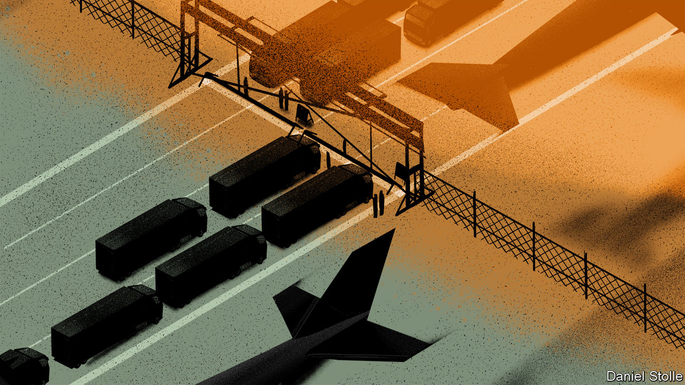

## A deadly disease disrupts

# The new coronavirus could have a lasting impact on global supply chains

> Multinationals have failed to take seriously the risk of disruption

> Feb 15th 2020NEW YORK, PARIS, SHANGHAI AND TOKYO

TO GLIMPSE THE impact of the new coronavirus on global businesses, consider Apple. Such is the American tech titan’s reliance on the Chinese mainland for parts and assembly that United Airlines typically shuttles some 50 of its executives between California and China each day. But not at the moment. United and other carriers have suspended flights to and from China. A lack of workers meant that after the end of the lunar new-year holiday Foxconn, which makes most of Apple’s iPhones in China, could not get its assembly plants back to full capacity this week. Analysts reckon that the virus could lead to Apple shipping 5-10% fewer iPhones this quarter and could scupper its plans to ramp up production of its popular AirPods.

As covid-19 spreads, its effect on business is amplified. Tourism into and out of the mainland has plunged. Some 400,000 Chinese tourists are forecast to cancel trips to Japan by the end of March. One large cruise ship in Asia was turned away by five countries because of fears that those on board were infected (Cambodia at last allowed it to dock). The Singapore Air Show earned the city-state some $250m in 2018, but far less this week owing to cancellations by 70 companies including Lockheed Martin, an American defence giant. The Mobile World Congress, a giant telecoms conference due to take place in Barcelona this month, has been cancelled after companies from Vodafone and BT to Facebook and Amazon pulled out. It is increasingly clear that the virus could damage global supply chains, costing the world’s economy dearly.

Most multinational firms have been caught by surprise. This is not the first time they have suffered shocks to their Asian supply chains. The tsunami that hit Japan in 2011 and devastating floods in Thailand the same year disrupted production for many big firms. More recently, Donald Trump’s trade war with China has exposed the risks of supply chains that rely too heavily on the mainland. But the bosses of such businesses have done little to prepare for shocks such as that inflicted by the outbreak of the new coronavirus.

Investors are punishing companies for this failure. The shares of American firms with strong exposure to China have underperformed the S&P500 index by 5% since early January, when news of the outbreak first broke (see chart).

There are three reasons to think the coming months could prove even more unpleasant for many firms. First, big multinationals have left themselves dangerously exposed to supply-chain risk owing to strategies designed to bring down their costs. For example, many keep only enough stock on hand to last a few weeks, confident that they can always replenish their inventories “just in time”. That confidence is misplaced, argues Bindiya Vakil of Resilinc, a consultancy.

The second vulnerability arises from the fact that giant firms are much more reliant on Chinese factories today than they were at the time of the SARS outbreak in 2003. China now accounts for 16% of global GDP, up from 4% back then. Its share of all exports in textiles and apparel is now 40% of the global total. It generates 26% of the world’s furniture exports. It is also a voracious consumer of things such as metals, needed in manufacturing. In 2003 China sucked in 7% of global mining imports. Today it claims closer to a fifth.

Koray Köse of Gartner, a research firm, points out that it is not only the increase in size of China’s manufacturing base that matters. Since 2003 factories have spread from the coast to poorer interior regions like Wuhan, where the epidemic broke out. Workers from such places now toil at factories all over China—and travel home for the holidays. That interconnectedness increases supply-chain risks, argues Mr Köse. So does the rising interdependence of many firms. Mainland suppliers no longer simply assemble products; they make many of the parts that go into them as well.

The third reason to think that big companies may experience a supply-chain shock is that the regions worst affected by covid-19 and the subsequent government lockdowns are particularly important to several global industries. The electronics industry is most at risk, according to Llamasoft, a supply-chain analytics firm, because of its relatively thin inventories and its lack of alternative sources for parts.

Hubei province, where Wuhan is located, is the heart of China’s “optics valley”, home to many firms making components essential for telecoms networks. Perhaps a quarter of the world’s optical-fibre cables and devices are made there. One of China’s most advanced chip-fabrication plants, which makes the flash memory used in smartphones, is found there, too. Analysts worry that the epidemic in Hubei could reduce global shipments of smartphones by as much as 10% this year.

The car industry has also been hit. The lack of parts from mainland-based suppliers forced Hyundai to shut all its car plants in South Korea (it is now partially reopening them). Nissan has temporarily closed one in Japan, and Fiat-Chrysler has warned that it could soon halt production at one of its European factories.

Fears of the virus are now affecting the global oil price. Chinese refiners are slashing output in anticipation of shrinking demand at home. Slowing Chinese demand is further darkening what was already a dismal outlook for natural gas. Chinese copper buyers have asked Chilean and Nigerian mining firms to delay or cancel shipments. Mongolia has suspended deliveries of coal to China.

Some Chinese firms are panicking. Dozens have received official “force majeure certificates”, which they hope will allow them to slip out of contracts without incurring penalties. They may not. Faced with faltering demand as well as closed ports and roads, CNOOC, a Chinese energy giant, recently used such tactics to avoid accepting LNG shipments. Total and Royal Dutch Shell, European oil majors, are rejecting the move.

What happens next? Big firms want to ramp up production quickly. But it is unclear how soon workers will be allowed to return to factories. However, factory dormitories are crowded. Foxconn’s workers are packed eight to a room at its Shenzhen plant. If that leads to renewed infections plants may be forced to shut down again. Senior bosses will return soon, but some worry that mid-level expatriate managers with young children will not.

Even when plants are up and running, moving goods around and out of China will remain difficult. Alan Cheung of Kerry Logistics, a big provider in Asia, reports that his drivers are getting stopped across the mainland because the Chinese government is still trying to prevent lorries moving around unless they are delivering food or other necessities. The longer shipping volumes are depressed, the bigger the backlog when China Inc returns to work. That will probably lead to bottlenecks and a surge in freight rates.

In the longer term the epidemic could dampen the love affair between multinationals and China. Big companies had long assumed that their mainland supply chains were reliable and easy to manage. Surveys have found that only a minority of firms across all industries regularly assess their supply-chain risks carefully. For years bosses have devolved responsibility for sourcing to mid-level managers, typically instructed to extract an extra percent or two from costs each year. The covid-19 outbreak has exposed the risks of doing so, especially since America’s trade war with China is not exactly resolved. Tsunamis and floods came and went and firms simply thought they could manage, says Jochen Siebert of JSC Automotive, a consultancy. He predicts that the epidemic will put the question of supply-chain management squarely on the desks of their CEOs. ■

Correction (February 18th): This article originally said that a cruise ship was turned away from five countries because scores on board were infected with the new coronavirus. In fact, at that point, no one on board had been found to be infected.

## URL

https://www.economist.com/international/2020/02/15/the-new-coronavirus-could-have-a-lasting-impact-on-global-supply-chains
