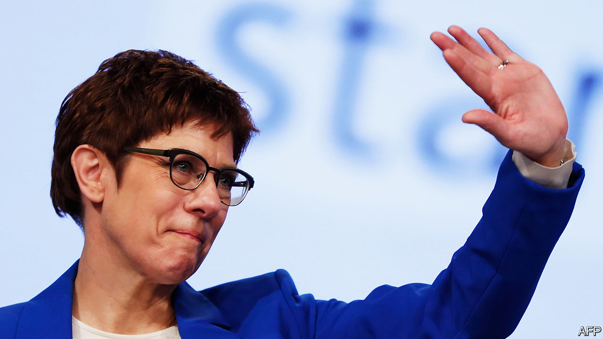

## Bad heir day

# Angela Merkel should quit soon

> Germany’s chancellor should encourage a successor to emerge quickly

> Feb 13th 2020

IT HOLDS HARSH views about immigrants, worries loudly about racial purity and detests the European Union (EU). For all these reasons, the Alternative for Germany (AfD), a far-right party, is considered toxic in its own country. Any mainstream German politician who dares get too close to it is tainted. Nonetheless, many are tempted, for the AfD is popular, particularly in the disadvantaged east of the country, where in each of three state elections last year it took around a quarter of the vote. To many voters there, the party’s claims that immigrants, liberals and the EU are to blame for Germany’s problems sound plausible. Many centre-right politicians would like to woo the same voters with watered-down versions of the same arguments. Some even think that it would make sense to do a deal with the demagogues.

They are wrong, as recent events reveal. In Thuringia, an eastern state, two of Germany’s most respectable parties, the Christian Democratic Union (CDU), which leads the national ruling coalition, and the much smaller Free Democrats, are now plunged into crisis (see [article](https://www.economist.com//europe/2020/02/13/angela-merkels-presumed-successor-quits-as-party-boss)). Their chapters in Thuringia went along with a plan to wrest the state government from the ex-communist Die Linke and install a Free Democrat as premier. Yet this could work only with the help of the local AfD, a particularly nasty branch of the outfit.

The reaction was instant: national condemnation, mass demonstrations and a threat to bring down the ruling coalition in Berlin itself. Within a couple of days the whole thing had fallen apart. But the damage has been immense. Because of her failure to defuse the crisis before it happened, Annegret Kramp-Karrenbauer, the national leader of the CDU, has felt obliged to say she will quit her job. (She was already on thin ice, after a series of poor election results, a spate of gaffes and dismal poll ratings.) She is also withdrawing from the contest to be the official candidate of the CDU to succeed Angela Merkel as chancellor after an election that is expected in 2021. As Germany contemplates Mrs Merkel’s departure after 15 years in power, it is less clear than ever who will take over.

Centrists will celebrate that the firewall keeping out the AfD has done its job. But the problem is unlikely to go away. In Germany’s disgruntled east, extremists of right and left are so popular, and the political landscape so fragmented, that winning elections and forming state governments without either one is increasingly hard. Until there is a realignment of German politics, the chances of another, graver breach of the firewall will remain. The danger lies within the CDU itself, which in the twilight of Mrs Merkel’s reign seems to have little consensus on what its core principles should be. One of the leading contenders to take over from Ms Kramp-Karrenbauer is Friedrich Merz, who speaks openly of his desire to filch as many as half of the AfD’s voters. How does he intend to do that except, to some extent, by aping their agenda?

The CDU could take a different course. Thanks to the spectacular rise of the Greens in recent state elections, last year’s European Parliament elections and in opinion polls, it looks likely that at the next general election the CDU and the Greens will together win a majority of seats in the Bundestag, opening up the chance of a new kind of coalition. If “black-green” is the answer, though, a lot of horse-trading will be needed; the two parties are at odds over heavy industry, euro-zone integration, the scale of public spending and Germany’s defence posture.

This debate is only just beginning. While the CDU decides which way it wants to take Germany, policy paralysis has descended on Europe’s biggest economy. And a paralysed Germany means a paralysed EU, not least because it will take up the rotating EU presidency in the second half of this year. The greatest favour that Mrs Merkel could do her country would be to force the pace, by announcing her imminent departure. Germany must not go on like this. ■

## URL

https://www.economist.com/leaders/2020/02/13/angela-merkel-should-quit-soon
