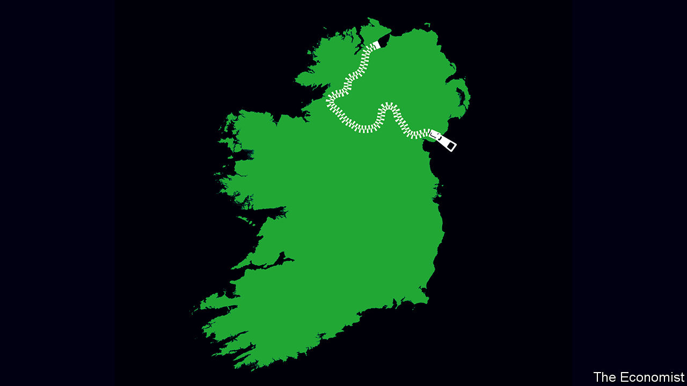

## A united Ireland

# Irish unification is becoming likelier

> Time to start thinking about what it might mean

> Feb 13th 2020

FOR MOST of the century since Ireland gained independence from Britain, control of the country has alternated between two parties. On February 8th that duopoly was smashed apart, when Sinn Fein got the largest share of first-preference votes in the republic’s general election. The party, with links to the Irish Republican Army (IRA), which bombed and shot its way through the 1970s, 1980s and 1990s, won with a left-wing platform that included promises to spend more on health and housing. Yet it did not hide its desire for something a lot more ambitious. “Our core political objective”, its manifesto read, “is to achieve Irish Unity and the referendum on Unity which is the means to secure this.”

Scottish independence has grabbed headlines since Brexit, but it is time to recognise the chances of a different secession from the United Kingdom. Sinn Fein’s success at the election is just the latest reason to think that a united Ireland within a decade or so is a real—and growing—possibility.

That prospect means something far beyond the island of Ireland. The Irish diaspora includes more than 20m Americans. Parties to ethnic conflicts across the world have long found common cause with Northern Ireland’s Roman Catholics, who contend that the separation from the south is an illegitimate vestige of 500 years of incompetent and often callous domination from London. Ireland, source of pubs, poets, playwrights and too many Eurovision songs for anyone’s good, has soft power to rival a country many times its size.

Until today, however, unification has never been more than a Republican fantasy. Even as the IRA waged a bloody campaign in the 20th century, the north’s constitutional status was cemented by a solid Protestant majority and the financial and military backing of the British state. The Good Friday agreement of 1998 took the heat out of the struggle, bringing an end to the Troubles, which had claimed over 3,500 lives. Many Catholics were content to have representation in Northern Ireland’s government thanks to that agreement, and to see their culture, flag and sports celebrated and subsidised. The Protestants have their terrorists, too, and a campaign for unification was thought to risk opening old wounds, with bloody consequences.

Brexit is one reason all this has changed. The north voted against, but the biggest unionist party and England voted for. Nationalists were not the only ones to be angered by the current home secretary, who suggested using the threat of food shortages to soften up the south in the negotiations, heedless of the famine in the 1840s when all of Ireland was under British rule. Brexit also creates an economic border in the Irish Sea, between Northern Ireland and Britain, even as it keeps a united Ireland for goods. Although services will become harder to trade with the south, trading goods will be easier than with Britain. In that the north’s six counties are affected more by what happens in Dublin, the value of having a say in who governs there will grow.

The pressure for unification is about more than Brexit. Northern Ireland’s census in 2021 is likely to confirm that Catholics outnumber Protestants for the first time. The republic has also become more welcoming. The influence of the Catholic church has faded dramatically and society has become more liberal. Over the past three decades restrictions on contraception have been lifted and gay marriage has been legalised. All this explains why support for unification in Northern Ireland appears to have risen in recent years. In some polls respondents show roughly equal support for it and the status quo.

That leads to the last reason for thinking that unification is more likely. Even though the Good Friday agreement reconciled some Catholics to remaining in the United Kingdom, it also set out how the north could peacefully rejoin the republic (see [article](https://www.economist.com//briefing/2020/02/13/brexit-and-sinn-feins-success-boost-talk-of-irish-unification)). A British secretary of state who thinks it likely that a majority favours unification is bound to call a vote on the north’s constitutional status. To change the republic’s constitution, another referendum would be required in the south.

The EU has already said that Northern Ireland could rejoin the bloc under Ireland’s membership after such a vote, meaning that for Northern Irish voters a referendum on Irish unity is also a second referendum on Brexit. Unlike an independent Scotland, which would have to go it alone (at least until the EU agreed to admit it), Northern Ireland would immediately rejoin a larger, richer club, from which it could win big subsidies—if not, perhaps, as big as the subsidy it gets from Westminster today.

There are obstacles and uncertainties. Sinn Fein’s recent success may turn some in the north against unification. Brexit may turn out to have less effect than expected. A British secretary of state may use the wriggle room in the Good Friday agreement to hold off calling a referendum. Many British politicians worry that such a vote would be an administrative headache or, worse, provoke violence. So do their Irish counterparts (barring Sinn Fein), though they must always be seen to be fully behind unification.

Yet sooner than most people expect, the momentum for a united Ireland could come to seem unstoppable. If Scotland chooses independence, many in Northern Ireland would lose their ancestral connection to Britain. If the government in Westminster persistently refused to recognise that there was a majority in favour of unification in Northern Ireland, that could be just as destabilising as calling a referendum.

The island of Ireland needs a plan. The priority should be to work out how to make unionists feel that they have a place in a new Ireland. Work is needed on the nuts and bolts of unification—including how to, and indeed whether to, merge two health systems (one of which is free), the armed forces and police services, and what to do about the north’s devolved assembly. It helps that the republic has a fine record for the sort of citizen-led constitutional consultations that might help sort things out. Politicians from Britain and Ireland need to start talking, too. The price of ending violence two decades ago was for Northern Ireland, the republic and Britain to jointly set out a political route to a united Ireland. If the people of the north and the republic choose that path, the politicians must follow it. ■