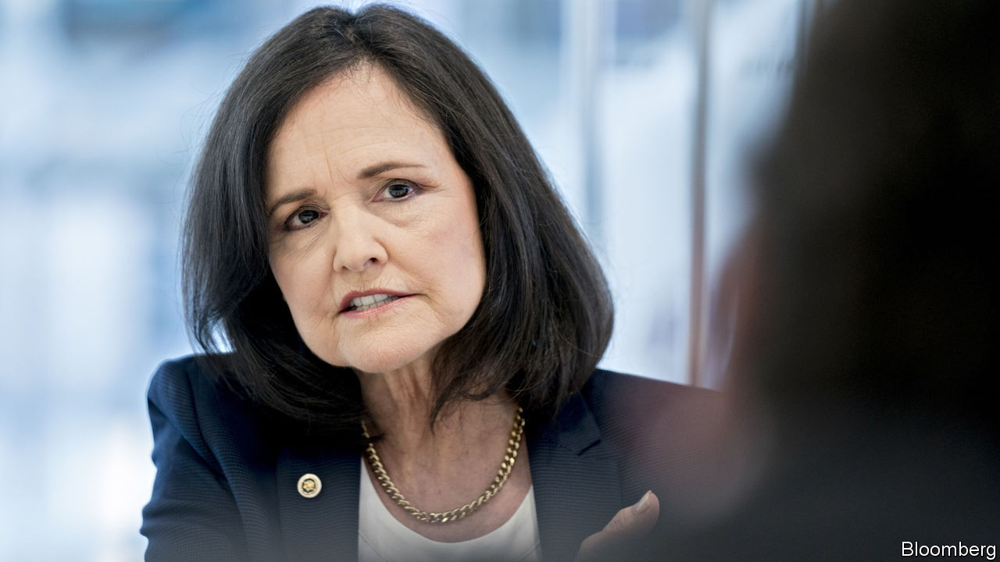

## Shel-no

# Why the Senate should reject Judy Shelton’s nomination to the Fed

> It is not her views that are the problem so much as her motives

> Feb 13th 2020

FOR MUCH of the past decade the Federal Reserve has operated without all its seven governors. Presidents Barack Obama and Donald Trump have struggled to find nominees whom the Senate, which must approve appointments to the Fed, finds acceptable. On February 13th, after we went to press, Mr Trump’s latest candidates for the job—Judy Shelton and Christopher Waller—were due to appear before the Senate Banking Committee for a grilling. Mr Waller, head of research at the St Louis Fed, is a perfectly good candidate. Unfortunately Ms Shelton, a former think-tanker, adviser to Mr Trump and official at the European Bank for Reconstruction and Development, is not fit for the Fed. Whatever she says, the Senate should reject her nomination.

The problem with Ms Shelton is not her belief, shared by Mr Trump, that interest rates should be lower, nor her status as an outsider to the clubby world of central banking. Annoyingly for the experts, Mr Trump is probably right when he grumbles—as he frequently does—that the Fed has been too hawkish during his presidency. For two decades the Fed has made mistakes because of groupthink. Just as in the 2000s central bankers and economists were blind to financial risks, so in the 2010s they have perennially overestimated the risk of inflation. Setting interest rates is a technical job, but more intellectual diversity among those who steer the economy would be no bad thing.

Instead, two other factors disqualify Ms Shelton. First, her past views crossed the line where unconventional thinking ends and quackery begins. She has spent much of her career questioning whether central banks should exist at all, and calling for a return to the gold standard, which would remove much of the Fed’s power to set monetary policy. True, she would not be the first central banker with a record of gold-standard advocacy. Alan Greenspan, who chaired the Fed from 1987 to 2006, had such a history when he was appointed. But since then decades of experience have shown that, for all its problems, today’s monetary regime is superior. It has led to inflation that is low and stable. America is in its longest-ever economic expansion, and poor workers are enjoying large pay rises (see [article](https://www.economist.com//finance-and-economics/2020/02/13/wage-gains-for-low-earners-have-helped-sustain-americas-economic-expansion)). To rip up this framework would risk these advances for little gain. Ms Shelton’s campaign to go back in time lacks common sense.

The second problem is Ms Shelton’s record of changing her mind on interest rates. She has transformed from a hawk who predicted that low rates would cause “ruinous inflation” in the early 2010s, when the unemployment rate was near 9%, to a dove who wants the Fed to cut rates “expeditiously” today, when jobs are booming. In principle this is no cause for shame. Central bankers change their minds often, and some have undergone similar wholesale transformations. But Ms Shelton’s change of heart looks calculated to advance her career. In addition to wanting rate cuts, she now argues that the Fed should work “hand in hand” with Congress and the White House and that it should pursue a weaker dollar to help exporters—sycophantic echoes of Mr Trump. Ms Shelton has even suggested that there should be an international economic summit, in the spirit of Bretton Woods, held at Mr Trump’s Mar-a-Lago resort.

Ms Shelton is right that the Fed’s independence is more principle than law. But that is all the more reason to defend it, by opposing the appointment of cronies. The central bank already looks vulnerable. If Mr Trump wins re-election, he could choose to replace Jerome Powell, the Fed’s chair. If he loses, the new occupant of the White House may want to pick a fight with the Fed. Bernie Sanders is now the front-runner for the Democratic nomination (see [article](https://www.economist.com//united-states/2020/02/15/mike-bloombergs-very-expensive-moment)). He once sponsored legislation designed to give Congress more control over monetary policy, and in 2015 denounced an interest-rate rise as evidence of a “rigged economic system”. Democrats and Republicans alike have grown accustomed to the ballooning deficits that low interest rates make possible. Washington will be in no mood for tighter monetary policy if that proves necessary.

The Fed is one of the few parts of America’s government not to have been afflicted by the country’s toxic partisan divides and win-at-all-costs politics. The Senate must protect the central bank by rejecting overtly political nominations to its board. It should say no to Ms Shelton. ■