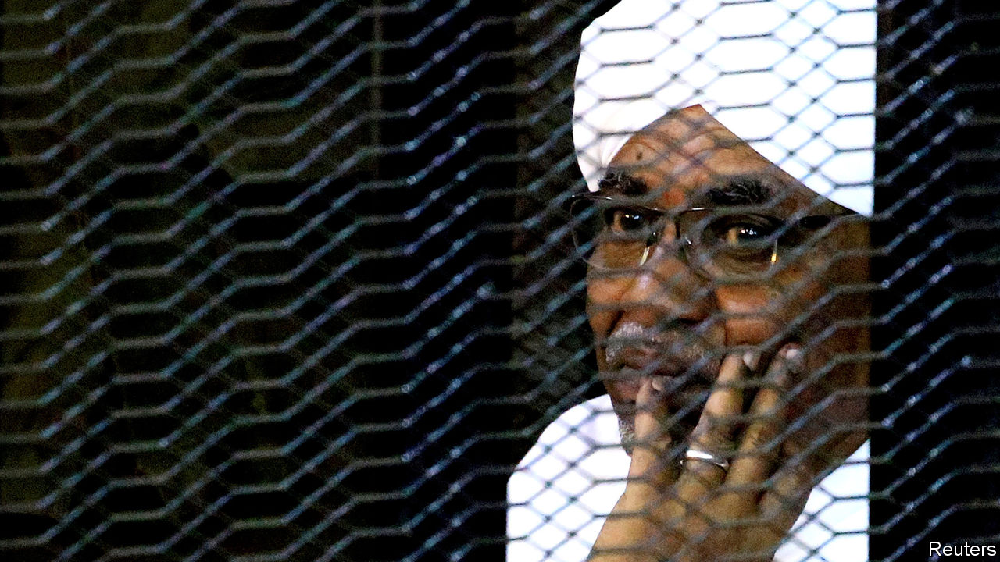
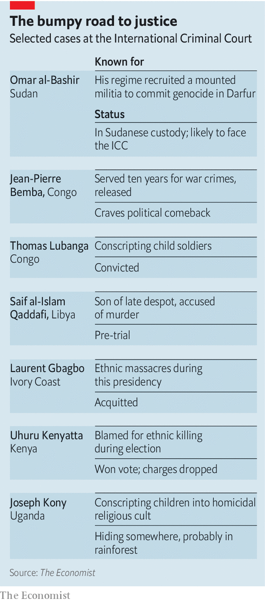

## A day of reckoning

# Omar al-Bashir, Sudan’s ex-dictator, could at last face justice

> The ICC accuses him of genocide. Sudan may even let him be tried

> Feb 13th 2020

FOR MORE than a decade, Omar al-Bashir gaily thumbed his nose at the International Criminal Court (ICC). After he was indicted for war crimes, crimes against humanity and genocide in the country’s western region of Darfur, his defiance badly damaged the young court’s credibility. On February 11th, however, Sudan’s former dictator was pushed a step closer to justice, as the new Sudanese government agreed that he would appear before the ICC. Where, and when, that might happen remains unresolved. But if it happens, it will chip away at the culture of impunity that emboldens despots everywhere.

Mr Bashir, who seized power in 1989, now languishes in a Sudanese prison after being swept from office last April in a popular uprising. The decision to let him appear before the ICC was taken by the country’s new joint military and civilian council during talks with Darfuri rebel groups in Juba, the capital of South Sudan. Handing Mr Bashir over to the ICC has been one of the rebels’ long-standing demands.

Violence in the region continues. In January for instance, the United Nations reported that at least 54 people had been killed and another 40,000 or so displaced in a fresh bout of intercommunal fighting. In all, since the Darfur conflict erupted in 2003, perhaps 300,000 people have died, mostly of war-induced hunger and disease. More than 2m have been made homeless. The bulk of the blame rests with the Arab-dominated Sudanese army and its mass-raping mounted militia, the janjaweed. Mr Bashir’s government claimed that it ran a limited campaign to crush a rebellion. In fact, it is accused of a widespread campaign of ethnic cleansing targeting black-African groups such as the Masalit, Fur and Zaghawa. Hence the genocide charges: Mr Bashir, in the words of the ICC, deliberately inflicted on each target group “conditions of life calculated to bring about the group’s physical destruction”.

But how exactly Mr Bashir and those indicted with him are to appear before the ICC has yet to be worked out. The transitional government is sensitive to the national humiliation some Sudanese would feel if Mr Bashir were sent to The Hague, where the ICC sits. That looks unlikely to happen. Instead, officials are exploring ways in which Mr Bashir and the others could appear in front of ICC judges, or perhaps a hybrid court, in Sudan itself. It will be up to the ICC to decide whether such a court in Sudan would be sturdy enough.

The possible transfer of Mr Bashir will reignite controversy about the ICC’s role in Africa, where many countries accuse it of bias, pointing out that most of the cases, and all the indictments, have been against Africans. The indictment in 2009 of Mr Bashir caused particular anger; he was a sitting head of state and Sudan is not a member of the ICC. President Yoweri Museveni of Uganda, a member country, went so far as to call the court “a bunch of useless people”. Some have simply ignored the court’s demands. Member states have an obligation to arrest those who are charged but, before the revolution in Sudan, Mr Bashir roamed ICC member countries in Africa untroubled, sometimes even at the invitation of host governments. In 2010, a month after he was indicted for genocide, he joined the celebrations in Nairobi for Kenya’s new constitution.

African criticisms of the court came to a head in 2016 when South Africa, Burundi and the Gambia announced plans to withdraw. Burundi was upset by the opening of an investigation into crimes in Burundi. South Africa was miffed when the court reprimanded it for failing to arrest Mr Bashir when he visited in 2015. Fears grew of an exodus of African states, co-ordinated by the African Union. Yet the court’s legitimacy in Africa is not as shaky as it seems. Though Burundi has left, South Africa has not followed through; the Gambia changed government and rapidly changed its mind. Other African countries came to the court’s defence. Nigeria, the most populous, vocally supports it. The new Sudanese government’s co-operation with the ICC would be a remarkable further step.

It helps that the ICC’S chief prosecutor, Fatou Bensouda, is a Gambian, trained in Nigeria. She points out that most of the cases against Africans were referred by African governments themselves. They were often willing to co-operate as long as the court investigated political opponents or rebels, but got jumpy when the court turned to crimes by state armed forces.

Mr Bashir’s fate suggests a novel path to the ICC; a revolution followed by the new government calling in the court to help prosecute former leaders. That might worry Saif al-Islam Qaddafi, the son of Libya’s former despot, indicted for crimes against humanity by the ICC (see table).

Yet Sudan’s willingness to bring in the ICC will not alone fix the court’s troubles in Africa. Paradoxically, the likelihood of stronger co-operation by African governments rests more on the ICC’s ability to pursue cases outside of Africa. The ICC has moved that way, opening preliminary investigations into abuses by British forces in Iraq and pushing for an investigation into all sides in Israel-Palestine.

The fight against impunity in Africa faces other problems, too. The ICC in practice is only able to try political losers, not those in power. It risks being used as a tool by the mighty to remove rivals while remaining untouched themselves. One lesson some leaders will take, says Phil Clark of the School of Oriental and African Studies in London, is “don’t lose power.”

The prosecution of Mr Bashir might deter other despots from slaughtering inconvenient ethnic groups. But only if it succeeds. The court has had more cases collapse before or during trial than it has completed. The kind of people it goes after are the kind who terrify witnesses. For years, Mr Bashir did everything he could to hinder the work of the ICC. And even now, to have a chance of a successful trial, the court first needs to get its hands on him. ■

## URL

https://www.economist.com/middle-east-and-africa/2020/02/13/omar-al-bashir-sudans-ex-dictator-could-at-last-face-justice
