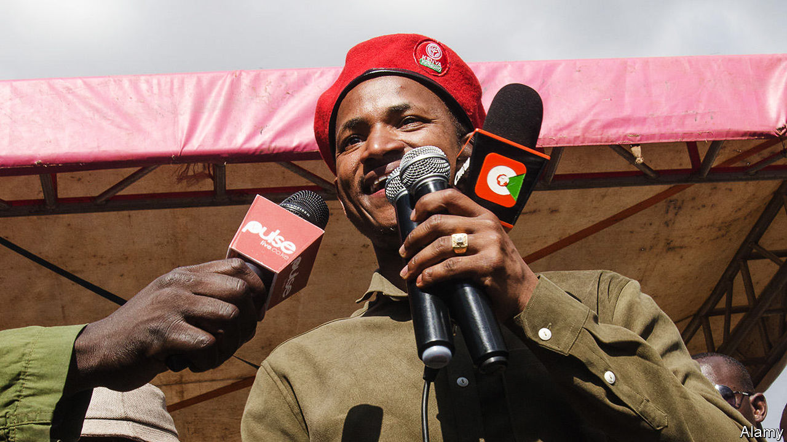

## I shot the DJ

# One law for the mighty in Kenya

> The country’s leaders make a mere show of holding wrongdoers to account

> Feb 13th 2020NAIROBI

NAIROBI’S B-CLUB is popular with Kenya’s gilded classes. Those unfortunate to live within earshot are less keen, and last October won a court ruling revoking its licence. But legal orders matter little to politically connected nightclub owners. Few Kenyans were surprised when CCTV footage emerged on January 17th showing an MP, Paul Ongili (pictured), propping up B-Club’s bar at seven in the morning.

The MP did find himself in a spot of bother, though, when the clip then showed him raise a pistol and shoot the club’s DJ through the neck. Mr Ongili, better known as Babu Owino, was arrested and charged with attempted murder, which he denies.

He was held for ten days. A judge then set him free on bail, requiring that he pay his victim’s hospital bills. He will remain free during a trial that will presumably weigh his claim that he mistook the DJ, Felix Orinda, for an assassin, against witnesses’ suggestions that they argued over penis size. (After surgery, Mr Orinda remains too unwell to give his version of events.)

If history is anything to go by, a trial could take years and never reach a verdict. This is typical for members of the political elite who get themselves into trouble, a fellow MP says wearily. While the press watches, judges sternly remand them into custody. But as attention wanders, they are freed pending a trial destined to remain perpetually snagged in procedure. “Babu Owino has already served his sentence,” the legislator concludes.

Once bail has been posted, there is no end to the ways in which matters can be strung out. Chris Okemo, a former energy minister, and Samuel Gichuru, the ex-head of Kenya’s state power utility, have managed to drag out a case seeking their extradition to Jersey on corruption charges (which they deny) for nearly nine years. No bigwig has gone to jail for decades.

Kenya’s president, Uhuru Kenyatta, likes to blame corrupt judges for the absence of convictions. But lawyers say prosecutors are at least as responsible, suggesting that they leave loopholes or make blunders for defence lawyers to exploit. It is a system, cynics say, designed to benefit the government in two ways.

For starters, the government can show that it is responding to public anger over corruption by arresting a big fish or two without having to worry about them actually ending up in jail. Last year corruption charges were brought against Henry Rotich, a former finance minister, and Mike Sonko, the governor of Nairobi, which they deny. Some hailed the charges as evidence of Mr Kenyatta’s intent to toughen up. Others saw the arrests as an example of what Wachira Maina, a constitutional lawyer, calls “motion without movement”.

Second, it can be useful for the government to leave politicians squirming on a hook. Charges that have been shelved can be dusted off if a politician steps out of line, says one MP arrested on suspicion of graft. “It’s a good way of keeping us quiet.”

It also ensures that impunity flourishes. Beyond the usual corruption, accusations of violent crime by politicians are becoming more common. Last year an MP was briefly held on suspicion of shooting her political rival’s uncle. The trial of a governor accused of murdering his pregnant girlfriend in 2018 meanders on.

Justice is less kind to ordinary Kenyans. A policeman last month stopped a motorist, Mildred Owiso, for using her mobile phone while driving and climbed into her car. Mrs Owiso, a strong-willed social activist, protested: policemen usually only get into vehicles when they want a bribe and she had no intention of paying. A fracas ensued and members of the public came to help her, sending the policeman packing.

People power did not prevail for long. That night, ten tear-gas-lobbing officers raided her house and arrested Mrs Owiso and her husband on charges of incitement to violence. For good measure, they also killed her dog. ■

## URL

https://www.economist.com/middle-east-and-africa/2020/02/13/one-law-for-the-mighty-in-kenya
