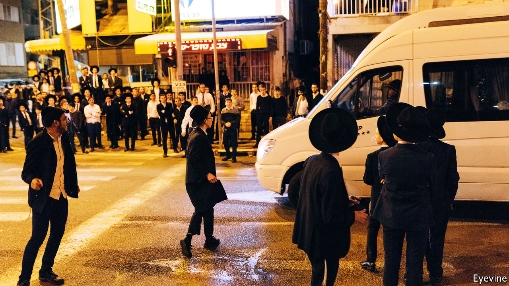

## Sabbath riders

# Secular Israelis on buses strike a blow for religious freedom

> Transport on the Sabbath could have implications for Israel’s election

> Feb 13th 2020JAFFA

AT THE Clock-Tower Square in Jaffa, dozens of Israelis wait in the winter sun for a bus home after a Saturday afternoon in nearby restaurants and bars. Any other day of the week this would be normal, but for today’s passengers there is a subversive thrill.

For over 70 years buses and trains have not run in most of Israel from sundown on Friday to nightfall on Saturday. Before Israel’s founding in 1948, its first leader, David Ben-Gurion, won support from ultra-Orthodox rabbis for statehood by promising that public services would not operate on Shabbat. Every Israeli government since has adhered to the agreement, against public wishes: 71% of Jewish citizens favour public transport on the Sabbath, a survey finds.

In November 2019 Tel Aviv and neighbouring towns established a privately run bus network. It has proven wildly popular, and more towns have joined in. Local governments were reluctant to challenge the government of Binyamin Netanyahu, which relies on ultra-Orthodox coalition partners. They depend on budgets from the interior ministry, which is in the hands of Shas, an ultra-Orthodox party. But Mr Netanyahu now heads a mere caretaker government. Though religious cabinet members lambast the Sabbath buses, the ministry cannot change levels of funding.

Tel Aviv and many of its suburbs are relatively secular. In the two stalemated elections held in 2019, their residents tended towards centre-left opposition parties. Neither Mr Netanyahu nor Benny Gantz, an opposition leader, could form a coalition. On March 2nd Israel will hold its third election in 12 months.

Mr Gantz is targeting “soft-right” voters souring on Mr Netanyahu. Dahlia Scheindlin, a pollster, thinks some might be attracted to “the murky concept of a liberal government”, meaning enforcing the rule of law, tackling corruption (Mr Netanyahu is under indictment) and defying religious coercion. According to her surveys, between one-quarter and one-third of Likud voters are concerned about these issues. Who knows where a taboo bus ride might lead?

## URL

https://www.economist.com/middle-east-and-africa/2020/02/13/secular-israelis-on-buses-strike-a-blow-for-religious-freedom
