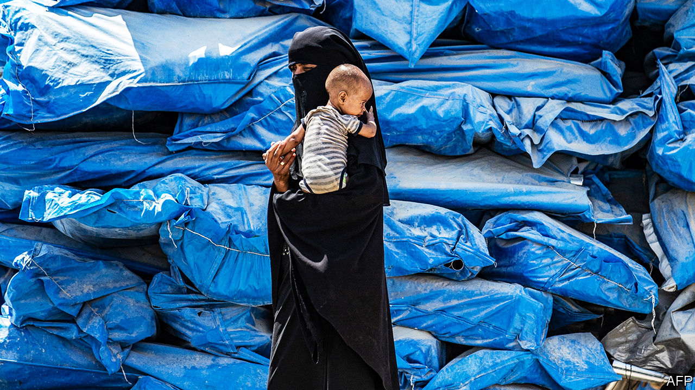

## Frustrated are the peacemakers

# Why the United Nations cannot end wars in the Arab world

> It’s not for lack of trying

> Feb 13th 2020BEIRUT

EVEN AFTER nearly a decade of carnage, Syria’s civil war still manages to shock. More than 700,000 people have fled a regime offensive in Idlib, the country’s last rebel-held pocket. Shelter is scarce; with temperatures near zero, families sleep rough on the roadside. Desperate to keep millions of refugees from crossing its southern border, Turkey has deployed thousands of troops to slow the Syrian advance, risking conflict with Russia, which backs Bashar al-Assad, Syria’s dictator, with jets in the sky and mercenaries on the ground. At least a dozen Turkish soldiers have been killed.

Against this backdrop Geir Pedersen, the United Nations special envoy, is pressing ahead with a committee meant to redraw Syria’s constitution—a body Mr Assad has already said he will ignore. As the regime draws closer to Idlib, as another 1m civilians prepare to flee, the UN has staked time and prestige on an effort that was doomed from the start.

Since 2011, 13 UN envoys have tried to play healer in the Middle East’s civil wars: four in Syria, six in Libya and three in Yemen. None has succeeded. The war in Syria is winding down only because the regime has slaughtered its enemies. Libya and Yemen are failed states. At best the UN’s efforts have been ineffective. At worst, in Syria, they helped tip momentum towards one of the warring parties.

There is a large body of academic research on how wars end. One study finds that including women in negotiations makes them more likely to succeed. Another posits a link between failed ceasefires and subsequent success, which seems a verbose way of saying that if at first you don’t succeed, try again.

Mostly, though, wars end when at least one party decides that the cost of continuing outweighs the possible benefits. That is a hard choice for the losing side to make in a civil war. Combatants cannot simply lay down their arms and go home. Defeat can mean annihilation. In 1997 Barbara Walter of the University of California analysed half a century of resolved conflicts. She found that just 20% of civil wars ended in a peace deal, compared with 55% of inter-state conflicts. “Groups fighting civil wars almost always chose to fight to the finish,” she wrote.

If outsiders want to broker a deal, they must change this calculation. The Dayton accords, which America negotiated in 1995 to end the war in Bosnia, are often cited. But America and its NATO allies were not mere negotiators. They were also dropping bombs on one of the belligerents. In Syria, by contrast, “I’m conscious that I have almost no leverage,” says Mr Pedersen. Even when backed with weapons, diplomatic efforts often fail. America could not bring durable peace to Afghanistan or Iraq, despite its might.

In peacekeeping, unlike peacemaking, the UN has often succeeded. The territorial dispute in Cyprus, though still unresolved, has not caused any deaths since the 1990s. But there must be a peace to keep. The UN has only rarely authorised outside countries to shoot their way in to impose one. Failing that, with one belligerent (like Mr Assad) on a roll, there is no incentive to stop fighting and let the blue helmets in.

So the UN set its sights lower. The former special envoy, Staffan de Mistura, pursued local ceasefires—“freeze zones”, as he called them. A tally in 2018 by the Atlantic Council, a think-tank, looked at 18 such truces in the Damascus suburbs. The median agreement held for just ten days; only three lasted longer than a month. They allowed Mr Assad to regroup. He did not have enough men to fight on all fronts, and the men he had were often bad at fighting. Though the regime could not tolerate well-armed rebels in the suburbs of Damascus, neither could it afford to throw troops into meat-grinder urban warfare. With the UN’s help, Mr Assad cut deals in the suburbs, then starved residents into submission.

A similar approach in Yemen focused on Hodeida, a strategic port that has seen a lot of fighting. In December 2018 the warring parties struck a deal in Stockholm that called for an immediate ceasefire and a redeployment of forces. A year later, aid agencies reported that Hodeida was still the most dangerous governorate for Yemeni civilians, accounting for one-quarter of all casualties.

Though the UN focuses on creating safe zones, none of the Middle East’s civil wars is truly local. Iran and Russia intervened to support Mr Assad. Gulf states sent arms and money to his rebel opponents and laid waste to Yemen with American support. The situation in Libya is so chaotic that even dirt-poor Chad has become a player.

But the UN looks powerless to halt such support. Syria is not subject to an arms embargo, while restrictions in Yemen apply only to certain groups, such as the Houthis (whose Iranian patrons ignore the edict). The Security Council, where America, Russia, China, France and Britain hold vetoes, would probably fail to impose a blanket ban on either state. UN members such as Turkey and the United Arab Emirates suffer no consequences for violating the organisation’s arms embargo on Libya.

Officials say they are doing all they can. At a conference in Rome in December, Mr de Mistura compared himself to a doctor working on a chronic case. “You cannot cure everything. Some diseases are difficult—but would you abandon the patient?” he asked. “You try to reduce the pain until the treatment is found.”

Yet the UN often fails to do even that. Unable to stem the flow of weapons, it is left to preside over talks ever more divorced from reality. It took more than a year just to agree on the members of Syria’s constitutional committee. Mr Assad said his delegation to its first meeting was not there in an official capacity. Still the talks lurch on—not even a palliative, in Mr de Mistura’s metaphor. More like a placebo.■

## URL

https://www.economist.com/middle-east-and-africa/2020/02/13/why-the-united-nations-cannot-end-wars-in-the-arab-world
